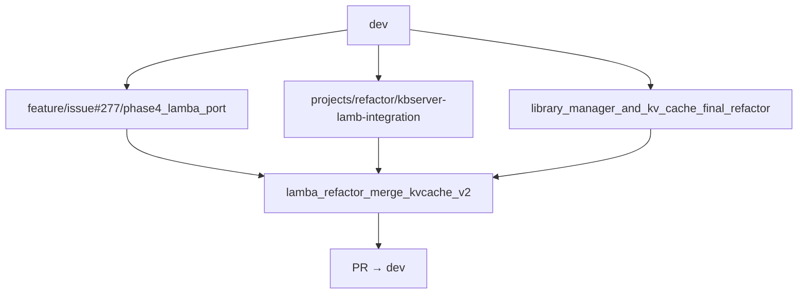

# Pull Request: `lamba_refactor_merge_kvcache_v2`

**Branch:** `lamba_refactor_merge_kvcache_v2` → `dev`
**Commits:** ~332 commits (vs `dev`)
**Stats:** 586 files changed, +75,209 / -35,014 lines

---

## Summary

Integration branch consolidating LAMB's main development lines: the completions pipeline with a two-plugin architecture (KV-cache friendly), Knowledge Stores (new KB Server), Library Manager, LTI modules (Phase 4), and the frontend migration to a pnpm monorepo. Includes post-merge fixes, design system restoration, and pre-merge validation hardening.

---

## Branch lineage and merge history

This branch is an **integration line**, not a single feature. It merges several upstream development tracks into one testable whole before landing on `dev`.

### Primary merge: `feature/issue#277/phase4_lamba_port` (Issue #277)

**Commit:** `f1fb71b6` — *Merge phase4_lamba_port: frontend monorepo + LTI modules + Knowledge Stores (temporal)*

This is the **original Phase 4 branch** (`feature/issue#277/phase4_lamba_port`). Merging it into `lamba_refactor_merge_kvcache_v2` brings:

| Area | What landed from Phase 4 |
|------|---------------------------|
| **Frontend monorepo** | pnpm workspace: `@lamb/ui`, `creator-app`, `module-chat`, `module-file-eval`; removal of `frontend/svelte-app/` |
| **LTI Activity Module System** | `backend/lamb/modules/` — chat + file evaluation modules, JWT sessions, `LTIContext` hooks |
| **File evaluation** | Upload, AI grading, Moodle LTI passback (`lti_passback.py`), group work |
| **LTI core refactor** | `lti_router.py`, `lti_activity_manager.py`, `auth_context.py` — module dispatch, dead template removal |
| **Backend packaging** | `requirements-base.txt` + `requirements-ml.txt`, Docker/Caddy updates |
| **Shared UI package** | Nav, Footer, authService, sessionManager, i18n (4 locales), sanitize utils in `@lamb/ui` |
| **Post-merge consolidation** | Import path fixes (`@lamb/ui`), AAC terminal, org-admin, assistant sharing — see `frontend/MERGE_DEV_TO_PHASE4.md` |

**Post-Phase-4 fixes on this branch** (same PR, after `f1fb71b6`):

- `81546152` — restore AssistantForm + imports after merge conflicts
- `c9d622ec` — LTI configure endpoint with existing activities
- `554b6539`, `0b04eb1a`, `756faf82` — Playwright regressions
- `ab442b79` — design system tokens, logo, version
- `d728c491` — DB init once per process; LTI module `config.js` samples
- `eb0c8718` — pre-merge PPS/RAG + document RAG validation (see §5)
- **Create PPS default (post-merge):** `resolveCreatePromptProcessor()` forces `kvcache_augment` on create reset/submit; both PPS visible in Advanced create; removed temporary `LAMB_LEGACY_PPS_DEFAULT` / `apply_defaults_pps_policy` served-defaults hack

### Other integration merges (same branch)

| Merge | Content |
|-------|---------|
| `6c3968c2` | KB Server + LAMB integration (`projects/refactor/kbserver-lamb-integration`) — Knowledge Stores, `lamb-kb-server/`, Creator Interface KS routes |
| KV-cache / Library Manager line | `kvcache_augment`, `library_file_rag`, query rewriting KS RAG, Library Manager folders/capabilities |
| `7a3103cb` | `dev` synced into cost-management / library refactor line |

**Review note:** Phase 4–specific bugs (monorepo auth, dual `apiClient`, raw `fetch()` in LTI modules, XSS/marked migration) are documented in [`frontend/MERGE_DEV_TO_PHASE4.md`](frontend/MERGE_DEV_TO_PHASE4.md). A dedicated review of that surface is **deferred** until after this PR description is finalized.

---

## 1. Completions Pipeline — Two-Plugin Architecture

**Goal:** Separate the legacy pipeline (`simple_augment` + KB-based RAGs) from the new KV-cache friendly pipeline (`kvcache_augment` + Knowledge Stores / Library Manager), without modifying legacy code.

### 1.1 New PPS: `kvcache_augment.py`

- Injects `document_context` at the **beginning** of the system prompt (KV-cache friendly: stable prefix = cache hits ~97-98%).
- `COMPATIBLE_RAG` declares compatible RAGs: `library_file_rag`, `knowledge_store_rag`, `query_rewriting_ks_rag`, `rubric_rag`, `no_rag`.
- `DEFAULT_RAG_PROMPT_TEMPLATE` as D3 fallback when no `prompt_template` exists but RAG context is available.
- **Labeled doc wrapper:** wraps the document with a "REFERENCE DOCUMENT" header + creator selection note + recency-bias reminder.
- `COMPATIBLE_RAG` validation in `main.py` (`load_and_validate_plugins`): rejects invalid PPS-RAG combinations at **completion** time.
- `metadata_validators.py` + Creator Interface create/update: rejects incompatible combos at **save** time (see §5, commit `eb0c8718`).
- **Default PPS changed:** `kvcache_augment` is now the default PPS for new assistants (was `simple_augment`). Create mode uses `resolveCreatePromptProcessor()` so the form always selects `kvcache_augment` when available, regardless of stale org defaults or localStorage cache. Both PPS are visible in Advanced Mode create; legacy `simple_augment` remains disabled (read-only) in edit mode only.

**Key files:**
- `backend/lamb/completions/pps/kvcache_augment.py` (new, 197 lines)
- `backend/lamb/completions/main.py` (COMPATIBLE_RAG validation)
- `backend/lamb/completions/org_config_resolver.py` (new)
- `backend/lamb/completions/plugin_config.py` (new)

### 1.2 New RAG: `library_file_rag.py`

- Fetches documents from Library Manager via HTTP (`/libraries/{id}/items/{id}/content`).
- Replaces logic previously embedded in `single_file_rag.py`.
- `single_file_rag.py` remains untouched as legacy (static `file_path` only).

### 1.3 Query Rewriting KS RAG

- New RAG processor `query_rewriting_ks_rag`: rewrites the user query using a small-fast-model over conversation history, then queries Knowledge Stores via KB Server v2 (port 9092).
- Shared modules: `_ks_query_helpers.py` (used by `knowledge_store_rag` and `query_rewriting_ks_rag`) and `_query_rewriting_helper.py` (SFM rewriting).
- **Note:** legacy `context_aware_rag` still targets KB Server v1 (9090); it was **not** refactored onto `_ks_query_helpers`.
- Frontend display name: `query_rewriting_ks_rag` → **"Context Aware Rag"**. Legacy `context_aware_rag` uses the same label today (suffix "(Old)" planned but not yet applied — see §11).

**Key files:**
- `backend/lamb/completions/rag/query_rewriting_ks_rag.py` (new, 122 lines)
- `backend/lamb/completions/rag/_ks_query_helpers.py` (new, 112 lines)
- `backend/lamb/completions/rag/_query_rewriting_helper.py` (new, 116 lines)
- `backend/lamb/completions/rag/knowledge_store_rag.py` (new, 129 lines)

### 1.4 Frontend — PPS/RAG Compatibility Filtering

- `ragProcessorHelpers.js`: `PPS_COMPATIBLE_RAG` backend mirror, `getCompatibleRagForPps()`, `ppsSupportsDocumentRag()`, `isHiddenInCreate()`, `isDocumentRag()`, `isLegacyPps()`, `resolveCreatePromptProcessor()`.
- `ConfigurationPanel.svelte`: RAG dropdown filtered by PPS compatibility; PPS dropdown shows both processors in create Advanced Mode.
- **Legacy PPS lock in edit mode:** All assistants using `simple_augment` show a locked read-only UI in edit mode with an i18n'd amber notice banner. KB selectors, KS selectors, Top-K input, and document toggle are all disabled. The user is directed to create a new assistant for changes.
- `LibraryItemSelector.svelte`: library + item selector for Document RAG.
- `AssistantForm` refactored: from ~1,747 LOC monolith to ~535 LOC orchestrator + logic modules + UI subcomponents.

### New files

| File | Description |
|------|-------------|
| `backend/lamb/completions/pps/kvcache_augment.py` | New KV-cache friendly PPS (197 lines) |
| `backend/lamb/completions/rag/library_file_rag.py` | RAG via Library Manager HTTP (72 lines) |
| `backend/lamb/completions/rag/query_rewriting_ks_rag.py` | Query rewriting + KS retrieval (122 lines) |
| `backend/lamb/completions/rag/knowledge_store_rag.py` | Knowledge Store RAG processor (129 lines) |
| `backend/lamb/completions/rag/_ks_query_helpers.py` | Shared KS query helpers (112 lines) |
| `backend/lamb/completions/rag/_query_rewriting_helper.py` | SFM query rewriting (116 lines) |
| `backend/lamb/completions/org_config_resolver.py` | Org-level config resolution (80 lines) |
| `backend/lamb/completions/plugin_config.py` | Plugin configuration loader (61 lines) |
| `backend/creator_interface/metadata_validators.py` | Metadata validation: library refs, **COMPATIBLE_RAG on save** |
| `frontend/.../components/ConfigurationPanel.svelte` | Extracted configuration panel (363 lines) |
| `frontend/.../components/RagOptionsPanel.svelte` | Extracted RAG options panel (104 lines) |
| `frontend/.../components/KnowledgeBaseSelector.svelte` | KB selector component (103 lines) |
| `frontend/.../components/KnowledgeStoreSelector.svelte` | KS selector component (72 lines) |
| `frontend/.../components/LibraryItemSelector.svelte` | Library item selector (111 lines) |
| `frontend/.../components/FormActions.svelte` | Form action buttons (50 lines) |
| `frontend/.../logic/assistantFormFetchers.js` | Extracted fetch logic (176 lines) |
| `frontend/.../logic/assistantFormSubmit.js` | Extracted submit logic |
| `frontend/.../logic/importAssistantValidator.js` | Import validation (141 lines) |
| `frontend/.../utils/ragProcessorHelpers.js` | PPS/RAG compatibility + helpers (183 lines) |
| `frontend/.../components/assistants/ConfigurationPanel.svelte.test.js` | Both PPS in create dropdown + legacy edit lock tests |
| `frontend/.../components/assistants/RagOptionsPanel.svelte.test.js` | Legacy banner + disabled selectors tests |

### Modified files

| File | Change |
|------|--------|
| `backend/static/json/defaults.json` | Default PPS: `simple_augment` → `kvcache_augment` |
| `backend/creator_interface/assistant_router.py` | Metadata default PPS: `simple_augment` → `kvcache_augment`; removed served-defaults PPS override |
| `backend/lamb/assistant_default_pps.py` | Simplified: `default_prompt_processor()` + `load_defaults_json_document()` (no env policy) |
| `backend/config.py` | Removed `LAMB_LEGACY_PPS_DEFAULT` env flag |
| `backend/.env.example` | Removed `LAMB_LEGACY_PPS_DEFAULT` docs |
| `testing/playwright/.env.sample` | Removed `LAMB_LEGACY_PPS_DEFAULT` docs |
| `backend/lamb/completions/pps/simple_augment.py` | Cleanup: removed document_context, added COMPATIBLE_RAG |
| `backend/lamb/completions/rag/context_aware_rag.py` | Legacy KB v1 path unchanged; query rewriting via `_query_rewriting_helper` only |
| `backend/lamb/completions/main.py` | COMPATIBLE_RAG at completion time; `_require_document_context` HTTP 502 on document load failure |
| `backend/creator_interface/assistant_router.py` | Metadata validation on create **and** update |
| `frontend/.../assistants/AssistantForm.svelte` | Refactor: ~1747→~535 LOC; `resolveCreatePromptProcessor()` on non-advanced submit |
| `frontend/.../assistants/logic/assistantFormState.svelte.js` | Document RAG fields; create reset uses `resolveCreatePromptProcessor()` |
| `frontend/.../assistants/logic/assistantFormSubmit.js` | `document_rag: 'library_file_rag'`; submit validation for PPS/RAG/refs |
| `frontend/.../assistants/logic/importAssistantValidator.js` | Import checks aligned with backend metadata rules |
| `frontend/.../stores/assistantConfigStore.js` | Fallback PPS + capabilities; added new RAGs to store |
| `frontend/.../utils/ragProcessorHelpers.js` | Added `isLegacyPps()` + `resolveCreatePromptProcessor()` |
| `frontend/.../components/assistants/components/ConfigurationPanel.svelte` | Both PPS in create Advanced Mode, `isLegacyEdit` wiring, document toggle disabled |
| `frontend/.../components/assistants/components/RagOptionsPanel.svelte` | Generalized legacy banner for all `simple_augment` RAGs, disabled selectors |
| `frontend/.../components/assistants/components/KnowledgeBaseSelector.svelte` | Added `disabled` prop |
| `frontend/.../components/assistants/components/KnowledgeStoreSelector.svelte` | Added `disabled` prop |
| `frontend/packages/ui/src/lib/locales/*.json` | Added `legacyPpsNotice` key in 4 locales |

---

## 2. Knowledge Stores — New KB Server (port 9092)

**Goal:** Vectorization microservice with plugin architecture, replacing the legacy KB Server (port 9090) for new assistants.

### 2.1 Backend KB Server (`lamb-kb-server/`)

- **Plugin architecture:** 3 vector DBs (ChromaDB, Qdrant), 4 chunking strategies (simple, hierarchical/parent-child, by_page, by_section), 3 embedding vendors (OpenAI, Ollama, local).
- **Async ingestion:** SQLite-backed job queue with polling.
- **Per-org filesystem isolation:** vectors at `data/storage/{org_id}/{collection_id}/`.
- **Locked store setup:** chunking strategy, embedding vendor/model, and vector DB backend are immutable after creation.
- **FR-10:** Library items referenced by active Knowledge Stores cannot be deleted.

### 2.2 LAMB Integration

- **Creator Interface endpoints:** `/creator/knowledge-stores/*` with ACL + proxy to KB Server.
- **DB tables:** `knowledge_stores` + `kb_content_links` in LAMB DB.
- **HTTP client:** `backend/creator_interface/knowledge_store_client.py` (608 lines).
- **Router:** `backend/creator_interface/knowledge_store_router.py` (753 lines).
- **RAG processor:** `knowledge_store_rag.py` + `query_rewriting_ks_rag.py` in the completions pipeline.
- **CLI:** `lamb ks ...` / `lamb knowledge-store ...` in `lamb-cli/`.

### 2.3 Frontend

- **Components:** `KnowledgeStoresList.svelte` (895 lines), `KnowledgeStoreDetail.svelte` (1146 lines), `AddContentToKSModal.svelte` (641 lines), `IngestionProgressModal.svelte` (323 lines).
- **Unified wizard:** `CreateKnowledgeWizard.svelte` with stepper for Library + Knowledge Store.
- **Cache store:** `ksCache.js` (stale-while-revalidate).
- **Route:** `/knowledge-stores` redirects to `/libraries?section=knowledge-stores`.
- **i18n:** Knowledge Bases/Stores keys across 4 locales (en, es, ca, eu).

### New files

| File | Description |
|------|-------------|
| `lamb-kb-server/` | Complete microservice (new, ~5000+ lines) |
| `lamb-kb-server/backend/main.py` | FastAPI app + lifespan (184 lines) |
| `lamb-kb-server/backend/config.py` | Centralized config (77 lines) |
| `lamb-kb-server/backend/database/` | Connection + models (114 + 139 lines) |
| `lamb-kb-server/backend/plugins/base.py` | Plugin base class (394 lines) |
| `lamb-kb-server/backend/plugins/chunking/` | 4 strategies: simple, hierarchical, by_page, by_section |
| `lamb-kb-server/backend/plugins/embedding/` | 3 vendors: openai, ollama, local |
| `lamb-kb-server/backend/plugins/vector_db/` | 2 backends: chromadb, qdrant |
| `lamb-kb-server/backend/routers/` | collections, content, jobs, query, system |
| `lamb-kb-server/backend/services/` | collection, ingestion, query services |
| `lamb-kb-server/backend/tasks/worker.py` | Async job worker (320 lines) |
| `lamb-kb-server/backend/schemas/` | Pydantic schemas (collection, content, query, jobs) |
| `lamb-kb-server/tests/` | 29 test files (unit + integration + e2e) |
| `backend/creator_interface/knowledge_store_client.py` | HTTP client for KB Server v2 (608 lines) |
| `backend/creator_interface/knowledge_store_router.py` | Creator Interface KS endpoints (753 lines) |
| `frontend/.../knowledgeStores/KnowledgeStoresList.svelte` | KS list view (895 lines) |
| `frontend/.../knowledgeStores/KnowledgeStoreDetail.svelte` | KS detail view (1146 lines) |
| `frontend/.../knowledgeStores/AddContentToKSModal.svelte` | Add content modal (641 lines) |
| `frontend/.../knowledgeStores/IngestionProgressModal.svelte` | Ingestion progress (323 lines) |
| `frontend/.../knowledge/CreateKnowledgeWizard.svelte` | Unified creation wizard (580 lines) |
| `frontend/.../knowledge/wizard/StepKSSetup.svelte` | KS setup step (784 lines) |
| `frontend/.../knowledge/wizard/StepKSContent.svelte` | KS content step (262 lines) |
| `frontend/.../knowledge/wizard/StepLibrarySetup.svelte` | Library setup step (418 lines) |
| `frontend/.../knowledge/wizard/StepLibraryContent.svelte` | Library content step (503 lines) |
| `frontend/.../knowledge/wizard/Step8_ReviewCreate.svelte` | Review + create step (752 lines) |
| `frontend/.../knowledge/wizard/Step9_Done.svelte` | Done step (113 lines) |
| `frontend/.../modals/CreateKnowledgeStoreModal.svelte` | Create KS modal (641 lines) |
| `frontend/.../services/knowledgeStoreService.js` | KS API service (403 lines) |
| `frontend/.../stores/ksCache.js` | KS cache store (119 lines) |
| `frontend/.../routes/knowledge-stores/+page.svelte` | KS route redirect (20 lines) |
| `lamb-cli/src/lamb_cli/commands/knowledge_store.py` | CLI commands (425 lines) |

### Modified files

| File | Change |
|------|--------|
| `backend/lamb/database_manager.py` | New tables knowledge_stores + kb_content_links (+837 lines) |
| `backend/creator_interface/knowledges_router.py` | Refactored for legacy KB + new KS coexistence |
| `backend/creator_interface/kb_server_manager.py` | Dual KB Server legacy + v2 support |
| `backend/creator_interface/main.py` | KS router registration |
| `frontend/.../components/KnowledgeBaseDetail.svelte` | KB/KS coexistence adjustments |
| `frontend/.../components/KnowledgeBasesList.svelte` | KB/KS coexistence adjustments |
| `frontend/.../routes/knowledgebases/+page.svelte` | KB/KS coexistence adjustments |
| `frontend/packages/ui/src/lib/locales/*.json` | New KS i18n keys across 4 locales |
| `lamb-cli/src/lamb_cli/commands/assistant.py` | KS support in assistant commands |

---

## 3. Library Manager — Document Repository

**Goal:** Independent microservice (port 9091) for importing and structuring documents in markdown format with permalinks.

### 3.1 Improvements in this branch

- **Folders:** folder system with CRUD, move, tree view (`folder_service.py`, `folders router`).
- **Capabilities:** structured content (text, images, pages) served via API (`capabilities router`, `content_handlers/`).
- **File tree UI:** `FileTreeModal.svelte` (1055 lines), `FileTreeNode.svelte` (283 lines), `MoveToFolderPicker.svelte`, `TreePreviewPane.svelte`.
- **Content renderers:** `ImagesRenderer`, `PagesRenderer`, `TextRenderer`.
- **Plugin improvements:** markitdown error handling, shared MIME detection, improved URL import, YouTube transcript with titles.
- **FR-10 interlock:** items referenced by Knowledge Stores cannot be deleted.

### 3.2 LAMB Integration

- **Creator Interface:** `/creator/libraries/*` endpoints with ACL + proxy.
- **Library Manager client:** `library_manager_client.py` (164 lines updated).
- **Library router:** `library_router.py` (560 lines updated).
- **Frontend:** `LibrariesList.svelte`, `LibraryDetail.svelte`, `ItemContentModal.svelte`, `ItemContentTabs.svelte`, `PluginPickerModal.svelte`.
- **Cache:** `librariesCache.js` (stale-while-revalidate).

### New files

| File | Description |
|------|-------------|
| `library-manager/backend/routers/folders.py` | Folder CRUD router (159 lines) |
| `library-manager/backend/routers/capabilities.py` | Content capabilities router (225 lines) |
| `library-manager/backend/services/folder_service.py` | Folder service (398 lines) |
| `library-manager/backend/plugins/content_handlers/` | capability, images, pages, text handlers |
| `library-manager/backend/plugins/_markitdown_errors.py` | Markitdown error handling (88 lines) |
| `library-manager/backend/plugins/_mime.py` | Shared MIME detection (32 lines) |
| `library-manager/backend/schemas/folders.py` | Folder schemas (87 lines) |
| `library-manager/backend/database/models.py` | Folder model added (+45 lines) |
| `frontend/.../libraries/ItemContentModal.svelte` | Item content viewer (75 lines) |
| `frontend/.../libraries/ItemContentTabs.svelte` | Content tabs (308 lines) |
| `frontend/.../libraries/PluginPickerModal.svelte` | Plugin picker (129 lines) |
| `frontend/.../libraries/fileTree/FileTreeModal.svelte` | File tree modal (1055 lines) |
| `frontend/.../libraries/fileTree/FileTreeNode.svelte` | Tree node component (283 lines) |
| `frontend/.../libraries/fileTree/MoveToFolderPicker.svelte` | Move picker (98 lines) |
| `frontend/.../libraries/fileTree/TreePreviewPane.svelte` | Preview pane (174 lines) |
| `frontend/.../libraries/fileTree/treeOps.js` | Tree operations logic (352 lines) |
| `frontend/.../libraries/capabilities/ImagesRenderer.svelte` | Images renderer (174 lines) |
| `frontend/.../libraries/capabilities/PagesRenderer.svelte` | Pages renderer (86 lines) |
| `frontend/.../libraries/capabilities/TextRenderer.svelte` | Text renderer (41 lines) |
| `frontend/.../libraries/capabilities/index.js` | Capabilities barrel (53 lines) |
| `frontend/.../stores/librariesCache.js` | Libraries cache store (117 lines) |
| `frontend/.../routes/libraries/+page.svelte` | Libraries unified page (270 lines) |

### Modified files

| File | Change |
|------|--------|
| `library-manager/backend/main.py` | Registered folders + capabilities routers (+87 lines) |
| `library-manager/backend/services/import_service.py` | Refactored import flow (+196 lines) |
| `library-manager/backend/services/content_service.py` | Added content serving (+138 lines) |
| `library-manager/backend/routers/content.py` | Content endpoint updated |
| `library-manager/backend/routers/importing.py` | Import router updated (+84 lines) |
| `library-manager/backend/plugins/base.py` | Improved plugin base (+112 lines) |
| `library-manager/backend/plugins/markitdown_import.py` | Improved error handling |
| `library-manager/backend/plugins/markitdown_plus_import.py` | Improvements (+244 lines) |
| `library-manager/backend/plugins/url_import.py` | Improved URL import (+216 lines) |
| `library-manager/backend/plugins/youtube_transcript_import.py` | Titles + improvements (+243 lines) |
| `library-manager/backend/plugins/simple_import.py` | Minor adjustments |
| `library-manager/backend/database/connection.py` | Folder support (+33 lines) |
| `backend/creator_interface/library_manager_client.py` | Updated client (+164 lines) |
| `backend/creator_interface/library_router.py` | Expanded router: folders, capabilities (+560 lines) |
| `frontend/.../libraries/LibrariesList.svelte` | UI adjustments |
| `frontend/.../libraries/LibraryDetail.svelte` | Added file tree + capabilities (+141 lines) |
| `frontend/.../services/libraryService.js` | New endpoints: folders, capabilities |
| `lamb-cli/src/lamb_cli/commands/library.py` | New CLI commands: folders (+356 lines) |

---

## 4. Phase 4 — LTI Activity Module System + Frontend Monorepo

**Source branch:** `feature/issue#277/phase4_lamba_port` (Issue #277), merged at `f1fb71b6`. Section 4 describes the Phase 4 surface area; post-merge fixes for this line are in §5.

### 4.0 Phase 4 merge scope (from `feature/issue#277/phase4_lamba_port`)

Beyond the file lists below, the Phase 4 merge introduced:

- **Monorepo auth/session:** unified `sessionManager` in `@lamb/ui` with `registerOnClearSession()` (logout clears creator-app stores).
- **Module SPAs:** `/m/chat/` and `/m/file-eval/` built as separate Vite apps, served by backend static routes.
- **Removed legacy templates:** `lti_activity_setup.html`, `lti_dashboard.html` replaced by Svelte module UIs.
- **Documentation relocation:** old root `Documentation/` tree trimmed; operational docs moved to `docs/`, `environment_data/`, service READMEs.
- **Known Phase 4 follow-ups (not blocking this PR):** dual `apiClient.js`, raw `fetch()` in LTI modules, marked→`renderMarkdownSafe` migration — see [`frontend/MERGE_DEV_TO_PHASE4.md`](frontend/MERGE_DEV_TO_PHASE4.md).

### 4.1 LTI Activity Module System

- **Chat Module (`modules/chat/`):** LTI launch, JWT session management, instructor dashboard, student flow.
- **File Evaluation Module (`modules/file_evaluation/`):** AI-powered file evaluation, grading, group work, Moodle grade passback.
  - `evaluation_service.py` (255 lines): AI evaluation via assistant.
  - `grade_service.py` (144 lines): grade management.
  - `lti_passback.py` (269 lines): Moodle grade sync via LTI outcomes.
  - `document_extractor.py` (107 lines): document content extraction.
  - `storage_service.py` (86 lines): submission storage.
- **Base module (`modules/base.py`):** `LTIContext` class, `on_student_launch()` / `on_instructor_launch()` hooks.
- **JWT tokens:** replaced in-memory LTI tokens with persistent JWTs.
- **Security:** auth guards, disabled user handling, session reconciliation.

### 4.2 Frontend Monorepo Migration

- **pnpm workspace:** `@lamb/ui` (shared), `creator-app` (main SPA), `module-chat` (LTI chat), `module-file-eval` (LTI file evaluation).
- **`@lamb/ui`:** Nav, Footer, LanguageSelector, ConfirmationModal, userStore, configStore, authService, configService, i18n (4 locales), sanitize utils.
- **`creator-app`:** full creator interface UI with design system (Button, Badge, Modal, Card, Tabs, etc.).
- **`module-chat`:** independent SPA for `/m/chat/` (setup + dashboard).
- **`module-file-eval`:** independent SPA for `/m/file-eval/` (upload + grading).
- **`svelte-app/` removal:** complete migration to monorepo.

### 4.3 Design System

- **UI primitives:** 20+ components in `frontend/packages/creator-app/src/lib/components/ui/` (Button, IconButton, Modal, Badge, Card, Toast, Tabs, FormField, Dropdown, OverflowMenu, Dropzone, Stepper, Banner, Collapsible, Checkbox, EmptyState, Skeleton*).
- **CSS tokens in `app.css`:** semantic colors (brand, success, warning, danger, info), shadows, radii, motion, typography.
- **Icons:** barrel in `icons.js` (re-export of lucide-svelte). `flowbite-svelte` removed.
- **Status badges:** `statusBadge.js` with locked mapping (ready=success, processing=info, failed=danger, etc.).

### New files

| File | Description |
|------|-------------|
| `backend/lamb/modules/__init__.py` | Module registry (23 lines) |
| `backend/lamb/modules/base.py` | LTIContext + base module class (109 lines) |
| `backend/lamb/modules/chat/__init__.py` | Chat module (149 lines) |
| `backend/lamb/modules/chat/service.py` | Chat service: dashboard, sessions (484 lines) |
| `backend/lamb/modules/file_evaluation/__init__.py` | File eval module (268 lines) |
| `backend/lamb/modules/file_evaluation/service.py` | File eval service (441 lines) |
| `backend/lamb/modules/file_evaluation/evaluation_service.py` | AI evaluation (255 lines) |
| `backend/lamb/modules/file_evaluation/evaluator_client.py` | Evaluator HTTP client (234 lines) |
| `backend/lamb/modules/file_evaluation/grade_service.py` | Grade management (144 lines) |
| `backend/lamb/modules/file_evaluation/lti_passback.py` | Moodle grade passback (269 lines) |
| `backend/lamb/modules/file_evaluation/document_extractor.py` | Document extraction (107 lines) |
| `backend/lamb/modules/file_evaluation/storage_service.py` | Submission storage (86 lines) |
| `backend/lamb/modules/file_evaluation/router.py` | File eval API router (375 lines) |
| `backend/lamb/modules/file_evaluation/schemas.py` | Pydantic schemas (147 lines) |
| `backend/lamb/modules/file_evaluation/migrations.py` | DB migrations (121 lines) |
| `frontend/packages/ui/` | Complete shared package (new) |
| `frontend/packages/ui/src/lib/components/Nav.svelte` | Navigation component |
| `frontend/packages/ui/src/lib/components/Footer.svelte` | Footer component |
| `frontend/packages/ui/src/lib/components/modals/ConfirmationModal.svelte` | Shared confirmation modal |
| `frontend/packages/ui/src/lib/services/authService.js` | Auth service (225 lines) |
| `frontend/packages/ui/src/lib/services/configService.js` | Config service (53 lines) |
| `frontend/packages/ui/src/lib/session/sessionManager.js` | Session manager (57 lines) |
| `frontend/packages/ui/src/lib/stores/userStore.js` | User store |
| `frontend/packages/ui/src/lib/stores/configStore.js` | Config store (28 lines) |
| `frontend/packages/ui/src/lib/i18n/` | i18n setup + 4 locales |
| `frontend/packages/ui/src/lib/utils/sanitize.js` | DOMPurify sanitization |
| `frontend/packages/ui/src/lib/styles/theme.css` | Theme CSS (59 lines) |
| `frontend/packages/module-chat/` | LTI chat package (new) |
| `frontend/packages/module-chat/src/routes/setup/+page.svelte` | Chat setup page (479 lines) |
| `frontend/packages/module-chat/src/routes/dashboard/+page.svelte` | Chat dashboard (352 lines) |
| `frontend/packages/module-file-eval/` | LTI file evaluation package (new) |
| `frontend/packages/module-file-eval/src/routes/upload/+page.svelte` | Student upload (719 lines) |
| `frontend/packages/module-file-eval/src/routes/grading/+page.svelte` | Instructor grading (860 lines) |
| `frontend/packages/module-file-eval/src/lib/services/api.js` | File eval API client (110 lines) |
| `frontend/packages/module-file-eval/src/lib/services/gradingService.js` | Grading service (81 lines) |
| `frontend/packages/module-file-eval/src/lib/services/submissionService.js` | Submission service (50 lines) |
| `frontend/packages/module-file-eval/src/lib/locales/` | i18n across 4 locales |
| `frontend/packages/creator-app/src/lib/components/ui/` | 20+ UI primitives (new) |
| `frontend/packages/creator-app/src/lib/components/ui/Button.svelte` | Button primitive (153 lines) |
| `frontend/packages/creator-app/src/lib/components/ui/IconButton.svelte` | Icon button (136 lines) |
| `frontend/packages/creator-app/src/lib/components/ui/Modal.svelte` | Modal primitive (213 lines) |
| `frontend/packages/creator-app/src/lib/components/ui/Badge.svelte` | Badge (83 lines) |
| `frontend/packages/creator-app/src/lib/components/ui/Card.svelte` | Card (77 lines) |
| `frontend/packages/creator-app/src/lib/components/ui/Toast.svelte` | Toast (110 lines) |
| `frontend/packages/creator-app/src/lib/components/ui/Tabs.svelte` | Tabs (95 lines) |
| `frontend/packages/creator-app/src/lib/components/ui/FormField.svelte` | Form field (263 lines) |
| `frontend/packages/creator-app/src/lib/components/ui/Dropdown.svelte` | Dropdown (179 lines) |
| `frontend/packages/creator-app/src/lib/components/ui/OverflowMenu.svelte` | Overflow menu (117 lines) |
| `frontend/packages/creator-app/src/lib/components/ui/Dropzone.svelte` | Dropzone (185 lines) |
| `frontend/packages/creator-app/src/lib/components/ui/Stepper.svelte` | Stepper (135 lines) |
| `frontend/packages/creator-app/src/lib/components/ui/Banner.svelte` | Banner (90 lines) |
| `frontend/packages/creator-app/src/lib/components/ui/Collapsible.svelte` | Collapsible (72 lines) |
| `frontend/packages/creator-app/src/lib/components/ui/Checkbox.svelte` | Checkbox (74 lines) |
| `frontend/packages/creator-app/src/lib/components/ui/EmptyState.svelte` | Empty state (53 lines) |
| `frontend/packages/creator-app/src/lib/components/ui/Skeleton.svelte` | Skeleton loader (53 lines) |
| `frontend/packages/creator-app/src/lib/components/ui/SkeletonCard.svelte` | Skeleton card (24 lines) |
| `frontend/packages/creator-app/src/lib/components/ui/SkeletonRow.svelte` | Skeleton row (22 lines) |
| `frontend/packages/creator-app/src/lib/components/ui/SkeletonTable.svelte` | Skeleton table (36 lines) |
| `frontend/packages/creator-app/src/lib/components/ui/Tooltip.svelte` | Tooltip (102 lines) |
| `frontend/packages/creator-app/src/lib/components/ui/icons.js` | Icon barrel (117 lines) |
| `frontend/packages/creator-app/src/lib/components/ui/index.js` | UI barrel (31 lines) |
| `frontend/packages/creator-app/src/lib/components/common/EntityListShell.svelte` | List shell (223 lines) |
| `frontend/packages/creator-app/src/lib/components/common/FilterBar.svelte` | Filter bar (274 lines) |
| `frontend/packages/creator-app/src/lib/components/common/FilterChip.svelte` | Filter chip (35 lines) |
| `frontend/packages/creator-app/src/lib/components/common/ResizableTable.svelte` | Resizable table (45 lines) |
| `frontend/packages/creator-app/src/lib/components/modals/NotificationModal.svelte` | Notification modal (180 lines) |
| `frontend/packages/creator-app/src/lib/components/plugins/PluginParamFields.svelte` | Plugin params (267 lines) |
| `frontend/packages/creator-app/src/lib/services/apiClient.js` | Centralized API client (94 lines) |
| `frontend/packages/creator-app/src/lib/utils/statusBadge.js` | Status badge mapping (79 lines) |
| `frontend/packages/creator-app/src/lib/utils/listHelpers.js` | List utility helpers (327 lines) |
| `frontend/packages/creator-app/src/lib/utils/dateHelpers.js` | Date helpers (99 lines) |
| `frontend/packages/creator-app/src/lib/utils/nameSanitizer.js` | Name sanitizer (103 lines) |
| `frontend/packages/creator-app/src/lib/utils/orgAdmin.js` | Org admin helpers (58 lines) |
| `frontend/packages/creator-app/src/lib/utils/sessionGuard.js` | Session guard (76 lines) |
| `frontend/packages/creator-app/src/lib/stores/toast.js` | Toast store (128 lines) |
| `frontend/packages/creator-app/src/lib/stores/templateStore.js` | Template store (407 lines) |
| `frontend/packages/creator-app/src/lib/stores/rubricStore.svelte.js` | Rubric store (508 lines) |
| `frontend/packages/creator-app/src/lib/stores/wizardDraftStore.svelte.js` | Wizard draft store (135 lines) |
| `frontend/packages/creator-app/src/lib/stores/wizardFileStore.svelte.js` | Wizard file store (136 lines) |
| `frontend/packages/creator-app/src/lib/services/pluginMatcher.js` | Plugin matching (58 lines) |
| `frontend/packages/creator-app/src/lib/services/organizationService.js` | Org service (26 lines) |
| `frontend/packages/creator-app/src/routes/api/chat/+server.js` | Chat API proxy (66 lines) |
| `frontend/pnpm-workspace.yaml` | pnpm workspace config |

### Modified files

| File | Change |
|------|--------|
| `backend/lamb/lti_router.py` | Refactor: JWT tokens, module dispatch, dead code removal (+699 lines) |
| `backend/lamb/lti_activity_manager.py` | Refactor: module architecture, dynamic owner (+491 lines) |
| `backend/lamb/lti_users_router.py` | LTI users adjustments |
| `backend/lamb/auth_context.py` | Improved auth context (+108 lines) |
| `backend/lamb/main.py` | Module router registration |
| `backend/main.py` | Static serving + module setup (+150 lines) |
| `backend/utils/pipelines/auth.py` | Auth pipeline (+18 lines) |
| `backend/lamb/templates/` | **Removed** (lti_activity_setup.html, lti_dashboard.html) |
| `frontend/svelte-app/` | **Removed** (migrated to monorepo) |
| `frontend/packages/creator-app/src/routes/+layout.svelte` | Layout updated for monorepo |
| `frontend/packages/creator-app/src/routes/+layout.js` | Layout JS updated |
| `frontend/packages/creator-app/src/routes/+page.svelte` | Home page updated |
| `frontend/packages/creator-app/src/routes/admin/+page.svelte` | Admin page updated |
| `frontend/packages/creator-app/src/routes/assistants/+page.svelte` | Assistants page updated |
| `frontend/packages/creator-app/src/routes/org-admin/+page.svelte` | Org admin updated |
| `frontend/packages/creator-app/src/lib/services/assistantService.js` | Updated service (+244 lines) |
| `frontend/packages/creator-app/src/lib/services/knowledgeBaseService.js` | Updated service (+175 lines) |
| `frontend/packages/creator-app/src/lib/services/rubricService.js` | Updated service (+403 lines) |
| `frontend/packages/creator-app/src/lib/services/templateService.js` | Updated service |
| `frontend/packages/creator-app/src/lib/services/adminService.js` | Updated service (+56 lines) |
| `frontend/packages/creator-app/src/lib/services/analyticsService.js` | Updated service |
| `frontend/packages/creator-app/src/lib/services/aacService.js` | Updated service |
| `frontend/packages/creator-app/src/lib/session/sessionManager.js` | Updated session manager |
| `frontend/packages/creator-app/src/lib/stores/assistantStore.js` | Updated store |
| `frontend/packages/creator-app/src/lib/stores/assistantPublish.js` | Updated publish store |
| `frontend/packages/creator-app/src/lib/stores/aacStore.svelte.js` | Updated AAC store |
| `frontend/packages/creator-app/src/app.css` | Full design system restored (123 lines) |
| `frontend/packages/creator-app/src/lib/components/assistants/AssistantSharingModal.svelte` | Sharing modal (+168 lines) |
| `frontend/packages/creator-app/src/lib/components/aac/AacTerminal.svelte` | Improved terminal (+358 lines) |
| `frontend/packages/ui/src/lib/locales/en.json` | Expanded i18n keys (+414 lines) |
| `frontend/packages/ui/src/lib/locales/es.json` | Spanish locale (1118 lines) |
| `frontend/packages/ui/src/lib/locales/ca.json` | Catalan locale (1118 lines) |
| `frontend/packages/ui/src/lib/locales/eu.json` | Basque locale (1118 lines) |

---

## 5. Bugs Fixed (Post-Merge and Pre-Merge)

### 5.1 Post-merge integration fixes

| Commit | Bug | Fix |
|--------|-----|-----|
| `ab442b79` | Design system tokens lost after merge (app.css was a 10-line stub) | Restored full design system (~123 lines) |
| `ab442b79` | LAMB logo not displaying (404, missing `static/img/lamb_1.png`) | Created `frontend/packages/creator-app/static/img/lamb_1.png` |
| `ab442b79` | Version shows "0.1" instead of "0.6" | `generate-version.js` now writes version.js in both packages (creator-app and @lamb/ui) |
| `4689f244` | Admin service incorrect token handling + modal accessibility | Token handling fix + modal a11y |
| `0b04eb1a` | Playwright tests `creator_flow` and `account_disable_security` persistently failing | Test fixes |
| `756faf82` | Post-merge Playwright regressions + FR-10 interlock lost | Restored FR-10 + fixes |
| `f3f18ed5` | `document_context` passed to all PPS (including `simple_augment`) | Only passed to `kvcache_augment` |
| `322e8560` | Transcription button broken in assistants | Transcription button fix |
| `c9d622ec` | LTI configure endpoint fails with existing activities | Configure endpoint fix |
| `81546152` | Broken imports after merge + refactored AssistantForm lost | Restored imports and AssistantForm |
| `d728c491` | DB migrations/PRAGMAs on every request; LTI modules missing `config.js` | `_optimizations_applied` / `_migrations_applied` flags; `config.js` samples for module-chat/file-eval |

### 5.2 Pre-merge validation hardening (`eb0c8718`)

Review-driven fixes before opening PR to `dev`. Plan: `docs/superpowers/plans/bug_fixes_pre_merge.md` (local, gitignored).

| Bug | Symptom | Fix |
|-----|---------|-----|
| **Invalid PPS/RAG saved, fails at chat** | Assistant saved OK; completion returns 400 for incompatible `prompt_processor` + `rag_processor` / `document_rag` | `_validate_compatible_rag()` in `metadata_validators.py`; validation on **create** and **update** in `assistant_router.py`; UI: `clearDocumentRagIfUnsupported()`, `validateSubmission`, guard in `buildAssistantPayload` |
| **Reference Document without library/item** | Create allowed empty `library_id`/`item_id` | `validateSubmission` requires both; backend validation on create (symmetry with update) |
| **`library_file_rag` silent failure** | Library Manager errors → chat without document, no user feedback | `_error_result()` in `library_file_rag.py`; `_require_document_context()` → HTTP **502** in `main.py` |
| **Import validator desaligned** | Import rejected valid `single_file_rag` + library refs | `importAssistantValidator.js` aligned with `metadata_validators.py`; PPS↔RAG checks on import |

**Files touched:** `metadata_validators.py`, `assistant_router.py`, `main.py`, `library_file_rag.py`, `assistantFormSubmit.js`, `assistantFormState.svelte.js`, `importAssistantValidator.js` + unit tests.

### New files

| File | Description |
|------|-------------|
| `frontend/packages/creator-app/static/img/lamb_1.png` | LAMB logo restored |

### Modified files

| File | Change |
|------|--------|
| `frontend/packages/creator-app/src/app.css` | Design system restored: 10→123 lines |
| `frontend/packages/creator-app/scripts/generate-version.js` | Writes version.js in both packages |
| `frontend/packages/ui/src/lib/version.js` | Regenerated: 0.1→0.6 |
| `frontend/packages/creator-app/src/lib/version.js` | Regenerated with version 0.6 |
| `backend/lamb/completions/pps/kvcache_augment.py` | Fix: document_context only for kvcache_augment |
| `backend/lamb/completions/pps/simple_augment.py` | Fix: removed erroneous document_context |
| `backend/lamb/completions/main.py` | Fix: document_context routing; document load failure → HTTP 502 |
| `backend/lamb/completions/rag/library_file_rag.py` | Explicit error results instead of silent empty context |
| `backend/creator_interface/metadata_validators.py` | COMPATIBLE_RAG validation on save |
| `backend/creator_interface/assistant_router.py` | Metadata validation on create |
| `frontend/.../logic/assistantFormSubmit.js` | Submit validation for PPS/RAG/document refs |
| `frontend/.../logic/assistantFormState.svelte.js` | `clearDocumentRagIfUnsupported()` |
| `frontend/.../logic/importAssistantValidator.js` | Import rules aligned with backend |
| `backend/lamb/lti_router.py` | Fix: configure endpoint with existing activities |
| `frontend/.../assistants/AssistantForm.svelte` | Fix: imports restored post-merge |

---

## 6. Tests

### 6.1 Backend Tests (new)

| File | Description |
|------|-------------|
| `backend/tests/test_creator_knowledge_stores_integration.py` | Knowledge Stores CRUD via Creator Interface (427 lines) |
| `backend/tests/test_creator_libraries_content.py` | Library content serving (254 lines) |
| `backend/tests/test_creator_libraries_integration.py` | Library CRUD via Creator Interface (259 lines) |
| `backend/tests/test_creator_library_folders.py` | Folder CRUD + tree operations (217 lines) |
| `backend/tests/test_fr10_interlock.py` | FR-10: cannot delete items referenced by KS (145 lines) |
| `backend/tests/test_knowledge_store_options.py` | KS setup options + locked fields (284 lines) |
| `backend/tests/test_ks_query_helpers.py` | Shared KS query helper functions (62 lines) |
| `backend/tests/test_query_rewriting_helper.py` | SFM query rewriting helper (47 lines) |
| `backend/tests/test_query_rewriting_ks_rag.py` | Query rewriting KS RAG processor (161 lines) |
| `backend/tests/test_rubric_eval_helper.py` | Rubric evaluation helper (67 lines) |
| `backend/tests/test_simple_augment.py` | Simple augment PPS (legacy, no document_context) (52 lines) |
| `backend/tests/test_library_route_ordering.py` | Route ordering fix (36 lines) |

### 6.2 Unit Tests (testing/unit-tests/)

| File | Description |
|------|-------------|
| `test_kvcache_augment.py` | kvcache_augment PPS: D3 fallback, labeled doc wrapper, COMPATIBLE_RAG (245 lines) |
| `test_library_file_rag.py` | library_file_rag: Library Manager HTTP integration (171 lines) |
| `test_document_rag_pipeline.py` | Dual-channel pipeline: document_rag + rag_processor (77 lines) |
| `test_compatible_rag_validation.py` | COMPATIBLE_RAG validation in load_and_validate_plugins (94 lines) |
| `test_single_file_rag.py` | Legacy single_file_rag (static file_path) (93 lines) |
| `test_simple_augment.py` | simple_augment without document_context (13 lines) |
| `test_metadata_validation.py` | metadata_validators: library_file_rag, COMPATIBLE_RAG on save |

### 6.3 Frontend Tests (Vitest)

| File | Description |
|------|-------------|
| `assistantFormSubmit.test.js` | Payload building with library_file_rag (227 lines) |
| `assistantFormDocumentRag.test.js` | Document RAG toggle + LibraryItemSelector (156 lines) |
| `assistantFormLibrary.test.js` | Library selection for single_file_rag (129 lines) |
| `LibraryItemSelector.svelte.test.js` | Component rendering + interaction (94 lines) |
| `ragProcessorHelpers.test.js` | PPS_COMPATIBLE_RAG, filtering, helpers (95 lines updated) |
| `FilterBar.svelte.test.js` | Filter bar component (127 lines) |
| `PluginParamFields.svelte.test.js` | Plugin parameter fields (197 lines) |
| `pluginMatcher.test.js` | Plugin matching logic (89 lines) |
| `treeOps.test.js` | File tree operations (249 lines) |
| `sanitize.svelte.test.js` | DOMPurify sanitization (70 lines) |
| `importAssistantValidator.spec.js` | Import validation (295 lines) |
| `ConfigurationPanel.svelte.test.js` | PPS dropdown filtering + legacy edit lock (new) |
| `RagOptionsPanel.svelte.test.js` | Legacy banner + disabled KB/KS selectors (new) |

### 6.4 Playwright E2E Tests (new)

| File | Description |
|------|-------------|
| `assistant_with_knowledge_store.spec.js` | E2E: create assistant with KS (522 lines) |
| `context_aware_new.spec.js` | E2E: dual-channel RAG (KS + Document) (735 lines) |
| `knowledge_store_api.spec.js` | API: KS CRUD + content ingestion (320 lines) |
| `knowledge_store_e2e_workflow.spec.js` | E2E: full KS workflow (416 lines) |
| `knowledge_store_ui.spec.js` | UI: KS list, detail, create (217 lines) |
| `fr10_ui.spec.js` | UI: FR-10 interlock (no delete referenced items) (326 lines) |
| `account_disable_security.spec.js` | Security: disabled user handling (474 lines) |
| `library_tree_api.spec.js` | API: folder tree operations (229 lines) |
| `library_wait_polling.spec.js` | Polling for import completion (137 lines) |
| `org_migration_flow.spec.js` | Org migration flow (534 lines) |
| `creator_flow.spec.js` | Updated creator flow (138 lines updated) |

### 6.5 KB Server Tests (`lamb-kb-server/tests/`)

- **Unit:** 13 files (chunking, config, database, dependencies, embedding plugins, plugin discovery/registry, schemas, services, vector DB chromadb/qdrant).
- **Integration:** 9 files (auth, collections, content pipeline, edge cases, jobs, main lifespan, query, system, worker).
- **E2E:** 7 files (auth boundary, concurrency, crash recovery, error paths, multitenancy, pipeline matrix, server smoke).

### 6.6 Library Manager Tests (new)

| File | Description |
|------|-------------|
| `test_capabilities.py` | Content capabilities API (241 lines) |
| `test_folders.py` | Folder CRUD + tree (327 lines) |
| `test_items_move.py` | Move items between folders (262 lines) |
| `test_coverage_gaps.py` | Coverage gap filling (742 lines) |
| `test_markitdown_errors.py` | Markitdown error handling (84 lines) |
| `test_plugin_discovery.py` | Plugin discovery (189 lines) |
| `test_plugin_params_passthrough.py` | Plugin params passthrough (186 lines) |

### 6.7 CLI Tests (`lamb-cli/tests/`)

| File | Description |
|------|-------------|
| `test_knowledge_store.py` | KS CLI commands (1065 lines) |
| `test_library.py` | Library CLI commands (919 lines) |
| `test_assistant.py` | Updated assistant CLI (145 lines updated) |
| `test_chat.py` | Chat CLI (46 lines) |

### New files

| File | Description |
|------|-------------|
| `backend/tests/conftest.py` | Shared test fixtures (225 lines) |
| `backend/tests/test_creator_knowledge_stores_integration.py` | KS integration tests (427 lines) |
| `backend/tests/test_creator_libraries_content.py` | Library content tests (254 lines) |
| `backend/tests/test_creator_libraries_integration.py` | Library integration tests (259 lines) |
| `backend/tests/test_creator_library_folders.py` | Folder tests (217 lines) |
| `backend/tests/test_fr10_interlock.py` | FR-10 interlock tests (145 lines) |
| `backend/tests/test_knowledge_store_options.py` | KS options tests (284 lines) |
| `backend/tests/test_ks_query_helpers.py` | KS query helpers tests (62 lines) |
| `backend/tests/test_query_rewriting_helper.py` | Query rewriting tests (47 lines) |
| `backend/tests/test_query_rewriting_ks_rag.py` | QR KS RAG tests (161 lines) |
| `backend/tests/test_rubric_eval_helper.py` | Rubric eval tests (67 lines) |
| `backend/tests/test_simple_augment.py` | Simple augment tests (52 lines) |
| `backend/tests/test_library_route_ordering.py` | Route ordering tests (36 lines) |
| `backend/pytest.ini` | Pytest config (7 lines) |
| `testing/unit-tests/completions/test_kvcache_augment.py` | kvcache_augment tests (245 lines) |
| `testing/unit-tests/completions/test_library_file_rag.py` | library_file_rag tests (171 lines) |
| `testing/unit-tests/completions/test_document_rag_pipeline.py` | Dual-channel pipeline tests (77 lines) |
| `testing/unit-tests/completions/test_compatible_rag_validation.py` | COMPATIBLE_RAG tests (94 lines) |
| `testing/unit-tests/completions/test_single_file_rag.py` | single_file_rag tests (93 lines) |
| `testing/unit-tests/conftest.py` | Unit test fixtures (17 lines) |
| `testing/unit-tests/assistant_router/test_metadata_validation.py` | Metadata validation tests (154 lines) |
| `frontend/.../assistants/assistantFormSubmit.test.js` | Submit logic tests (227 lines) |
| `frontend/.../assistants/assistantFormDocumentRag.test.js` | Document RAG tests (156 lines) |
| `frontend/.../assistants/assistantFormLibrary.test.js` | Library tests (129 lines) |
| `frontend/.../assistants/LibraryItemSelector.svelte.test.js` | Component tests (94 lines) |
| `frontend/.../assistants/importAssistantValidator.spec.js` | Import validator tests (295 lines) |
| `frontend/.../common/FilterBar.svelte.test.js` | FilterBar tests (127 lines) |
| `frontend/.../plugins/PluginParamFields.svelte.test.js` | Plugin params tests (197 lines) |
| `frontend/.../services/pluginMatcher.test.js` | Plugin matcher tests (89 lines) |
| `frontend/.../libraries/fileTree/treeOps.test.js` | Tree ops tests (249 lines) |
| `frontend/.../utils/sanitize.svelte.test.js` | Sanitize tests (70 lines) |
| `testing/playwright/tests/assistant_with_knowledge_store.spec.js` | E2E KS assistant (522 lines) |
| `testing/playwright/tests/context_aware_new.spec.js` | E2E dual-channel RAG (735 lines) |
| `testing/playwright/tests/knowledge_store_api.spec.js` | E2E KS API (320 lines) |
| `testing/playwright/tests/knowledge_store_e2e_workflow.spec.js` | E2E KS workflow (416 lines) |
| `testing/playwright/tests/knowledge_store_ui.spec.js` | E2E KS UI (217 lines) |
| `testing/playwright/tests/fr10_ui.spec.js` | E2E FR-10 interlock (326 lines) |
| `testing/playwright/tests/account_disable_security.spec.js` | E2E security (474 lines) |
| `testing/playwright/tests/library_tree_api.spec.js` | E2E folder tree (229 lines) |
| `testing/playwright/tests/library_wait_polling.spec.js` | E2E polling (137 lines) |
| `testing/playwright/tests/org_migration_flow.spec.js` | E2E org migration (534 lines) |
| `testing/playwright/fixtures/sample.md` | Test fixture |
| `lamb-kb-server/tests/` | 29 test files (unit + integration + e2e) |
| `library-manager/tests/test_capabilities.py` | Capabilities tests (241 lines) |
| `library-manager/tests/test_folders.py` | Folder tests (327 lines) |
| `library-manager/tests/test_items_move.py` | Move items tests (262 lines) |
| `library-manager/tests/test_coverage_gaps.py` | Coverage gaps tests (742 lines) |
| `library-manager/tests/test_markitdown_errors.py` | Markitdown error tests (84 lines) |
| `library-manager/tests/test_plugin_discovery.py` | Plugin discovery tests (189 lines) |
| `library-manager/tests/test_plugin_params_passthrough.py` | Plugin params tests (186 lines) |
| `lamb-cli/tests/test_commands/test_knowledge_store.py` | KS CLI tests (1065 lines) |
| `lamb-cli/tests/test_commands/test_library.py` | Library CLI tests (919 lines) |
| `lamb-cli/tests/test_commands/test_chat.py` | Chat CLI tests (46 lines) |

### Modified files

| File | Change |
|------|--------|
| `testing/unit-tests/completions/test_simple_augment.py` | Adapted: no document_context |
| `testing/unit-tests/assistant_router/test_metadata_validation.py` | Adapted: library_file_rag |
| `frontend/.../assistants/AssistantForm.svelte.test.js` | Adapted to refactor |
| `frontend/.../assistants/assistantFormFetchers.test.js` | Updated (+39 lines) |
| `frontend/.../assistants/assistantFormState.svelte.test.js` | Updated (+15 lines) |
| `frontend/.../utils/ragProcessorHelpers.test.js` | Updated: PPS_COMPATIBLE_RAG (+95 lines) |
| `testing/playwright/tests/creator_flow.spec.js` | Updated post-merge (+138 lines) |
| `testing/playwright/tests/access_control_and_user_dashboard.spec.js` | Adjustments |
| `testing/playwright/tests/admin_and_sharing_flow.spec.js` | Adjustments |
| `testing/playwright/tests/admin_role_lifecycle.spec.js` | Adjustments |
| `testing/playwright/tests/kb_delete_modal.spec.js` | Adjustments |
| `testing/playwright/tests/kb_detail_modals.spec.js` | Adjustments |
| `testing/playwright/tests/org_no_admin_and_role_promotion.spec.js` | Adjustments |
| `testing/playwright/tests/url_ingest.spec.js` | Adjustments |
| `testing/playwright/tests/youtube_titles.spec.js` | Updated (+83 lines) |
| `testing/playwright/playwright.config.js` | Updated config |
| `lamb-cli/tests/test_commands/test_assistant.py` | Updated: KS support (+145 lines) |
| `library-manager/tests/test_content_serving.py` | Updated |
| `library-manager/tests/test_edge_cases.py` | Updated |
| `library-manager/tests/test_import_plugins.py` | Updated |

---

## 7. Infrastructure and Configuration

- **Docker Compose:** new services `kb-server-v2` (9092), `library-manager` (9091), workers config.
- **Caddyfile:** reverse proxy config.
- **Requirements:** split into `requirements-base.txt` + `requirements-ml.txt` (avoids pip resolution-too-deep).
- **Environment data:** centralized `.env.example` files in `environment_data/`.
- **Backend Dockerfile:** updated for monorepo frontend build.
- **Scripts:** `clean_kb_robust.py`, `clean_knowledge_base_service.py`.

### New files

| File | Description |
|------|-------------|
| `Caddyfile` | Reverse proxy config (17 lines) |
| `backend/requirements-base.txt` | Base Python deps (47 lines) |
| `backend/requirements-ml.txt` | ML Python deps (34 lines) |
| `environment_data/.env.example` | Root env example |
| `environment_data/.env.next.example` | Next env example (104 lines) |
| `environment_data/backend/.env.example` | Backend env example (242 lines) |
| `environment_data/lamb-kb-server-stable/backend/.env.example` | KB stable env example (71 lines) |
| `environment_data/lamb-kb-server/backend/.env.example` | KB v2 env example (51 lines) |
| `environment_data/library-manager/backend/.env.example` | Library Manager env example (42 lines) |
| `environment_data/open-webui/.env.example` | Open WebUI env example (13 lines) |
| `environment_data/testing/cli/.env.sample` | CLI test env sample (21 lines) |
| `environment_data/testing/playwright/.env.sample` | Playwright env sample (17 lines) |
| `lamb-kb-server/Dockerfile` | KB Server Dockerfile (41 lines) |
| `lamb-kb-server/pyproject.toml` | KB Server project config (123 lines) |
| `lamb-kb-server/docker-compose.test.yml` | KB Server test compose (36 lines) |
| `docker-compose-workers.yaml` | Workers compose config (23 lines) |
| `scripts/clean_kb_robust.py` | KB cleanup script (76 lines) |
| `scripts/clean_knowledge_base_service.py` | KB service cleanup script (36 lines) |

### Modified files

| File | Change |
|------|--------|
| `docker-compose-example.yaml` | New services kb-server-v2, library-manager (+95 lines) |
| `backend/Dockerfile` | Updated for monorepo frontend build |
| `backend/requirements.txt` | Split into base + ml |
| `.dockerignore` | Updated |
| `.gitignore` | Updated: new exclusions (+114 lines) |
| `scripts/setup.sh` | Updated |

---

## 8. Documentation

| File | Content |
|------|---------|
| `docs/POST_MERGE_CHANGES.md` | Post-merge consolidation changelog |
| `docs/superpowers/PRD-refactor-pipeline-two-plugins.md` | PRD: two-pipeline architecture (Catalan) |
| `docs/superpowers/2026-06-08-kvcache-augment-pps-integration-changelog.md` | kvcache_augment integration changelog |
| `docs/superpowers/mini-prd-2-knowledge-stores-integration.md` | Mini-PRD: kvcache_augment improvements post-KS merge |
| `docs/superpowers/mini-prd-rama-A-context-to-system-prompt.md` | Mini-PRD: context-to-system-prompt merge plan |
| `docs/superpowers/plans/2026-06-08-context-to-system-prompt-refactor.md` | Plan: Document RAG separation from legacy pipeline |
| `docs/superpowers/plans/2026-06-01-query-rewriting-ks-rag.md` | Plan: query rewriting KS RAG |
| `docs/superpowers/plans/2026-06-01-query-rewriting-ks-rag-implementation-summary.md` | Summary: completed implementation |
| `docs/superpowers/plans/2026-05-29-document-rag-system-prompt-changelog.md` | Changelog: Document RAG system prompt injection |
| `docs/superpowers/plans/2026-05-28-single-file-rag-library-manager-changelog.md` | Changelog: single_file_rag → Library Manager |
| `docs/superpowers/mermaids.md` | Mermaid diagrams for multitool flow |
| `docs/superpowers/TFG_PLANNING_GUIDE.md` | Thesis planning guide (Catalan) |
| `docs/follow-ups/server-side-pagination-libraries-ks.md` | Deferred: server-side pagination |
| `frontend/MIGRATION_MONOREPO.md` | Monorepo migration guide |
| `frontend/packages/creator-app/src/lib/components/assistants/refactor.md` | AssistantForm refactor documentation |

### New files

| File | Description |
|------|-------------|
| `docs/POST_MERGE_CHANGES.md` | Post-merge consolidation changelog (177 lines) |
| `docs/superpowers/PRD-refactor-pipeline-two-plugins.md` | PRD two-pipeline architecture (767 lines) |
| `docs/superpowers/2026-06-08-kvcache-augment-pps-integration-changelog.md` | kvcache_augment changelog |
| `docs/superpowers/mini-prd-2-knowledge-stores-integration.md` | Mini-PRD KS improvements (454 lines) |
| `docs/superpowers/mini-prd-rama-A-context-to-system-prompt.md` | Mini-PRD context-to-system-prompt (322 lines) |
| `docs/superpowers/plans/2026-06-08-context-to-system-prompt-refactor.md` | Plan: Document RAG separation (1363 lines) |
| `docs/superpowers/plans/2026-06-01-query-rewriting-ks-rag.md` | Plan: query rewriting KS RAG (1915 lines) |
| `docs/superpowers/plans/2026-06-01-query-rewriting-ks-rag-implementation-summary.md` | Implementation summary (390 lines) |
| `docs/superpowers/plans/2026-05-29-document-rag-system-prompt-changelog.md` | Document RAG changelog (306 lines) |
| `docs/superpowers/plans/2026-05-28-single-file-rag-library-manager-changelog.md` | single_file_rag→LM changelog (91 lines) |
| `docs/superpowers/mermaids.md` | Mermaid diagrams (515 lines) |
| `docs/superpowers/TFG_PLANNING_GUIDE.md` | Thesis planning guide (1786 lines) |
| `docs/follow-ups/server-side-pagination-libraries-ks.md` | Deferred server-side pagination (295 lines) |
| `frontend/MIGRATION_MONOREPO.md` | Monorepo migration guide (296 lines) |
| `frontend/packages/creator-app/src/lib/components/assistants/refactor.md` | AssistantForm refactor docs (419 lines) |
| `lamb-kb-server/Documentation/issue_334_known_bugs.md` | KB Server known bugs (73 lines) |
| `lamb-kb-server/Documentation/issue_337_lamb_integration_adrs.md` | KB Server ADRs (215 lines) |
| `lamb-kb-server/README.md` | KB Server README (184 lines) |

---

## 9. Performance Optimizations

### 9.1 DB Init Once Per Process

**Problem:** Every `LambDatabaseManager()` instantiation (73 per-request call sites) was running `_configure_database_optimizations()` (8 PRAGMAs) and `run_migrations()` (including migration 13's expensive backfill: full table scan + JSON extraction + aggregation over `usage_logs`).

**Fix:** Added class-level flags `_optimizations_applied` and `_migrations_applied` (same pattern as existing `_system_org_initialized`). Migrations and PRAGMAs now execute once per process at startup, not on every request.

**Impact:** Eliminates redundant migration 13 backfill (expensive SQL aggregation) from every request cycle. `log_token_usage()` and `check_assistant_quota()` are unaffected — they depend on tables that exist after the first instantiation (module-level, at import time).

**Verification:** `WAL mode enabled` and `Running database migrations` appear once at startup in logs, not on every request.

### 9.2 LTI Module config.js

**Problem:** `module-chat` and `module-file-eval` had no `static/config.js` → build output missing the file → backend served an empty fallback `{}` → warnings in logs.

**Fix:**
- Added `static/config.js` and `static/config.js.sample` to both LTI modules with `window.LAMB_CONFIG = { API_BASE_URL: '' }`.
- Updated `docker-compose-example.yaml` and `docker-compose-workers.yaml` to copy `config.js.sample` → `config.js` before build if missing.
- Backend routes at `/m/chat/config.js` and `/m/file-eval/config.js` now serve the real file via `FileResponse` instead of the inline fallback.

**Verification:** Logs show `Serving module-chat/file-eval config.js from: .../frontend/build/m/.../config.js` (no missing-config warnings for LTI modules).

### Modified files

| File | Change |
|------|--------|
| `backend/lamb/database_manager.py` | Added `_optimizations_applied` and `_migrations_applied` class flags |
| `frontend/packages/module-chat/static/config.js` | New: LAMB_CONFIG with empty API_BASE_URL |
| `frontend/packages/module-chat/static/config.js.sample` | New: sample config template |
| `frontend/packages/module-file-eval/static/config.js` | New: LAMB_CONFIG with empty API_BASE_URL |
| `frontend/packages/module-file-eval/static/config.js.sample` | New: sample config template |
| `docker-compose-example.yaml` | Copy config.js.sample → config.js pre-build |
| `docker-compose-workers.yaml` | Copy config.js.sample → config.js pre-build |

---

## 10. Known Limitations / Follow-ups

### Deferred intentionally (not in scope for this PR)

| Item | Notes |
|------|-------|
| **Edit mode Reference Document UX** | Checkbox disabled in edit, but `LibraryItemSelector` still allows changing library/item. Accepted for now. |
| **Design system debt** | `admin/+page.svelte` and some assistant subcomponents still use raw Tailwind colors (`bg-green-100`, `bg-amber-50`, etc.) instead of semantic tokens. |
| **MCP / direct DB assistant create** | `mcp_router.py` → `add_assistant` bypasses Creator Interface metadata validation. Low risk if only UI is used. |

### Moodle grade passback (file-eval)

**Symptom (Docker dev):** grade sync fails with `Connection refused` to `http://localhost:8000/outcomes`.

**Cause:** Moodle sends `lis_outcome_service_url` from its `wwwroot` (`localhost:8000`). LAMB stores and POSTs to that URL as-is. This works when backend and Moodle share `localhost` (local dev without Docker). In Docker, `localhost` is the container, not the host running Moodle. This is a **network/reachability issue in dev**, not a bug in LTI passback logic (OAuth, XML, sourcedid).

**Production:** should work when Moodle has a public/reachable URL (e.g. `https://moodle.example.edu/...`) and LAMB can reach it.

**Options (Docker dev only; do not block this merge):**

| Option | Approach | Pros | Cons |
|--------|----------|------|------|
| **A — Moodle config** | Set `$CFG->wwwroot` to `http://host.docker.internal:8000` | No LAMB code changes | Each dev configures Moodle; may need re-launch to refresh stored URL |
| **B — LAMB env rewrite** | `LAMB_LTI_OUTCOME_HOST_REWRITE=host.docker.internal:8000` rewrites `localhost` only when signing/posting | Browser can keep `localhost:8000` for Moodle | Small code change + docs; opt-in |
| **C — Defer** | Accept passback untested in Docker dev | Zero extra scope | Test passback in local or staging before release |

**Recommendation for this PR:** Option C (defer). Document A or B as follow-up if the team often tests file-eval grades in Docker.

### Other notes from manual testing (out of merge scope)

- **`qwen3.6-flash` 403 (free tier exhausted):** fallback to `qwen3.6-plus` works; consider changing org default model to avoid double latency.
- **`[TRACE]` logs:** not present in current branch (removed or never committed).

### Phase 4 monorepo follow-ups (from `MERGE_DEV_TO_PHASE4.md`)

To be reviewed in a **separate pass** after this PR is stable on `dev`:

- Unify dual `apiClient.js` in creator-app (sessionGuard + 401 handling).
- Move generic API client to `@lamb/ui` so LTI modules can share it.
- Replace raw `fetch()` in module-chat / module-file-eval.
- Migrate direct `marked` usage to `renderMarkdownSafe` from `@lamb/ui`.

---

## 11. Known Issues / Pending

### Pipeline / assistants

- **Org `assistant_defaults` migration (optional):** Orgs with `prompt_processor: simple_augment` stored in SQLite may still serve that value via `/creator/assistant/defaults`, but create flow now ignores it via `resolveCreatePromptProcessor()`. Follow-up: migrate org defaults or stop persisting `prompt_processor` in org Admin if desired.
- **Legacy `single_file_rag` full migration (deferred):** Edit mode now locks all `simple_augment` assistants (generalized legacy banner + disabled KB/KS/Top-K/document controls). `single_file_rag` still shows read-only `file_path` plus the specific single-file notice. Future work: editable via `LibraryItemSelector` with RAG type locked + backend dual-path in `single_file_rag.py`.
- **Legacy `no_rag` notice gap:** Assistants with `simple_augment` + `no_rag` do not mount `RagOptionsPanel`, so they only see the disabled PPS field — no amber banner. Acceptable for now; add a ConfigurationPanel-level notice if needed.
- **RAG display names:** `context_aware_rag` and `query_rewriting_ks_rag` both show as "Context Aware Rag" in the UI; disambiguation suffix "(Old)" not yet implemented in `getRagProcessorDisplayName()`.

### Phase 4 / monorepo (needs dedicated review)

- Items listed in §10 (`MERGE_DEV_TO_PHASE4.md` TODOs) — auth client consolidation, LTI module fetch patterns, XSS sanitization gaps.
- **Moodle passback in Docker dev** — see §10; defer unless team tests file-eval grades in containers regularly.

### Resolved in this branch (no longer pending)

- Invalid PPS/RAG metadata saved then failing at chat → fixed `eb0c8718`
- Reference Document create without library/item → fixed `eb0c8718`
- `library_file_rag` silent failure → fixed `eb0c8718`
- Import validator vs backend mismatch → fixed `eb0c8718`
- FR-10 interlock lost after merge → fixed `756faf82`
- `document_context` leaking to `simple_augment` → fixed `f3f18ed5`
- Create form stuck on `simple_augment` from org defaults / localStorage → fixed via `resolveCreatePromptProcessor()`; removed `LAMB_LEGACY_PPS_DEFAULT` hack
- Playwright create-assistant specs: no changes required (audit: 7 specs; none assert implicit `simple_augment` on create)
