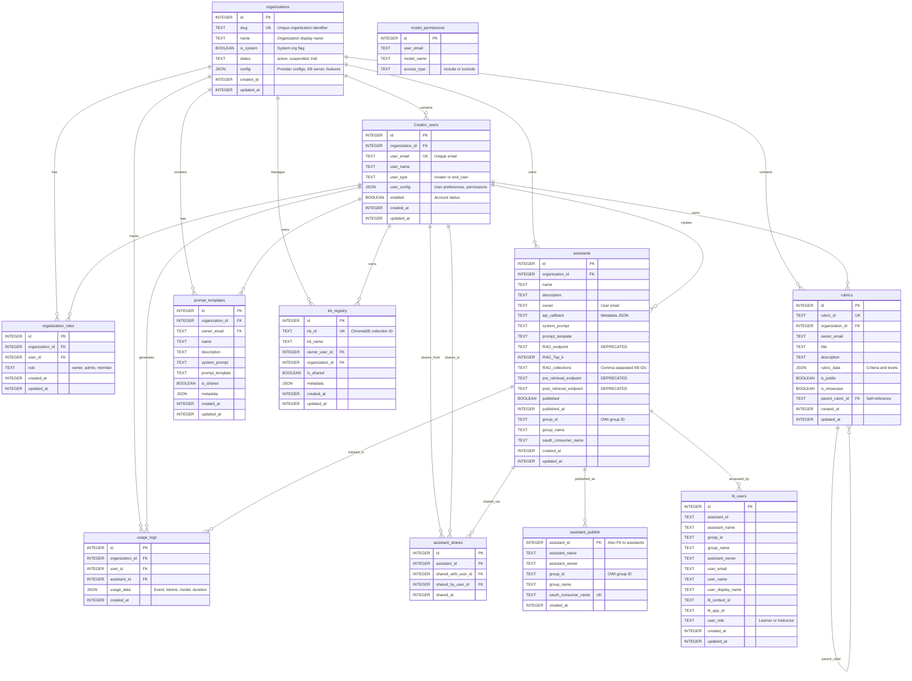

# LAMB Database Entity-Relationship Diagram

**Database:** LAMB Database (`lamb_v4.db`)  
**Type:** SQLite  
**Last Updated:** November 2025

---

## Overview

This diagram shows all tables in the LAMB database and their relationships. The LAMB database contains:

- **Multi-tenancy structures** (organizations, organization_roles)
- **User accounts** (Creator_users)
- **Core features** (assistants, assistant_shares, assistant_publish)
- **Resources** (rubrics, prompt_templates, kb_registry)
- **Tracking** (usage_logs, lti_users, model_permissions)

---

## Entity-Relationship Diagram

https://mermaid.live/edit#pako:eNq9WNtS4zgQ_RWVnw0FgQwhb1wyUyyzQHGp3dpKlUuxO44K2fJKciDD8O_bkp3EF-UCk508pGKrj6Q-fVrdypsXigi8vgfyktFY0mSYEvwIGdOU_aCaiVSRnz_39sRb7WUgBQdF-mToTagaemtgFxKoFjLIFcgCEYpUU5auh1GlmNI01QVGvGywzxWNIeAiLuy1pOHzeoTMR5KFH9hSJkWS6UBDknGq4QPI51EgIUZ_5MyCEpribheY4rtO1NakO2EN9kJjA-shDQJjSEFuBC3WCdSEynJzxc9gjHR9GqzFWmg1dlVpOI2dcduIasasCii-KyS3PMryEWdqYpHlb4iCZdTaWK5ZJUdoGIJSCBnNVkNcmkcIS1dDVnMeBVNG6w7OWXaQniECJwknjEd1UD0B3oqX5nN18zj4NrgnLCJ318vXj4O_H4nieUyernHip5T9m0NtFkTgWmzMQM6XWgBTmgCibqvmEVMY6JkdqwLOb2-_D85uCFOBmimUAwIfih-4HBlzGrfmR650rmxANJuCT1SuMkgjiHyiJaO8ivjj4faG4IEwZjEi7qSY4s5l-Ub55PqcYICnIH0yRsXlcpldVYKKbEW16PZYnkW1sfdV1JeHxWb-569rYLT56rAx-myOWZrMYkWOGOdolLDUJwkko3rIftnDeqbuxjnrgPUMEsp4TYb2TUsU1tiqy_FezzKYH7lC4soE5WI33JKKtV_o5Qmf8KyCMWBqYfb7JAOZMExYkSqXjiGlIw4RQs_CUOSpLtW6U8YrR8gO6XaQF4EKJcsMpDFiVTUnyB0RmrEgpJyP8AREyz9BU_SJWprbOW1zPijKQmOsUSsao_dn3wKMZiYYkj30Lgd394OLs8fBpYtyY_wosuDZMUkoOIewOCKH3oVIErqnAA9VEwhzTlxdqta-URtYkvDUgSnlm_dRYITSHwHNtbWoWW2_KuWsyV4sRZ6ZgOOJ_NdV8YiutHZV2DlEIGiuJyYlVJ60cmx3Wl6UZ4ekl0ZW3Ca7uBIoYaJFJRvaElzgHH4tB62YfwNteIxtZm4FO2VrsH2-1zhzFY6yw3hhuE1XEWnYjWbbWDm9WLZRW7Ye1b1_JKTzoG0bo_USWNafj9SastNxjRsezN0EXh2OmUGaOXZvZy2L-Xeg0hy8WMGuUmyD8xDr2U5rS6V__f_7lI1aLUuy2ZKtHUNvMMW-E_s88QwpluME78rcJ1Eu7eLbUFFz1-KDSlHfVqIrxVHM6BKbvT7MexGWhjyPwPYir_bnfO_vrnZ_y10V5obFp8-0ADYLnF5ppvlW3YGNWLmNMmQXkmnAvpzQNCIcpsDViiuALQGh-3YwES8hVc09lHeepd9fTXV4AD7eW3RtO82P1sV1hx1Yhf5fbM8-1U7V2DaneSOqSdnB7ZDN6oV-S4kjxMrbCGuCrtDLc7Js3VwlGhHupqXge93BtC5kv5Uuz_diySKvj2c--B52FKgSfPQsa0NPT8BcrM3fABGMac61oeEdYRlN_xEimSOxFMYTrz-mXOFTsVr5P-PCxNyl5YW5vXj9o0M7hdd_8169_uGX7v7BUffoS-ek2-mednq-N_P63d7-4elht9c5PjnuHXePT7rvvvfDLnqw3zs5PsVP7witjzoHnff_ALB3cq0 

---

## Key Relationships

### Multi-Tenancy (Organizations)
- **organizations** is the root entity for multi-tenancy
- Each organization contains users, assistants, and resources
- Organizations are isolated from each other
- The "lamb" organization is special (is_system = TRUE)

### User Management
- **Creator_users** belong to organizations
- Users have roles within organizations via **organization_roles**
- Two user types: `creator` (full access) and `end_user` (OWI only)
- Users can be enabled/disabled via the `enabled` flag

### Assistants
- **assistants** are created by users and belong to organizations
- Assistants can be published via **assistant_publish** (LTI integration)
- Assistants can be shared via **assistant_shares** (NEW feature)
- LTI users tracked in **lti_users** table

### Resource Sharing
- **rubrics** support forking via self-reference (parent_rubric_id)
- **prompt_templates** can be shared within organizations
- **kb_registry** tracks Knowledge Base sharing metadata

### Soft References
- `assistants.owner` → email (not FK)
- `rubrics.owner_email` → email (not FK)
- Allows flexibility but requires manual integrity management

---

## Cascade Delete Behavior

**ON DELETE CASCADE:**
- Organization deletion → All org resources deleted
- User deletion → User's assistants, shares, KBs deleted
- Assistant deletion → Shares and publish records deleted

**ON DELETE SET NULL:**
- Parent rubric deletion → Child's parent_rubric_id set to NULL

---

## Legend

- **PK** = Primary Key
- **FK** = Foreign Key
- **UK** = Unique Key
- **||--o{** = One-to-Many relationship
- **Timestamps** = All INTEGER fields storing UNIX timestamps

---

**Related Documentation:**
- [Complete Database Schema](../LAMB_DATABASE_SCHEMA.md)
- [Open WebUI Database](./OpenWebUI_Database_ER_Diagram.md)
- [Simplified Overview](./Relationships_Overview_Diagram.md)

