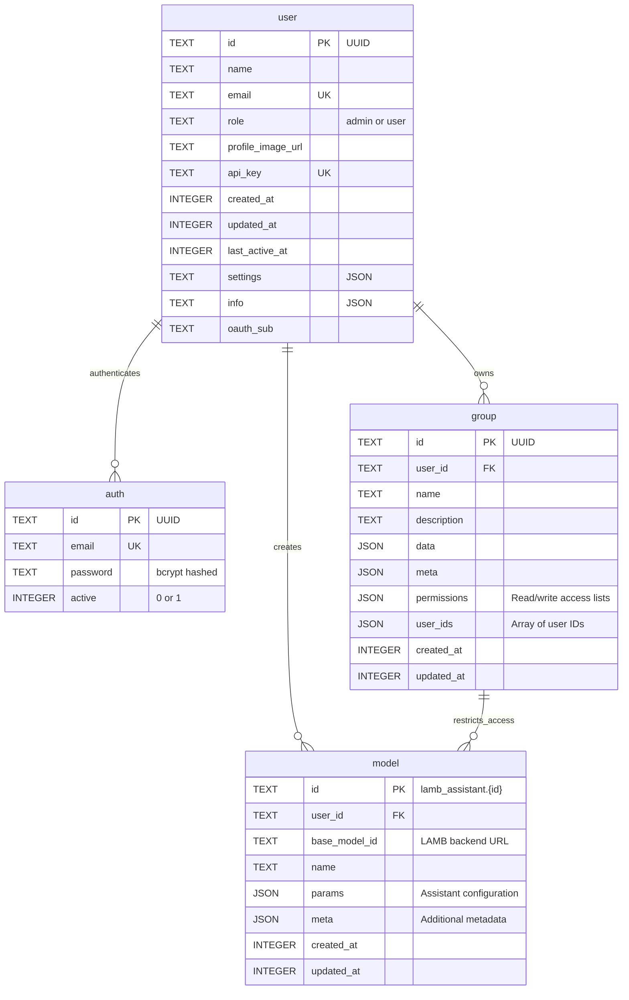

# Open WebUI Database Entity-Relationship Diagram

**Database:** Open WebUI Database (`webui.db`)  
**Type:** SQLite  
**Last Updated:** February 2026

---

## Overview

This diagram shows the Open WebUI database structure. LAMB integrates with Open WebUI for:

- **Chat interface** (models displayed to users)
- **Access control** (groups control who can use which models)
- **Mirror user management** (OWI user records synced from LAMB)

**Note:** This is a separate database from the LAMB database. Integration happens via email-based links and group IDs. Authentication is handled by LAMB natively — OWI mirror users have dummy passwords used only for programmatic chat handoff.

---

## Entity-Relationship Diagram



---

## Key Tables

### user
**Purpose:** User accounts for Open WebUI

**Key Fields:**
- `id` - UUID primary key
- `email` - Unique email (links to LAMB Creator_users)
- `role` - Admin or regular user
- `api_key` - For API access to OWI

**Usage in LAMB:**
- When LAMB creates a Creator_users, it also creates an OWI user
- Email serves as the link between databases
- JWT tokens generated for authenticated sessions

### auth
**Purpose:** Mirror user password storage (dummy passwords)

**Key Fields:**
- `id` - UUID (matches user.id)
- `email` - Unique email
- `password` - bcrypt hashed dummy password (LAMB-generated)
- `active` - Account status

**Post-Auth Migration:**
- Real passwords are stored in LAMB `Creator_users.password_hash`
- OWI auth table contains only LAMB-generated dummy passwords
- Dummy passwords are used by LAMB's OWI Bridge to programmatically obtain OWI JWTs for chat handoff
- Users never interact with OWI passwords directly

### group
**Purpose:** Access control for models (published assistants)

**Key Fields:**
- `id` - UUID primary key
- `user_id` - Group owner
- `permissions` - JSON with read/write access lists
- `user_ids` - JSON array of UUIDs with access

**Usage in LAMB:**
- Published assistants create/update OWI groups
- LAMB stores `group_id` in assistants table
- Assistant sharing updates group membership
- LTI users added to appropriate groups

**Permissions Structure:**
```json
{
  "read": {
    "group_ids": [],
    "user_ids": ["uuid-1", "uuid-2", "uuid-3"]
  },
  "write": {
    "group_ids": [],
    "user_ids": []
  }
}
```

### model
**Purpose:** Published assistants appear as models in OWI

**Key Fields:**
- `id` - Format: `lamb_assistant.{assistant_id}`
- `base_model_id` - LAMB backend URL for completions
- `params` - Assistant configuration
- `meta` - Additional metadata

**Usage in LAMB:**
- When assistant is published, LAMB creates model record
- Model ID format links to LAMB assistant
- Completions routed back to LAMB backend
- Access controlled via groups

---

## Integration with LAMB Database

### Email-Based Links

```
LAMB Database                   ←→   Open WebUI Database
────────────────────────────────────────────────────────
Creator_users.user_email        ←→   user.email
Creator_users.user_email        ←→   auth.email
```

**How it works:**
1. LAMB creates Creator_users with email (password stored in LAMB)
2. LAMB creates corresponding OWI mirror user and auth records (dummy password)
3. Email serves as the primary link
4. Login verified against LAMB `Creator_users.password_hash` (not OWI)
5. LAMB JWT tokens generated by LAMB
6. OWI JWTs obtained on-demand for chat handoff via dummy password

### Group ID Links

```
LAMB Database                   ←→   Open WebUI Database
────────────────────────────────────────────────────────
assistants.group_id             ←→   group.id
assistant_publish.group_id      ←→   group.id
```

**How it works:**
1. LAMB publishes assistant
2. LAMB creates/updates OWI group
3. Group ID stored in LAMB database
4. LAMB manages group membership
5. OWI enforces access control

### Model ID Links

```
LAMB Database                   ←→   Open WebUI Database
────────────────────────────────────────────────────────
assistants.id                   ←→   model.id (as lamb_assistant.{id})
```

**How it works:**
1. LAMB publishes assistant with id=42
2. LAMB creates OWI model with id="lamb_assistant.42"
3. OWI chat interface displays model
4. User sends message to model
5. OWI routes to LAMB backend via base_model_id
6. LAMB processes completion

---

## Data Flow: User Login

```
1. User enters email/password in LAMB frontend
2. LAMB sends credentials to /creator/login endpoint
3. LAMB verifies email exists in Creator_users table
4. LAMB checks user_type and enabled status
5. LAMB verifies password against Creator_users.password_hash (bcrypt)
6. LAMB generates LAMB JWT token
7. LAMB returns token + user info to frontend
8. If creator: Frontend stores LAMB token, shows creator interface
9. If end_user: Frontend redirects to OWI (obtains OWI token via /creator/owi-session)
```

> **Note:** OWI is not involved in the login flow. The OWI bridge is only used when redirecting users to OWI for chat (see Chat Handoff below).

---

## Data Flow: Assistant Publishing

```
1. Creator publishes assistant in LAMB
2. LAMB creates assistant_publish record
3. LAMB creates/updates OWI group
   - Generates group ID
   - Sets permissions
   - Adds creator to group
4. LAMB creates OWI model
   - ID: lamb_assistant.{id}
   - base_model_id: LAMB backend URL
   - params: Assistant config
5. LAMB stores group_id in assistants table
6. Published assistant appears in OWI chat
```

---

## Data Flow: Assistant Sharing

```
1. Creator shares assistant with users
2. LAMB creates assistant_shares records
3. LAMB gets or creates OWI group
4. LAMB adds users to group.user_ids
5. LAMB updates group permissions
6. Shared users can now access assistant in OWI
```

---

## Data Flow: LTI Launch

```
1. Student clicks LTI activity in LMS
2. LMS sends LTI launch POST to LAMB
3. LAMB validates OAuth signature
4. LAMB extracts user info (email, name)
5. LAMB ensures OWI mirror user exists (dummy password)
6. LAMB adds user to assistant's OWI group
7. LAMB generates OWI JWT (via dummy password) for chat redirect
8. LAMB creates lti_users record
9. LAMB redirects to OWI chat with OWI token
10. Student interacts with assistant
```

---

## Security Considerations

### Password Storage
- Real passwords stored in LAMB `Creator_users.password_hash` (bcrypt, cost factor 12)
- OWI auth table contains only LAMB-generated dummy passwords
- Dummy passwords used solely for programmatic OWI JWT acquisition (chat handoff)
- Users never interact with OWI passwords directly

### Token Management
- **LAMB JWTs:** Generated by LAMB for Creator Interface authentication. Validated by LAMB using JWT signature verification.
- **OWI JWTs:** Generated on-demand via OWI bridge (using dummy password) for chat handoff only. Not stored by the frontend; obtained via `GET /creator/owi-session` when navigating to chat.

### Access Control
- Groups enforce model access
- Permissions checked by OWI
- LAMB manages group membership
- User must be in group to access model

### Data Isolation
- Multi-tenancy at LAMB level (organizations)
- No cross-organization data leakage
- Groups isolate assistants
- Email-based linking preserves privacy

---

## Legend

- **PK** = Primary Key
- **FK** = Foreign Key
- **UK** = Unique Key
- **UUID** = Universally Unique Identifier
- **||--o{** = One-to-Many relationship

---

**Related Documentation:**
- [Complete Database Schema](../LAMB_DATABASE_SCHEMA.md)
- [LAMB Database](./LAMB_Database_ER_Diagram.md)
- [Simplified Overview](./Relationships_Overview_Diagram.md)
- [Architecture Documentation](../lamb_architecture.md)

