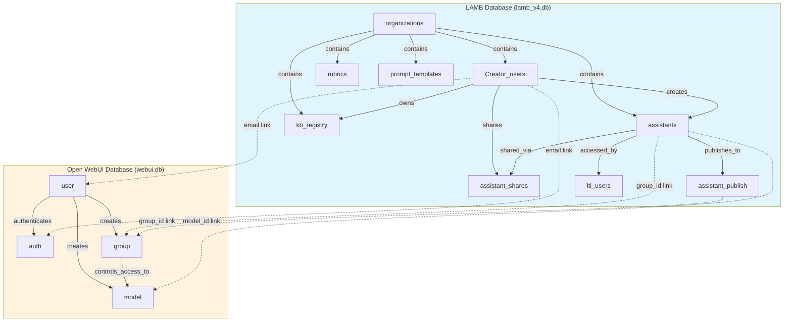

# LAMB System Relationships Overview

**Purpose:** High-level view of database integration  
**Type:** Simplified Architecture Diagram  
**Last Updated:** February 2026

---

## Overview

This diagram provides a simplified view of how the two databases (LAMB and Open WebUI) work together. It shows:

- **Main entity groups** in each database
- **Key relationships** within each database
- **Cross-database links** (shown with dotted lines)

Use this diagram to understand the overall architecture before diving into detailed ER diagrams.

---

## Simplified Relationships Diagram



---

## Entity Groups Explained

### LAMB Database (Blue)

**Multi-Tenancy:**
- `organizations` - Root entity for multi-tenant isolation
- Contains all organization-specific resources

**Users:**
- `Creator_users` - User accounts (creator or end_user types)
- Links to OWI via email

**Core Features:**
- `assistants` - Learning assistant definitions
- `assistant_shares` - Sharing relationships (NEW)
- `assistant_publish` - Publishing metadata for LTI
- `lti_users` - LTI launch tracking

**Resources:**
- `rubrics` - Evaluation criteria
- `prompt_templates` - Reusable prompts
- `kb_registry` - Knowledge Base metadata

### Open WebUI Database (Orange)

**Mirror Users & Chat:**
- `user` - Mirror user accounts (UUID-based, synced from LAMB)
- `auth` - Dummy password storage (LAMB-generated, for chat handoff)

**Access Control:**
- `group` - User groups for model access
- Controls who can use which assistants

**Models:**
- `model` - Published assistants as chat models
- Format: `lamb_assistant.{id}`

---

## Cross-Database Integration (Dotted Lines)

### 1. Email Links (Users ↔ User/Auth)

**Link:** `Creator_users.user_email` ↔ `user.email` / `auth.email`

**Purpose:**
- Mirror user synchronization
- Chat handoff (OWI JWT via dummy password)

**Flow:**
1. LAMB creates Creator_users (with password_hash)
2. LAMB creates OWI mirror user + auth (dummy password)
3. Login verified against LAMB Creator_users.password_hash (not OWI)
4. Email links the records for chat handoff

### 2. Group Links (Assistants ↔ Group)

**Link:** `assistants.group_id` / `assistant_publish.group_id` ↔ `group.id`

**Purpose:**
- Access control for published assistants
- Manage who can use assistants
- Sharing synchronization

**Flow:**
1. LAMB publishes assistant
2. LAMB creates/updates OWI group
3. Group ID stored in LAMB
4. LAMB manages group membership
5. OWI enforces access

### 3. Model Links (Assistants ↔ Model)

**Link:** `assistants.id` ↔ `model.id` (as `lamb_assistant.{id}`)

**Purpose:**
- Display assistants in OWI chat
- Route completions to LAMB backend
- Model configuration

**Flow:**
1. LAMB publishes assistant
2. LAMB creates OWI model
3. Model appears in chat UI
4. Completions routed to LAMB

---

## Key Workflows

### Workflow 1: User Creation

```
Admin creates user
    ↓
LAMB creates Creator_users record (with password_hash)
    ↓
LAMB creates OWI mirror user record (via email)
    ↓
LAMB creates OWI auth record (with dummy password)
    ↓
User can login (verified against LAMB)
```

### Workflow 2: Assistant Publishing

```
Creator creates assistant in LAMB
    ↓
LAMB stores in assistants table
    ↓
Creator clicks "Publish"
    ↓
LAMB creates assistant_publish record
    ↓
LAMB creates/updates OWI group
    ↓
LAMB creates OWI model
    ↓
Assistant appears in OWI chat
```

### Workflow 3: Assistant Sharing

```
Owner shares assistant with users
    ↓
LAMB creates assistant_shares records
    ↓
LAMB adds users to OWI group
    ↓
LAMB updates group permissions
    ↓
Shared users can access in OWI
```

### Workflow 4: LTI Launch

```
Student clicks LTI activity in LMS
    ↓
LMS sends LTI launch to LAMB
    ↓
LAMB validates OAuth signature
    ↓
LAMB ensures OWI mirror user exists (dummy password)
    ↓
LAMB adds user to assistant's group
    ↓
LAMB creates lti_users record
    ↓
LAMB generates OWI JWT (via dummy password)
    ↓
LAMB redirects to OWI with OWI token
    ↓
Student chats with assistant
```

### Workflow 5: Completion Request

```
User sends message in OWI chat
    ↓
OWI checks group membership (access control)
    ↓
OWI routes to model.base_model_id (LAMB backend)
    ↓
LAMB loads assistant config
    ↓
LAMB executes RAG (if configured)
    ↓
LAMB calls LLM connector (OpenAI, Ollama, etc.)
    ↓
LAMB streams response back to OWI
    ↓
User sees response in chat
```

---

## Database Characteristics

### LAMB Database
- **Type:** SQLite
- **Location:** `$LAMB_DB_PATH/lamb_v4.db`
- **Tables:** 12 main tables
- **Purpose:** Configuration, metadata, business logic
- **Managed by:** LAMB backend
- **Access:** Python ORM (SQLModel/SQLAlchemy)

### Open WebUI Database
- **Type:** SQLite
- **Location:** `$OWI_PATH/webui.db`
- **Tables:** 4 main tables (user, auth, group, model)
- **Purpose:** Authentication, chat interface, access control
- **Managed by:** Open WebUI + LAMB bridge
- **Access:** Python ORM (Open WebUI's models)

---

## Integration Architecture

```
┌─────────────────────────────────────────────────────────────┐
│                      LAMB Platform                          │
├─────────────────────────────────────────────────────────────┤
│                                                             │
│  ┌──────────────┐        ┌──────────────┐                 │
│  │   Frontend   │◄──────►│   Backend    │                 │
│  │   (Svelte)   │        │   (FastAPI)  │                 │
│  └──────────────┘        └───────┬──────┘                 │
│                                  │                          │
│                      ┌───────────┼───────────┐             │
│                      │           │           │             │
│                      ▼           ▼           ▼             │
│              ┌─────────┐  ┌─────────┐  ┌─────────┐        │
│              │  LAMB   │  │   OWI   │  │   OWI   │        │
│              │   DB    │  │ Bridge  │  │  WebUI  │        │
│              └─────────┘  └─────────┘  └────┬────┘        │
│                                              │             │
│                                              ▼             │
│                                         ┌─────────┐        │
│                                         │   OWI   │        │
│                                         │   DB    │        │
│                                         └─────────┘        │
└─────────────────────────────────────────────────────────────┘
```

### OWI Bridge
**Purpose:** Chat integration layer between LAMB and Open WebUI (authentication is handled by LAMB natively)

**Components:**
- `OwiDatabaseManager` - Direct DB access
- `OwiUserManager` - Mirror user management, chat handoff tokens
- `OwiGroupManager` - Group operations
- `OwiModelManager` - Model operations

**Location:** `/backend/lamb/owi_bridge/`

---

## Design Principles

### 1. Separation of Concerns
- **LAMB DB** = Configuration, metadata, and authentication
- **OWI DB** = Chat UI, mirror users, and access control
- Clear boundaries between systems

### 2. Loose Coupling
- Email-based linking (not hard FKs)
- Text-based group_id references
- Allows independent evolution

### 3. Synchronized State
- LAMB manages group membership
- OWI enforces access control
- Sanity checks available for verification

### 4. Privacy-First
- Multi-tenant isolation (organizations)
- Group-based access control
- No cross-organization leakage

### 5. Extensibility
- Plugin architecture for LLM connectors
- JSON config fields for flexibility
- Easy to add new providers/features

---

## Common Operations

### Check User Access to Assistant

```python
# 1. Check LAMB database
assistant = db.get_assistant_by_id(assistant_id)
is_owner = assistant.owner == user_email
is_shared = db.is_assistant_shared_with_user(assistant_id, user_id)

# 2. Check OWI database
group = owi_db.get_group(assistant.group_id)
is_in_group = user.id in group.user_ids

# Result: User can access if owner OR shared OR in group
can_access = is_owner or is_shared or is_in_group
```

### Sync Sharing to OWI

```python
# 1. Get current shares from LAMB
shares = db.get_assistant_shares(assistant_id)
user_emails = [share['user_email'] for share in shares]

# 2. Get or create OWI group
group = owi_group.get_or_create_group(assistant.group_id)

# 3. Get OWI user IDs
user_ids = [owi_user.get_user_by_email(email).id for email in user_emails]

# 4. Update group
owi_group.update_group_users(group.id, user_ids)
```

---

## Troubleshooting

### Issue: User can't access published assistant

**Check:**
1. Is assistant published? (`assistants.published = TRUE`)
2. Does OWI group exist? (Check `group` table)
3. Is user in group? (Check `group.user_ids` JSON)
4. Is LAMB group_id correct? (Match `assistants.group_id` to `group.id`)

### Issue: Login fails

**Check:**
1. Does Creator_users record exist?
2. Does Creator_users.password_hash contain a valid bcrypt hash?
3. Is user enabled? (`Creator_users.enabled = 1`)
4. Is `LAMB_JWT_SECRET` configured?

### Issue: Chat handoff to OWI fails

**Check:**
1. Does OWI mirror user exist with same email?
2. Does OWI auth record have a dummy password?
3. Is OWI reachable at `OWI_BASE_URL`?
4. Can LAMB authenticate with the dummy password?

### Issue: Sharing not working

**Check:**
1. Does assistant_shares record exist?
2. Is organization sharing enabled? (`config.features.sharing_enabled`)
3. Does user have can_share permission? (`user_config.can_share`)
4. Is OWI group updated? (Check `group.user_ids`)

---

## Legend

- **Solid lines** → Direct relationships within database
- **Dotted lines** → Cross-database integration links
- **Blue background** → LAMB database entities
- **Orange background** → Open WebUI database entities

---

## Related Documentation

- [Complete Database Schema](../LAMB_DATABASE_SCHEMA.md)
- [LAMB Database Details](./LAMB_Database_ER_Diagram.md)
- [Open WebUI Database Details](./OpenWebUI_Database_ER_Diagram.md)
- [Architecture Documentation](../lamb_architecture.md)
- [Assistant Sharing Implementation](../ASSISTANT_SHARING_IMPLEMENTATION.md)

---

**Quick Links:**
- [Product Requirements](../prd.md)
- [Installation Guide](../installationguide.md)
- [API Reference](../lamb_architecture.md#18-api-reference)

