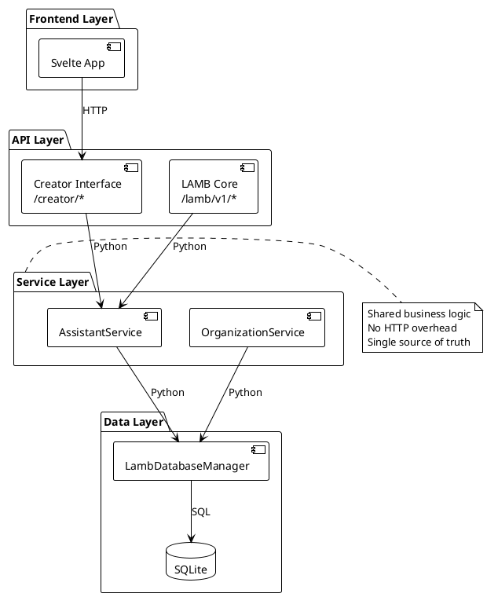

# 📚 LAMB Internal API Documentation - Implementation Proposal

**Version:** 1.0  
**Date:** December 23, 2025  
**Author:** System Architecture Team  
**Status:** Proposed

---

## Executive Summary

This document proposes a comprehensive documentation strategy for LAMB's internal APIs. As LAMB transitions from a dual HTTP-layer architecture to a service-oriented architecture, proper documentation becomes critical for:
- **Maintainability:** Understanding code relationships and dependencies
- **Developer Onboarding:** Reducing time-to-productivity for new developers
- **AI Agent Assistance:** Enabling LLMs to understand and modify the codebase
- **Plugin Development:** Clear contracts for extending LAMB functionality

---

## Table of Contents

1. [Documentation Structure](#1-documentation-structure)
2. [Documentation Formats by API Type](#2-documentation-formats-by-api-type)
3. [Documentation Generation Strategy](#3-documentation-generation-strategy)
4. [Documentation Audiences](#4-documentation-audiences)
5. [Interactive Documentation](#5-interactive-documentation)
6. [Maintenance Strategy](#6-maintenance-strategy)
7. [Specific Documentation Files](#7-specific-documentation-files-to-create)
8. [Tooling Recommendations](#8-tooling-recommendations)
9. [Example Documentation Structure](#9-example-documentation-structure)
10. [Phased Rollout Plan](#10-phased-rollout-plan)
11. [Success Metrics](#11-success-metrics)
12. [Recommendation](#12-recommendation)

---

## 1. DOCUMENTATION STRUCTURE

### Three-Tier Documentation Approach

```
Documentation/internal-apis/
├── 00-README.md                      # Navigation guide
├── 01-architecture-overview.md       # High-level system design
├── http-apis/                        # REST endpoints
│   ├── creator-interface-api.md      # /creator/* (frontend-facing)
│   ├── lamb-core-api.md              # /lamb/v1/* (internal/external)
│   └── openapi/                      # Auto-generated specs
│       ├── creator-interface.yaml
│       └── lamb-core.yaml
├── service-layer/                    # Python service APIs
│   ├── assistant-service.md          # AssistantService methods
│   ├── organization-service.md       # OrganizationService methods
│   ├── auth-service.md               # Authentication/authorization
│   └── examples/                     # Code examples
│       ├── creating-assistant.py
│       └── querying-assistant.py
├── plugin-interfaces/                # Plugin development
│   ├── rag-processor-interface.md    # RAG plugin contract
│   ├── pps-interface.md              # Prompt processor contract
│   ├── connector-interface.md        # LLM connector contract
│   └── plugin-examples/
│       ├── custom-rag-example.py
│       └── custom-connector-example.py
├── database-layer/                   # Direct DB access
│   ├── database-manager-api.md       # LambDatabaseManager methods
│   ├── schema-reference.md           # Table structures
│   └── migration-guide.md            # Schema changes
└── migration-guides/                 # Transition docs
    ├── from-http-to-service.md       # Moving from HTTP calls to services
    ├── deprecation-notices.md        # What's being removed
    └── breaking-changes.md           # Version-specific changes
```

### Rationale

- **Separation by Concern:** HTTP APIs, services, plugins, database each have distinct audiences
- **Hierarchy:** Move from high-level (HTTP) to low-level (database)
- **Examples Embedded:** Code examples live alongside API documentation
- **Migration Guides:** Smooth transition as architecture evolves

---

## 2. DOCUMENTATION FORMATS BY API TYPE

### A. HTTP REST APIs → OpenAPI (Swagger)

**Goal:** Auto-generate from code, keep in sync

**Tools:**
- Use FastAPI's built-in OpenAPI generation
- Enhance with detailed docstrings
- Generate static documentation

**Structure:**
```yaml
# Example: creator-interface-api.yaml
openapi: 3.0.0
info:
  title: "LAMB Creator Interface API"
  description: "Frontend-facing API for assistant management"
  version: "1.0.0"
  contact:
    name: "LAMB Development Team"
    email: "dev@lamb-project.org"
servers:
  - url: http://localhost:9099/creator
    description: Local development
  - url: https://lamb.example.edu/creator
    description: Production server
paths:
  /creator/assistant/create:
    post:
      summary: "Create a new assistant"
      description: |
        Creates an assistant and returns its ID.
        
        This endpoint validates the assistant name, creates the database record,
        and optionally publishes to OWI for LTI access.
      operationId: "createAssistant"
      tags: ["Assistants"]
      security:
        - bearerAuth: []
      requestBody:
        required: true
        content:
          application/json:
            schema:
              $ref: '#/components/schemas/AssistantCreate'
            examples:
              basicAssistant:
                value:
                  name: "math_tutor"
                  description: "A helpful mathematics tutor"
                  system_prompt: "You are a knowledgeable math tutor."
      responses:
        '201':
          description: Assistant created successfully
          content:
            application/json:
              schema:
                type: object
                properties:
                  assistant_id:
                    type: integer
                    example: 123
        '400':
          description: Invalid request (e.g., invalid name)
        '401':
          description: Unauthorized
        '409':
          description: Assistant name already exists
```

**Benefits:**
- Auto-generated from code
- Interactive testing (Swagger UI)
- Client SDK generation
- Always in sync with implementation

---

### B. Service Layer → Python Docstrings + Sphinx/MkDocs

**Goal:** Comprehensive Python API reference

**Format - Google Style Docstrings:**
```python
class AssistantService:
    """
    Service for assistant-related operations.
    
    This service is used by:
        * Creator Interface (/creator/assistant/*)
        * Completions Pipeline (/v1/chat/completions)
        * MCP endpoints (/v1/mcp/*)
    
    The service encapsulates all business logic related to assistants,
    providing a consistent interface for CRUD operations, validation,
    and permission checking.
    
    Examples:
        Basic usage::
        
            >>> service = AssistantService()
            >>> assistant = service.get_assistant_by_id(123)
            >>> if assistant:
            ...     print(f"Found: {assistant.name}")
            Found: Math Tutor
        
        Creating an assistant::
        
            >>> from lamb.lamb_classes import Assistant
            >>> new_assistant = Assistant(
            ...     name="science_helper",
            ...     description="Science tutor",
            ...     owner="teacher@school.edu",
            ...     system_prompt="You are a science tutor."
            ... )
            >>> assistant_id = service.create_assistant(new_assistant)
            >>> print(f"Created assistant {assistant_id}")
            Created assistant 124
    
    Attributes:
        db_manager (LambDatabaseManager): Database access layer
    
    Note:
        All methods that modify data check ownership permissions
        before allowing operations.
    """
    
    def __init__(self):
        """Initialize the service with database manager."""
        self.db_manager = LambDatabaseManager()
    
    def get_assistant_by_id(self, assistant_id: int) -> Optional[Assistant]:
        """
        Retrieve an assistant by ID.
        
        This is the primary method for fetching assistant data throughout
        the system. It returns the full Assistant object with all fields
        populated from the database.
        
        Args:
            assistant_id (int): The unique assistant identifier. Must be
                a positive integer.
            
        Returns:
            Optional[Assistant]: Assistant object if found with all fields
                populated (name, description, owner, metadata, etc.), or
                None if the assistant doesn't exist.
            
        Raises:
            ValueError: If assistant_id is negative or zero
            
        Examples:
            Simple retrieval::
            
                >>> service = AssistantService()
                >>> assistant = service.get_assistant_by_id(1)
                >>> print(assistant.name)
                'Math Tutor'
                >>> print(assistant.owner)
                'teacher@school.edu'
            
            Handling not found::
            
                >>> assistant = service.get_assistant_by_id(9999)
                >>> if assistant is None:
                ...     print("Assistant not found")
                Assistant not found
            
        Used By:
            * ``/v1/chat/completions`` - Completion pipeline (line 140)
            * ``/creator/assistant/{id}`` - Frontend retrieval
            * ``/v1/mcp/prompts/get/{name}`` - MCP protocol
            * Plugin system - Metadata parsing
            
        See Also:
            :meth:`get_assistant_by_name`: Search by name and owner
            :meth:`get_assistants_by_owner`: Get all for specific user
            :meth:`get_assistant_by_id_with_publication`: Include publication status
            
        Note:
            This method does NOT check ownership permissions. Use
            :meth:`check_ownership` before allowing modifications.
        """
        if assistant_id <= 0:
            raise ValueError(f"Invalid assistant_id: {assistant_id}")
        return self.db_manager.get_assistant_by_id(assistant_id)
```

**Generation:**
```bash
# Auto-generate from docstrings
sphinx-apidoc -o docs/source backend/lamb/services
sphinx-build -b html docs/source docs/build

# Or with MkDocs
mkdocs build
```

---

### C. Plugin Interfaces → Contract Documentation

**Goal:** Clear interface contracts for plugin developers

**Structure:**
```markdown
# RAG Processor Interface

## Overview

RAG (Retrieval-Augmented Generation) processors retrieve relevant context
from knowledge bases to augment LLM prompts.

**Purpose:** Inject domain-specific knowledge into completions  
**Called By:** Completion pipeline (`/v1/chat/completions`)  
**When:** Before prompt processing, after message validation  
**Location:** `backend/lamb/completions/rag/`

---

## Function Signature

### Sync Version
```python
def rag_processor(
    messages: List[Dict[str, str]], 
    assistant: Assistant,
    request: Dict[str, Any]
) -> Dict[str, Any]:
    """
    Process RAG context for completion.
    
    Args:
        messages: Conversation history in OpenAI format
            [{"role": "user", "content": "..."}]
        assistant: Assistant configuration object with
            RAG_collections, RAG_endpoint, metadata
        request: Original completion request with all parameters
        
    Returns:
        {
            "context": str,       # Retrieved text (required)
            "sources": List[str], # Source identifiers (optional)
            "metadata": Dict      # Additional data (optional)
        }
    """
```

### Async Version (Preferred)
```python
async def rag_processor(
    messages: List[Dict[str, str]], 
    assistant: Assistant,
    request: Dict[str, Any]
) -> Dict[str, Any]:
    """Same as sync but with async/await support."""
```

---

## Contract Requirements

### Must Implement
- ✅ Return dict with `"context"` key (string)
- ✅ Handle empty message list gracefully
- ✅ Handle missing assistant.RAG_collections gracefully
- ✅ Log errors instead of raising exceptions (use logger)

### Should Implement
- ⚠️ Return `"sources"` list for citation
- ⚠️ Include `"metadata"` for debugging
- ⚠️ Support async (future-proofing)

### Must Not
- ❌ Modify the `messages` list (read-only)
- ❌ Modify the `assistant` object (read-only)
- ❌ Make blocking I/O calls (use async)
- ❌ Raise exceptions on retrieval failures

---

## Loading Mechanism

Plugins are loaded dynamically at startup:

```python
# In lamb/completions/main.py
def load_plugins(plugin_type: str) -> Dict[str, Any]:
    """Load all plugins of given type."""
    plugin_dir = os.path.join(os.path.dirname(__file__), plugin_type)
    
    for plugin_file in glob.glob(os.path.join(plugin_dir, "*.py")):
        module = importlib.import_module(f"lamb.completions.{plugin_type}.{module_name}")
        if hasattr(module, 'rag_processor'):
            plugins[module_name] = module.rag_processor
```

**File Naming:** Plugin file name becomes the plugin name
- File: `simple_rag.py` → Plugin name: `"simple_rag"`

---

## Configuration

Plugins receive configuration via `assistant.metadata`:

```json
{
  "plugins": {
    "rag": {
      "name": "simple_rag",
      "config": {
        "kb_ids": ["kb_123", "kb_456"],
        "top_k": 5,
        "similarity_threshold": 0.7
      }
    }
  }
}
```

Access in plugin:
```python
def rag_processor(messages, assistant, request):
    # Parse metadata
    metadata = json.loads(assistant.metadata)
    rag_config = metadata.get("plugins", {}).get("rag", {}).get("config", {})
    
    kb_ids = rag_config.get("kb_ids", [])
    top_k = rag_config.get("top_k", 5)
    # ...
```

---

## Example Implementation

```python
# backend/lamb/completions/rag/custom_rag.py
import logging
from typing import List, Dict, Any
from lamb.lamb_classes import Assistant

logger = logging.getLogger(__name__)

async def rag_processor(
    messages: List[Dict[str, str]], 
    assistant: Assistant,
    request: Dict[str, Any]
) -> Dict[str, Any]:
    """
    Custom RAG processor with fallback handling.
    """
    try:
        # Extract last user message
        if not messages:
            logger.warning("No messages provided to RAG processor")
            return {"context": "", "sources": []}
        
        last_message = messages[-1].get("content", "")
        
        # Parse configuration
        import json
        metadata = json.loads(assistant.metadata or "{}")
        rag_config = metadata.get("plugins", {}).get("rag", {}).get("config", {})
        kb_ids = rag_config.get("kb_ids", [])
        
        if not kb_ids:
            logger.info(f"No knowledge bases configured for assistant {assistant.id}")
            return {"context": "", "sources": []}
        
        # Query knowledge bases
        context_parts = []
        sources = []
        
        for kb_id in kb_ids:
            results = await query_knowledge_base(kb_id, last_message)
            if results:
                context_parts.append(results["text"])
                sources.extend(results.get("sources", []))
        
        return {
            "context": "\n\n".join(context_parts),
            "sources": sources,
            "metadata": {
                "kb_count": len(kb_ids),
                "chunk_count": len(context_parts)
            }
        }
    
    except Exception as e:
        logger.error(f"RAG processor error: {e}", exc_info=True)
        # Return empty context on error (don't break completion)
        return {"context": "", "sources": [], "error": str(e)}
```

---

## Testing Your Plugin

```python
# tests/test_custom_rag.py
import pytest
from lamb.completions.rag.custom_rag import rag_processor
from lamb.lamb_classes import Assistant

@pytest.mark.asyncio
async def test_rag_with_valid_messages():
    """Test RAG processor with valid input."""
    messages = [
        {"role": "user", "content": "What is photosynthesis?"}
    ]
    
    assistant = Assistant(
        id=1,
        name="test",
        owner="test@example.com",
        metadata='{"plugins":{"rag":{"config":{"kb_ids":["kb_1"]}}}}',
        description="",
        api_callback="",
        system_prompt="",
        prompt_template=""
    )
    
    result = await rag_processor(messages, assistant, {})
    
    assert "context" in result
    assert isinstance(result["context"], str)
    assert "sources" in result

@pytest.mark.asyncio
async def test_rag_with_empty_messages():
    """Test RAG processor handles empty messages."""
    result = await rag_processor([], Assistant(...), {})
    assert result["context"] == ""
```

---

## Debugging

Enable debug logging for your plugin:

```python
# In your plugin
import logging
logger = logging.getLogger(__name__)
logger.setLevel(logging.DEBUG)

def rag_processor(...):
    logger.debug(f"RAG processor called with {len(messages)} messages")
    logger.debug(f"Assistant: {assistant.name} (ID: {assistant.id})")
    # ...
```

View logs:
```bash
# Backend logs
tail -f backend/logs/lamb.log | grep "custom_rag"
```

---

## See Also

- [Prompt Processor Interface](./pps-interface.md)
- [Connector Interface](./connector-interface.md)
- [Plugin Configuration Guide](../service-layer/plugin-configuration.md)
- [Example: Context-Aware RAG](../plugin-examples/context-aware-rag.md)
```

---

## 3. DOCUMENTATION GENERATION STRATEGY

### Auto-Generation (Preferred)

**Philosophy:** Documentation should be generated from code, not maintained separately.

#### Sphinx Configuration

```python
# docs/source/conf.py
import os
import sys
sys.path.insert(0, os.path.abspath('../../backend'))

project = 'LAMB Internal APIs'
copyright = '2025, LAMB Project'
author = 'LAMB Development Team'

extensions = [
    'sphinx.ext.autodoc',           # Auto-generate from docstrings
    'sphinx.ext.napoleon',          # Google/NumPy style docstrings
    'sphinx.ext.viewcode',          # Link to source code
    'sphinx.ext.intersphinx',       # Link to other docs (Python, FastAPI)
    'sphinx.ext.autosummary',       # Generate summary tables
    'sphinxcontrib.openapi',        # Embed OpenAPI specs
    'sphinx_copybutton',            # Copy code button
    'sphinx_tabs.tabs',             # Tabbed content
    'myst_parser',                  # Markdown support
]

# Napoleon settings (for Google-style docstrings)
napoleon_google_docstring = True
napoleon_numpy_docstring = False
napoleon_include_init_with_doc = True
napoleon_include_private_with_doc = False

# Autodoc settings
autodoc_default_options = {
    'members': True,
    'member-order': 'bysource',
    'special-members': '__init__',
    'undoc-members': True,
    'exclude-members': '__weakref__'
}

# Intersphinx mapping (link to external docs)
intersphinx_mapping = {
    'python': ('https://docs.python.org/3', None),
    'fastapi': ('https://fastapi.tiangolo.com', None),
}
```

#### Build Command
```bash
# Generate all documentation
make docs

# Which runs:
# 1. Extract OpenAPI specs from FastAPI
python scripts/generate_openapi.py

# 2. Generate Python API docs from docstrings
sphinx-apidoc -f -o docs/source/api backend/lamb/services

# 3. Build HTML documentation
sphinx-build -b html docs/source docs/build

# 4. Build PDF (optional)
sphinx-build -b latex docs/source docs/build/latex
cd docs/build/latex && make

# 5. Check for broken links
sphinx-build -b linkcheck docs/source docs/build/linkcheck
```

---

### Manual Documentation (For Context)

**Topics Requiring Manual Docs:**
1. **Architecture decisions** (why dual-API, why service layer)
2. **Data flow diagrams** (request→response paths)
3. **Security model** (authentication, authorization)
4. **Migration guides** (upgrading between versions)
5. **Best practices** (when to use services vs HTTP)
6. **Troubleshooting** (common errors, debugging)

**Format:** Markdown with Mermaid diagrams, stored in `Documentation/internal-apis/`

---

## 4. DOCUMENTATION AUDIENCES

### Audience-Specific Documentation Paths

```
Documentation/internal-apis/
├── for-frontend-developers/          # React/Svelte devs
│   ├── README.md                     # Start here
│   ├── creator-api-quickstart.md     # POST /creator/assistant/create
│   ├── authentication-guide.md       # Bearer tokens, refresh flow
│   ├── error-handling.md             # Status codes, error format
│   ├── async-patterns.md             # Handling streaming responses
│   └── examples/
│       ├── create-assistant.js       # Complete example
│       ├── query-assistant.js        # Completion request
│       └── handle-errors.js          # Error handling
│
├── for-backend-developers/           # Python devs
│   ├── README.md                     # Start here
│   ├── service-layer-guide.md        # Using AssistantService
│   ├── adding-new-features.md        # Where to add code
│   ├── testing-guide.md              # Unit/integration tests
│   ├── database-patterns.md          # Transaction, migrations
│   └── examples/
│       ├── add-service-method.py     # Extend service
│       ├── add-endpoint.py           # Add new endpoint
│       └── write-tests.py            # Test patterns
│
├── for-plugin-developers/            # Plugin authors
│   ├── README.md                     # Start here
│   ├── rag-plugin-tutorial.md        # Step-by-step RAG plugin
│   ├── connector-tutorial.md         # Custom LLM connectors
│   ├── pps-tutorial.md               # Prompt processors
│   ├── plugin-registry.md            # List of available plugins
│   └── examples/
│       ├── simple-rag-plugin.py      # Basic RAG
│       ├── custom-connector.py       # Custom LLM
│       └── plugin-tests.py           # Testing plugins
│
└── for-ai-agents/                    # LLMs/AI assistants
    ├── README.md                     # Start here (condensed)
    ├── api-reference-condensed.md    # High-level overview
    ├── code-navigation-guide.md      # Where to find what
    ├── common-modifications.md       # Frequent changes
    └── architecture-patterns.md      # Design decisions
```

### Audience Characteristics

| Audience | Knowledge Level | Primary Need | Doc Format |
|----------|----------------|--------------|------------|
| Frontend Devs | JavaScript/TypeScript | REST API usage | OpenAPI + Examples |
| Backend Devs | Python | Service layer API | Sphinx + Notebooks |
| Plugin Devs | Python (varied) | Interface contracts | Tutorials + Examples |
| AI Agents | Code understanding | Navigation + Context | Condensed + Diagrams |
| DevOps | Deployment | Configuration | Guides + Scripts |
| Architects | System design | Decisions + Patterns | ADRs + Diagrams |

---

## 5. INTERACTIVE DOCUMENTATION

### A. Swagger UI for HTTP APIs

**Automatic with FastAPI:**
```python
# In backend/main.py or backend/lamb/main.py
from fastapi import FastAPI
from fastapi.openapi.utils import get_openapi

app = FastAPI(
    title="LAMB Internal APIs",
    description="Complete API reference for LAMB system",
    version="1.0.0",
    docs_url="/docs",           # Swagger UI at /docs
    redoc_url="/redoc",         # ReDoc at /redoc
    openapi_url="/openapi.json" # OpenAPI spec at /openapi.json
)

def custom_openapi():
    """Customize OpenAPI schema with additional info."""
    if app.openapi_schema:
        return app.openapi_schema
    
    openapi_schema = get_openapi(
        title="LAMB Internal APIs",
        version="1.0.0",
        description="""
        ## LAMB API Reference
        
        LAMB provides three main API layers:
        - **Creator Interface** (`/creator/*`): Frontend-facing APIs
        - **Core API** (`/lamb/v1/*`): Internal and external integrations
        - **OpenAI-Compatible** (`/v1/chat/completions`): Standard LLM API
        
        ### Authentication
        All endpoints require Bearer token authentication:
        ```
        Authorization: Bearer YOUR_TOKEN_HERE
        ```
        
        ### Rate Limits
        - 100 requests/minute for most endpoints
        - 10 requests/minute for completion endpoints
        """,
        routes=app.routes,
        tags=[
            {"name": "Assistants", "description": "Assistant management operations"},
            {"name": "Completions", "description": "LLM completion generation"},
            {"name": "Organizations", "description": "Multi-tenant organization management"},
            {"name": "Knowledge Bases", "description": "RAG knowledge base operations"},
        ]
    )
    
    # Add security scheme
    openapi_schema["components"]["securitySchemes"] = {
        "bearerAuth": {
            "type": "http",
            "scheme": "bearer",
            "bearerFormat": "JWT"
        }
    }
    
    app.openapi_schema = openapi_schema
    return app.openapi_schema

app.openapi = custom_openapi

# Access at:
# - Swagger UI: http://localhost:9099/docs
# - ReDoc: http://localhost:9099/redoc
# - OpenAPI JSON: http://localhost:9099/openapi.json
```

**Benefits:**
- Interactive API testing in browser
- No Postman/curl needed for exploration
- Real-time request/response examples
- Authentication testing

---

### B. Jupyter Notebooks for Examples

**Structure:**
```
Documentation/internal-apis/notebooks/
├── README.md                         # How to use notebooks
├── 01-getting-started.ipynb          # Setup and first API call
├── 02-creating-assistants.ipynb      # Interactive tutorial
├── 03-plugin-development.ipynb       # Build a plugin step-by-step
├── 04-rag-integration.ipynb          # RAG workflow walkthrough
├── 05-migration-examples.ipynb       # Upgrade patterns
├── 06-performance-tuning.ipynb       # Optimization techniques
└── requirements.txt                  # Notebook dependencies
```

**Example Notebook:**
```python
# 02-creating-assistants.ipynb

# Cell 1: Setup
"""
# Creating Your First LAMB Assistant

This notebook walks through creating an assistant using the service layer.

**What you'll learn:**
- Initialize AssistantService
- Create an assistant
- Validate names
- Handle errors
"""

# Cell 2: Import and Setup
from lamb.services import AssistantService
from lamb.lamb_classes import Assistant

service = AssistantService()
print("✅ Service initialized")

# Cell 3: Create Simple Assistant
assistant = Assistant(
    name="demo_tutor",
    description="A demonstration tutor",
    owner="demo@example.com",
    system_prompt="You are a helpful tutor.",
    prompt_template="User: {user_input}\n\nAssistant:",
    api_callback="",  # Will use defaults
)

assistant_id = service.create_assistant(assistant)
print(f"✅ Created assistant with ID: {assistant_id}")

# Cell 4: Retrieve and Display
retrieved = service.get_assistant_by_id(assistant_id)
print(f"Name: {retrieved.name}")
print(f"Owner: {retrieved.owner}")
print(f"Description: {retrieved.description}")

# Cell 5: Try Invalid Name (demonstrates validation)
try:
    invalid = Assistant(
        name="invalid name with spaces",  # ❌ Will fail
        description="Test",
        owner="demo@example.com",
        system_prompt="",
        prompt_template="",
        api_callback=""
    )
    service.create_assistant(invalid)
except Exception as e:
    print(f"❌ Validation error (expected): {e}")

# Cell 6: Cleanup
service.delete_assistant(assistant_id, "demo@example.com")
print("✅ Cleanup complete")
```

**Benefits:**
- Runnable, interactive examples
- Visual outputs
- Can experiment with parameters
- Validated in CI (notebooks should run successfully)

---

## 6. MAINTENANCE STRATEGY

### Automated Validation

```yaml
# .github/workflows/docs-validation.yml
name: Validate Documentation

on: 
  push:
    branches: [main, develop]
  pull_request:
    paths:
      - 'backend/**/*.py'
      - 'Documentation/**/*.md'
      - 'docs/**'

jobs:
  validate-docs:
    runs-on: ubuntu-latest
    
    steps:
      - uses: actions/checkout@v3
      
      - name: Set up Python
        uses: actions/setup-python@v4
        with:
          python-version: '3.11'
      
      - name: Install dependencies
        run: |
          pip install -r requirements.txt
          pip install -r requirements-docs.txt
      
      - name: Check docstring coverage
        run: |
          # Fail if less than 80% of public APIs are documented
          interrogate backend/lamb/services/ --fail-under 80 -v
          interrogate backend/creator_interface/ --fail-under 70 -v
      
      - name: Validate OpenAPI specs
        run: |
          # Generate and validate OpenAPI
          python scripts/generate_openapi.py
          openapi-spec-validator openapi/creator-interface.yaml
          openapi-spec-validator openapi/lamb-core.yaml
      
      - name: Build documentation
        run: |
          # Fail on warnings (-W flag)
          sphinx-build -W -b html docs/source docs/build
      
      - name: Check broken links
        run: |
          # Find broken internal/external links
          linkchecker docs/build/index.html --check-extern
      
      - name: Run example notebooks
        run: |
          # Verify all notebooks execute successfully
          jupyter nbconvert --to notebook --execute \
            Documentation/internal-apis/notebooks/*.ipynb
      
      - name: Check for TODO/FIXME in docs
        run: |
          # Warn about unfinished documentation
          grep -r "TODO\|FIXME" Documentation/ || echo "No TODOs found"
      
      - name: Upload documentation artifact
        uses: actions/upload-artifact@v3
        with:
          name: documentation
          path: docs/build/
```

### Documentation Coverage Tool

```python
# scripts/check_doc_coverage.py
"""
Check documentation coverage for service layer methods.
"""
import ast
import os
from pathlib import Path

def check_docstring(node):
    """Check if a function/class has a docstring."""
    return ast.get_docstring(node) is not None

def analyze_file(filepath):
    """Analyze a Python file for documentation coverage."""
    with open(filepath, 'r') as f:
        tree = ast.parse(f.read())
    
    stats = {
        'classes': 0,
        'documented_classes': 0,
        'methods': 0,
        'documented_methods': 0
    }
    
    for node in ast.walk(tree):
        if isinstance(node, ast.ClassDef):
            stats['classes'] += 1
            if check_docstring(node):
                stats['documented_classes'] += 1
        elif isinstance(node, ast.FunctionDef):
            if not node.name.startswith('_'):  # Public methods only
                stats['methods'] += 1
                if check_docstring(node):
                    stats['documented_methods'] += 1
    
    return stats

def main():
    service_dir = Path('backend/lamb/services')
    total_stats = {
        'classes': 0,
        'documented_classes': 0,
        'methods': 0,
        'documented_methods': 0
    }
    
    for filepath in service_dir.rglob('*.py'):
        if filepath.name.startswith('__'):
            continue
        
        stats = analyze_file(filepath)
        for key in total_stats:
            total_stats[key] += stats[key]
        
        # Print per-file stats
        method_coverage = (stats['documented_methods'] / stats['methods'] * 100 
                          if stats['methods'] > 0 else 0)
        print(f"{filepath.name}: {method_coverage:.1f}% method coverage")
    
    # Print total stats
    method_coverage = (total_stats['documented_methods'] / total_stats['methods'] * 100 
                      if total_stats['methods'] > 0 else 0)
    class_coverage = (total_stats['documented_classes'] / total_stats['classes'] * 100 
                     if total_stats['classes'] > 0 else 0)
    
    print(f"\n📊 Total Coverage:")
    print(f"  Classes: {class_coverage:.1f}% ({total_stats['documented_classes']}/{total_stats['classes']})")
    print(f"  Methods: {method_coverage:.1f}% ({total_stats['documented_methods']}/{total_stats['methods']})")
    
    # Fail if below threshold
    if method_coverage < 80:
        print(f"\n❌ Method coverage {method_coverage:.1f}% is below 80% threshold")
        exit(1)
    else:
        print(f"\n✅ Documentation coverage meets threshold")

if __name__ == '__main__':
    main()
```

---

### Documentation as Code Principles

1. **Docs live with code** - Same PR updates both
2. **Docstrings are source of truth** - Auto-generate when possible
3. **CI fails on missing docs** - Enforce coverage thresholds
4. **Version docs with code** - Tags, branches mirror code versions
5. **Examples are tests** - Code examples must run successfully

---

## 7. SPECIFIC DOCUMENTATION FILES TO CREATE

### Priority 1: Core References (Week 1)

#### 1. `service-layer-api-reference.md`
**Content:**
- Complete method signatures for AssistantService, OrganizationService
- Parameter descriptions with types
- Return types and error conditions
- Usage examples for each method
- "Used by" references (who calls this)

**Generation:** Sphinx autodoc from docstrings

---

#### 2. `creator-interface-endpoints.md`
**Content:**
- All `/creator/*` endpoints
- Request/response schemas
- Authentication requirements
- Error codes and meanings
- cURL examples

**Generation:** OpenAPI from FastAPI + manual descriptions

---

#### 3. `plugin-development-guide.md`
**Content:**
- Interface contracts (RAG, PPS, Connector)
- Loading mechanism explanation
- Configuration patterns
- Testing plugins
- Common pitfalls

**Generation:** Manual (tutorial-style)

---

### Priority 2: Migration & Architecture (Week 2)

#### 4. `architecture-decision-records.md` (ADRs)
**Content:**
```markdown
# Architecture Decision Records

## ADR-001: Service Layer Introduction (2025-12-23)

### Status
**Accepted**

### Context
LAMB originally had a dual HTTP-layer architecture where:
- Frontend called `/creator/*` endpoints
- Creator Interface proxied requests to `/lamb/v1/*` endpoints
- Core endpoints accessed database directly

This created:
- Unnecessary HTTP overhead (internal proxying)
- Code duplication (similar logic in multiple routers)
- Testing complexity (need to test HTTP layer twice)
- Unclear boundaries (where does logic belong?)

### Decision
Introduce service layer (`backend/lamb/services/`) that:
1. Encapsulates all business logic
2. Is used by both HTTP layers and completion pipeline
3. Provides single source of truth for operations
4. Eliminates internal HTTP calls

### Consequences

**Positive:**
- ✅ No internal HTTP overhead
- ✅ Single source of truth for logic
- ✅ Easier testing (test services directly)
- ✅ Clear separation of concerns
- ✅ Reusable by plugins and completions

**Negative:**
- ⚠️ Migration effort for existing code
- ⚠️ Need to update documentation
- ⚠️ Breaking change for internal HTTP callers (if any)

### Implementation
- Created `AssistantService` in `backend/lamb/services/assistant_service.py`
- Created `OrganizationService` in `backend/lamb/services/organization_service.py`
- Updated `/creator/*` endpoints to use services
- Updated `/v1/chat/completions` to use services
- Deprecated `/lamb/v1/assistant/*` HTTP endpoints

### See Also
- [Service Layer Guide](../service-layer/service-layer-guide.md)
- [Migration Guide](../migration-guides/from-http-to-service.md)
```

---

#### 5. `migration-from-http-to-services.md`
**Content:**
- Before/after code examples
- Step-by-step migration instructions
- Breaking changes timeline
- Deprecation warnings
- Testing migration

---

#### 6. `data-flow-diagrams.md`
**Content:**
- Request flow (frontend → service → DB)
- Authentication flow
- Plugin pipeline
- RAG integration flow
- Mermaid/PlantUML diagrams

---

### Priority 3: Developer Experience (Week 3)

#### 7. `quickstart-guide.md`
**Content:**
```markdown
# LAMB API Quickstart Guide

Get started with LAMB's internal APIs in 10 minutes.

## Prerequisites
- Python 3.11+
- LAMB backend running
- Valid bearer token

## 1. Create Your First Assistant (Service Layer)

```python
from lamb.services import AssistantService
from lamb.lamb_classes import Assistant

# Initialize service
service = AssistantService()

# Create assistant
assistant = Assistant(
    name="quickstart_tutor",
    description="A helpful tutor",
    owner="you@example.com",
    system_prompt="You are a helpful tutor.",
    prompt_template="User: {user_input}\nAssistant:",
    api_callback=""  # Use defaults
)

assistant_id = service.create_assistant(assistant)
print(f"Created assistant: {assistant_id}")
```

## 2. Call Completion Endpoint

```python
import requests

response = requests.post(
    "http://localhost:9099/v1/chat/completions",
    headers={"Authorization": "Bearer YOUR_TOKEN"},
    json={
        "model": str(assistant_id),
        "messages": [
            {"role": "user", "content": "Hello!"}
        ],
        "stream": False
    }
)

print(response.json())
```

## 3. Add RAG to Assistant

[Continue with RAG setup...]
```

---

#### 8. `common-patterns.md`
**Content:**
- Permission checking pattern
- Error handling pattern
- Async operation pattern
- Transaction pattern
- Logging pattern

---

#### 9. `troubleshooting-guide.md`
**Content:**
- Common errors and solutions
- Debugging techniques
- Performance optimization tips
- Log interpretation
- FAQ

---

## 8. TOOLING RECOMMENDATIONS

### Documentation Stack

```toml
# requirements-docs.txt
sphinx==7.2.6                    # Main documentation generator
sphinx-rtd-theme==2.0.0          # Read the Docs theme
sphinx-autodoc-typehints==1.25.2 # Type hint support
sphinxcontrib-openapi==0.8.3     # OpenAPI embedding
myst-parser==2.0.0               # Markdown support
sphinx-copybutton==0.5.2         # Copy code button
sphinx-tabs==3.4.5               # Tabbed content
sphinx-autobuild==2021.3.14      # Live reload during development
interrogate==1.5.0               # Docstring coverage checker
linkchecker==10.3.0              # Broken link checker
jupyter==1.0.0                   # Notebook support
nbconvert==7.16.0                # Notebook conversion
openapi-spec-validator==0.7.1    # OpenAPI validation
```

**Alternative Stack (MkDocs):**
```toml
mkdocs==1.5.3
mkdocs-material==9.5.3           # Material theme
mkdocstrings[python]==0.24.0     # Python API docs
mkdocs-jupyter==0.24.6           # Jupyter notebook support
```

### Diagram Tools

#### 1. Mermaid (Embedded in Markdown)
```markdown
```mermaid
sequenceDiagram
    participant F as Frontend
    participant C as Creator API
    participant S as Service Layer
    participant D as Database
    
    F->>C: POST /creator/assistant/create
    C->>S: AssistantService.create_assistant()
    S->>D: INSERT INTO assistants
    D-->>S: assistant_id
    S-->>C: Assistant object
    C-->>F: JSON response {assistant_id: 123}
```‌
```

#### 2. PlantUML (For Complex Diagrams)


#### 3. Draw.io (For Architecture Diagrams)
- Export as SVG
- Store in `Documentation/diagrams/`
- Embed in Markdown: ``

---

### Code Quality Tools

```toml
# requirements-dev.txt (includes docs tools)
black==23.12.1          # Code formatting
ruff==0.1.9             # Linting
mypy==1.8.0             # Type checking
pytest==7.4.3           # Testing
pytest-cov==4.1.0       # Coverage reporting
interrogate==1.5.0      # Docstring coverage
```

---

## 9. EXAMPLE DOCUMENTATION STRUCTURE

### Sample: AssistantService API Documentation

```markdown
# AssistantService API Reference

**Module:** `lamb.services.assistant_service`  
**Class:** `AssistantService`  
**Source:** [`assistant_service.py`](../../backend/lamb/services/assistant_service.py)

---

## Overview

The `AssistantService` provides a unified interface for all assistant-related operations in LAMB.

### Responsibilities
- ✅ Assistant CRUD operations (Create, Read, Update, Delete)
- ✅ Name validation and sanitization
- ✅ Ownership verification
- ✅ Publication management (LTI/OWI)
- ✅ Metadata/plugin configuration parsing

### Used By
- **Creator Interface** (`/creator/assistant/*`) - Frontend-facing API
- **Completions Pipeline** (`/v1/chat/completions`) - OpenAI-compatible endpoint
- **MCP Endpoints** (`/v1/mcp/*`) - Model Context Protocol
- **Plugin System** - RAG, PPS, Connectors

### Dependencies
- `LambDatabaseManager` - Database access
- `lamb_classes.Assistant` - Data model

---

## Class Definition

```python
class AssistantService:
    def __init__(self):
        self.db_manager = LambDatabaseManager()
```

**Constructor Parameters:** None  
**Instance Attributes:**
- `db_manager` (LambDatabaseManager): Database manager instance

---

## Methods

### Query Methods

#### `get_assistant_by_id()`

Retrieves an assistant by its unique ID.

```python
def get_assistant_by_id(self, assistant_id: int) -> Optional[Assistant]
```

**Parameters:**
| Name | Type | Description |
|------|------|-------------|
| `assistant_id` | `int` | Unique assistant identifier (must be positive) |

**Returns:**
| Type | Description |
|------|-------------|
| `Optional[Assistant]` | Assistant object if found, `None` if not found |

**Raises:**
| Exception | When |
|-----------|------|
| `ValueError` | If `assistant_id` is <= 0 |

**Examples:**

=== "Basic Usage"
    ```python
    from lamb.services import AssistantService
    
    service = AssistantService()
    assistant = service.get_assistant_by_id(123)
    
    if assistant:
        print(f"Found: {assistant.name}")
        print(f"Owner: {assistant.owner}")
    else:
        print("Assistant not found")
    ```

=== "With Error Handling"
    ```python
    try:
        assistant = service.get_assistant_by_id(-1)
    except ValueError as e:
        print(f"Invalid ID: {e}")
    ```

=== "In Completion Pipeline"
    ```python
    # From lamb/completions/main.py line 140
    assistant_details = get_assistant_details(assistant_id)
    if not assistant_details:
        raise HTTPException(404, "Assistant not found")
    ```

**Used By:**
- ✓ `/v1/chat/completions` - Completion pipeline ([`completions/main.py:140`](../../backend/lamb/completions/main.py#L140))
- ✓ `/creator/assistant/{id}` - Frontend retrieval
- ✓ `/v1/mcp/prompts/get/{name}` - MCP protocol
- ✓ Plugin system - Metadata parsing

**See Also:**
- [`get_assistant_by_name()`](#get_assistant_by_name) - Search by name
- [`get_assistants_by_owner()`](#get_assistants_by_owner) - Get all for user
- [`check_ownership()`](#check_ownership) - Verify permissions

**Notes:**
- ⚠️ This method does NOT check ownership permissions
- ⚠️ Use `check_ownership()` before allowing modifications
- ✓ Returns full Assistant object with all fields populated

---

[Continue for all other methods with same structure...]

---

## Complete Example: Creating and Using an Assistant

```python
from lamb.services import AssistantService
from lamb.lamb_classes import Assistant

# Initialize service
service = AssistantService()

# 1. Validate name before creating
is_valid, error = service.validate_assistant_name("math-tutor")
if not is_valid:
    print(f"Invalid name: {error}")
    exit(1)

# 2. Create assistant
assistant = Assistant(
    name="math-tutor",
    description="A helpful mathematics tutor",
    owner="teacher@school.edu",
    system_prompt="You are a knowledgeable math tutor.",
    prompt_template="User: {user_input}\n\nAssistant:",
    metadata='{"plugins": {"connector": {"name": "openai"}}}',
    api_callback="",  # Legacy field
)

assistant_id = service.create_assistant(assistant)
print(f"✅ Created assistant: {assistant_id}")

# 3. Retrieve and verify
retrieved = service.get_assistant_by_id(assistant_id)
print(f"Name: {retrieved.name}")
print(f"Owner: {retrieved.owner}")

# 4. Check ownership before update
if service.check_ownership(assistant_id, "teacher@school.edu"):
    retrieved.description = "Updated description"
    service.update_assistant(assistant_id, retrieved)
    print("✅ Updated successfully")
else:
    print("❌ Permission denied")

# 5. Soft delete (doesn't remove from database)
service.soft_delete_assistant(assistant_id)
print("✅ Soft deleted (owner changed to deleted_assistant@owi.com)")
```

---

## Testing

```python
# tests/test_assistant_service.py
import pytest
from lamb.services import AssistantService
from lamb.lamb_classes import Assistant

@pytest.fixture
def service():
    return AssistantService()

@pytest.fixture
def sample_assistant():
    return Assistant(
        name="test_assistant",
        description="Test",
        owner="test@example.com",
        system_prompt="Test prompt",
        prompt_template="",
        api_callback="",
        metadata="{}"
    )

def test_create_assistant(service, sample_assistant):
    """Test assistant creation."""
    assistant_id = service.create_assistant(sample_assistant)
    assert assistant_id is not None
    assert assistant_id > 0

def test_get_assistant_by_id(service, sample_assistant):
    """Test retrieval by ID."""
    assistant_id = service.create_assistant(sample_assistant)
    retrieved = service.get_assistant_by_id(assistant_id)
    
    assert retrieved is not None
    assert retrieved.name == sample_assistant.name
    assert retrieved.owner == sample_assistant.owner

def test_validate_invalid_name(service):
    """Test name validation."""
    is_valid, error = service.validate_assistant_name("invalid name")
    assert not is_valid
    assert "special characters" in error
```

---

## Performance Considerations

- **get_assistant_by_id()** - O(1) database lookup by primary key
- **get_assistants_by_owner()** - O(n) where n = assistants for owner
- **create_assistant()** - Single INSERT, ~10ms typical

**Optimization Tips:**
1. Use `get_assistant_by_id_with_publication()` when you need publication data (single query vs multiple)
2. Cache frequently accessed assistants in memory
3. Use pagination with `get_assistants_by_owner_paginated()` for large result sets

---

## Source Code

::: lamb.services.assistant_service.AssistantService
    options:
      show_source: true
      members: true
      inherited_members: false
```

---

## 10. PHASED ROLLOUT PLAN

### Phase 1: Foundation (Week 1)

**Goal:** Set up documentation infrastructure and document core services

**Tasks:**
1. ✅ Set up documentation structure
   ```bash
   mkdir -p Documentation/internal-apis/{http-apis,service-layer,plugin-interfaces,database-layer,migration-guides}
   ```

2. ✅ Configure Sphinx/MkDocs
   ```bash
   pip install sphinx sphinx-rtd-theme myst-parser
   sphinx-quickstart docs
   # Configure conf.py with extensions
   ```

3. ✅ Create README navigation guide
   - Overview of documentation structure
   - How to find what you need
   - Contribution guidelines

4. ✅ Document service layer APIs
   - Add Google-style docstrings to `AssistantService`
   - Add docstrings to `OrganizationService`
   - Generate Sphinx documentation
   - Test coverage with `interrogate`

**Deliverables:**
- ✅ Documentation structure created
- ✅ Sphinx configured and building
- ✅ Service layer 80%+ documented
- ✅ Navigation guide complete

**Success Criteria:**
- `sphinx-build` runs without errors
- `interrogate` reports 80%+ coverage for services
- New developer can find service documentation in <2 minutes

---

### Phase 2: Core APIs (Week 2)

**Goal:** Document HTTP endpoints and create migration guides

**Tasks:**
1. ⏳ Generate OpenAPI specs for Creator Interface
   ```python
   # scripts/generate_openapi.py
   from fastapi.openapi.utils import get_openapi
   # Export to openapi/creator-interface.yaml
   ```

2. ⏳ Document HTTP endpoints
   - Add detailed docstrings to all Creator Interface endpoints
   - Add request/response examples
   - Document error codes

3. ⏳ Create migration guides
   - From HTTP to Service layer
   - Deprecation timeline
   - Breaking changes

4. ⏳ Write architecture overview
   - System components
   - Data flow diagrams
   - Security model

**Deliverables:**
- OpenAPI specs available at `/openapi.json`
- Migration guide for HTTP→Service transition
- Architecture overview with diagrams
- Swagger UI accessible at `/docs`

**Success Criteria:**
- All Creator Interface endpoints have OpenAPI documentation
- Migration guide tested by migrating 1 endpoint
- Architecture diagrams render correctly

---

### Phase 3: Developer Guides (Week 3)

**Goal:** Create tutorials and examples for developers

**Tasks:**
1. ⏳ Write quickstart tutorials
   - Creating your first assistant
   - Making completion requests
   - Adding RAG to an assistant

2. ⏳ Document plugin development
   - RAG processor interface and examples
   - Connector interface and examples
   - PPS interface and examples

3. ⏳ Create code examples and notebooks
   - Jupyter notebooks for interactive learning
   - Complete example scripts
   - Integration test examples

4. ⏳ Write troubleshooting guide
   - Common errors
   - Debugging techniques
   - Performance tips

**Deliverables:**
- 3 quickstart tutorials (assistant, completion, RAG)
- Plugin development guide with 3 examples
- 5 Jupyter notebooks
- Troubleshooting guide with 20+ common issues

**Success Criteria:**
- New developer can create assistant in <30 minutes
- Plugin developer can create custom RAG in <2 hours
- All notebooks execute successfully in CI

---

### Phase 4: Automation (Week 4)

**Goal:** Automate documentation validation and deployment

**Tasks:**
1. ⏳ Set up CI/CD for documentation
   ```yaml
   # .github/workflows/docs.yml
   - Build documentation on every PR
   - Check for broken links
   - Validate docstring coverage
   - Run example notebooks
   ```

2. ⏳ Implement automated validation
   - Docstring coverage checks (interrogate)
   - OpenAPI spec validation
   - Link checking
   - Example execution

3. ⏳ Deploy documentation
   - GitHub Pages / Read the Docs
   - Versioned documentation (per release)
   - Search functionality

4. ⏳ Set up monitoring
   - Track documentation coverage over time
   - Monitor broken links
   - Track API changes

**Deliverables:**
- CI/CD pipeline for documentation
- Documentation deployed to public URL
- Automated validation on all PRs
- Documentation coverage dashboard

**Success Criteria:**
- CI fails if documentation coverage drops below 80%
- Documentation auto-deploys on release
- Zero broken links in production docs
- Search works across all documentation

---

## 11. SUCCESS METRICS

### How to Measure Good Documentation

#### Coverage Metrics
- ✅ **80%+ of public APIs documented** (measured by interrogate)
- ✅ **100% of HTTP endpoints documented** (OpenAPI spec complete)
- ✅ **All plugin interfaces documented** (RAG, PPS, Connector)

#### Freshness Metrics
- ✅ **Docs updated in same PR as code** (enforced by CI)
- ✅ **Zero stale examples** (examples run successfully in CI)
- ✅ **Zero broken links** (linkchecker passes)

#### Usability Metrics
- ✅ **New developer creates assistant in <30 mins** (quickstart tutorial)
- ✅ **Plugin developer creates RAG in <2 hours** (plugin tutorial)
- ✅ **AI agent can navigate codebase** (condensed reference works)

#### Quality Metrics
- ✅ **95%+ of developers find answers in docs** (survey)
- ✅ **<10% of support questions about APIs** (docs answer most questions)
- ✅ **Documentation search finds relevant results** (search quality)

#### Maintenance Metrics
- ✅ **CI catches undocumented APIs** (interrogate in CI)
- ✅ **CI catches broken examples** (notebook execution in CI)
- ✅ **Documentation coverage trend is positive** (increasing over time)

### Tracking Dashboard

```python
# scripts/doc_metrics.py
"""Generate documentation metrics dashboard."""

def generate_metrics():
    return {
        "coverage": {
            "services": check_service_coverage(),      # interrogate
            "http_endpoints": check_openapi_coverage(), # OpenAPI completeness
            "plugins": check_plugin_docs()             # Manual check
        },
        "freshness": {
            "stale_examples": count_stale_examples(),  # Last update date
            "broken_links": count_broken_links(),      # linkchecker
            "outdated_diagrams": check_diagram_dates() # Manual
        },
        "quality": {
            "search_relevance": test_search_quality(), # Automated tests
            "example_success": run_all_examples(),     # Notebook execution
            "completeness_score": check_completeness() # Manual review
        }
    }

# Output to GitHub Actions summary
print(f"## Documentation Metrics\n")
print(f"- Coverage: {metrics['coverage']}")
print(f"- Freshness: {metrics['freshness']}")
print(f"- Quality: {metrics['quality']}")
```

---

## 12. RECOMMENDATION

### Start With (Immediate Priority)

#### 1. **Service Layer Docstrings** (Highest ROI)

**Why:**
- Used everywhere (creator interface, completions, plugins)
- Easy to auto-generate documentation
- Clear contracts for developers

**Action:**
```bash
# Add docstrings to all service methods
# Use Google style with complete parameter docs
# Include examples and "Used by" references

# Check coverage
interrogate backend/lamb/services/ --fail-under 80 -v
```

---

#### 2. **OpenAPI for Creator Interface** (Auto-Generated)

**Why:**
- Frontend developers' primary reference
- Interactive testing via Swagger UI
- Auto-generated from FastAPI

**Action:**
```python
# Enhance endpoint docstrings with examples
# Add request/response schemas
# Test at http://localhost:9099/docs
```

---

#### 3. **Migration Guide** (Critical for Transition)

**Why:**
- System is actively migrating from HTTP to services
- Developers need clear upgrade path
- Documents breaking changes

**Action:**
```markdown
# Create Documentation/internal-apis/migration-guides/from-http-to-service.md
# Include before/after examples
# List all deprecated endpoints
# Provide timeline for removal
```

---

#### 4. **Architecture Decision Records** (Capture "Why")

**Why:**
- Documents rationale for major changes
- Helps future developers understand decisions
- Prevents revisiting settled debates

**Action:**
```markdown
# Create Documentation/internal-apis/architecture-decision-records.md
# Document:
# - Why service layer was introduced
# - Why certain routers were removed
# - Design trade-offs and alternatives considered
```

---

### Then Expand To (Follow-Up)

5. **Plugin Interfaces** - Clear contracts for extensibility
6. **Database Layer** - Schema and migration docs
7. **Complete Examples** - End-to-end tutorials
8. **Interactive Tutorials** - Jupyter notebooks

---

## Next Steps

**Questions to Answer:**
1. Which documentation format do you prefer? (Sphinx vs MkDocs)
2. Should we start with Phase 1 implementation?
3. Do you want to review service layer docstring format first?
4. Any specific API areas that need immediate documentation?

**Proposed Next Action:**
Start implementing Phase 1 by adding comprehensive docstrings to `AssistantService` and generating initial Sphinx documentation.

---

**Document Version:** 1.0  
**Last Updated:** December 23, 2025  
**Status:** Proposal - Awaiting Approval  
**Next Review:** After Phase 1 completion

