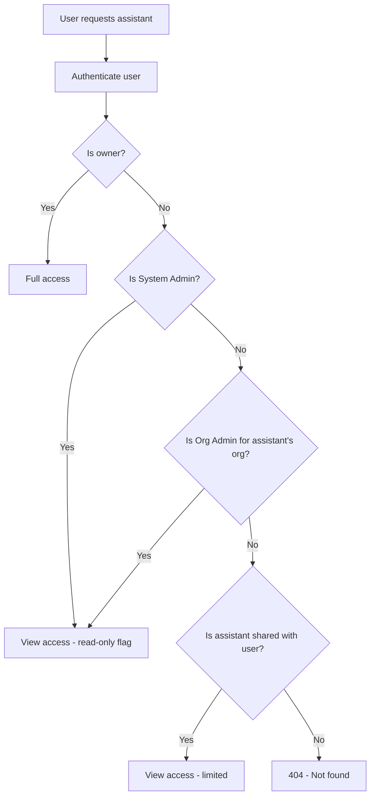
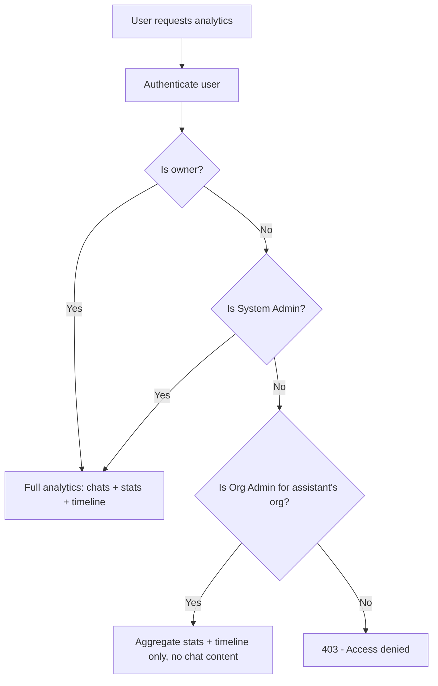
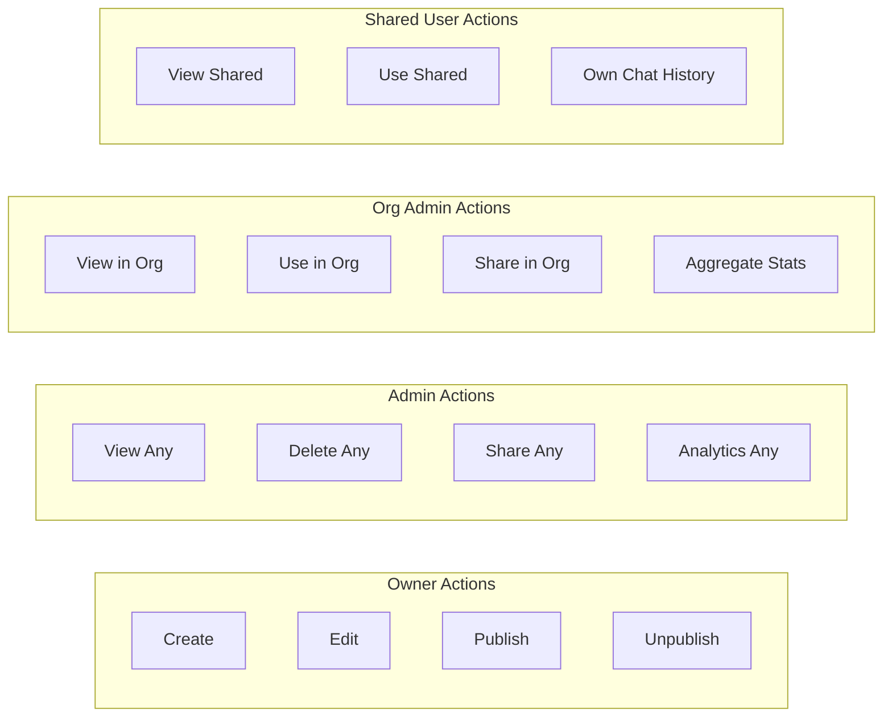
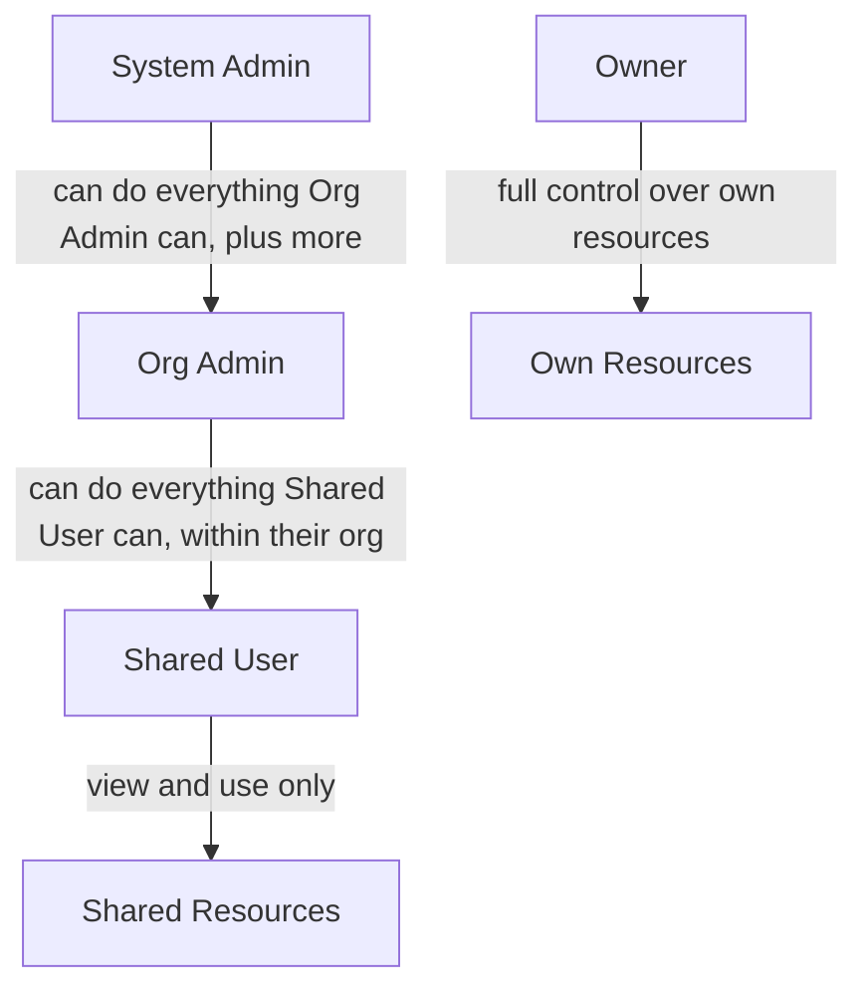

# LAMB Access Control & Roles

> **Status:** Approved  
> **Date:** February 2026  
> **Related Issue:** [#252](https://github.com/Lamb-Project/lamb/issues/252)

## 1. Overview

LAMB implements a role-based access control (RBAC) system that balances **administrative oversight** with **user privacy**. The design follows a "Pragmatic Middle Ground" philosophy: administrators have broad visibility but limited ability to modify other users' work, protecting both institutional accountability and individual teacher autonomy.

### Design Principles

1. **Privacy by default** -- When in doubt, deny access. Chat content is the most sensitive data.
2. **View, don't touch** -- Admins can see everything but cannot edit other users' resources. This prevents accidental damage while maintaining auditability.
3. **Teacher autonomy** -- Assistants are authored artifacts. Only the owner can modify them.
4. **Proportional access** -- Each role gets the minimum access needed to fulfil its function.

---

## 2. Roles

LAMB has four access levels, determined by a combination of the OWI system role and the organization role.

### System Admin

- **How assigned:** OWI role = `admin`
- **Scope:** Platform-wide
- **Purpose:** Platform maintenance, debugging, compliance, and user support

System Admins have the highest level of visibility across the entire platform. They can view any assistant's configuration and chat analytics, delete problematic resources, and manage sharing. However, they **cannot edit** other users' assistants -- this is a deliberate guardrail to prevent accidental modifications to authored content.

### Organization Admin (Org Admin)

- **How assigned:** Organization role = `admin` or `owner` in the `organization_roles` table
- **Scope:** Within their own organization
- **Purpose:** Facilitate collaboration, manage users, oversee resource usage

Org Admins are organizational facilitators. They can see what assistants exist in their organization, manage who has access, and use any assistant for evaluation purposes. They can view anonymized aggregate statistics (how many chats, unique users) but **cannot read individual chat transcripts** -- this protects both student privacy and teacher autonomy.

### Owner (Creator)

- **How assigned:** The user who created the assistant (stored in `assistants.owner`)
- **Scope:** Own resources
- **Purpose:** Full lifecycle management of their own assistants

Owners have complete control over their resources: create, edit, delete, share, publish, and view full analytics including chat history. This is the only role that can modify an assistant's configuration.

### Shared User

- **How assigned:** Via the `assistant_shares` table (explicit sharing by owner or admin)
- **Scope:** Specifically shared resources
- **Purpose:** Use assistants shared with them

Shared Users can view and interact with assistants that have been explicitly shared with them. They can see their own conversation history but cannot access other users' chats, edit the assistant, or share it further.

---

## 3. Permission Matrix

| Action                          | System Admin    | Org Admin              | Owner | Shared User           |
| ------------------------------- | :-------------: | :--------------------: | :---: | :-------------------: |
| View assistant config           | Any             | Any in org (read-only) | Own   | Shared only (limited) |
| Use / Chat                      | Any             | Any in org             | Own   | Shared only           |
| Edit assistant                  | NO (owner-only) | NO                     | YES   | NO                    |
| Delete assistant                | Any             | NO                     | Own   | NO                    |
| Share / manage access           | Any             | Any in org             | Own   | NO                    |
| View ALL chat history           | Any             | NO                     | Own   | NO                    |
| View OWN chat history           | Yes             | Yes                    | Yes   | Yes                   |
| View anonymized aggregate stats | Any             | Any in org             | Own   | NO                    |
| Publish / Unpublish             | NO (owner-only) | NO                     | YES   | NO                    |

---

## 4. Access Flow Diagrams

### 4.1 Assistant View Access



### 4.2 Chat Analytics Access



### 4.3 Assistant Lifecycle



### 4.4 Role Hierarchy



---

## 5. Privacy Boundaries

### Chat History

Chat content is the most privacy-sensitive data in LAMB. The access rules are strict:

| Who | What they can see |
|-----|-------------------|
| **Assistant Owner** | All chats for their assistant (subject to org anonymization settings) |
| **System Admin** | All chats for any assistant (for platform maintenance and compliance) |
| **Org Admin** | Anonymized aggregate stats only (total chats, unique users, last active date). **No chat content.** |
| **Shared User** | Only their own conversations with the assistant |
| **LTI Activity Owner** | Anonymized chats if `chat_visibility_enabled` and student has consented |

### Why Org Admin Cannot See Chat Content

1. **Student privacy** -- Chat conversations may contain personal information, academic work, or sensitive questions. Org admins (typically department heads or coordinators) should not have access to individual student interactions.
2. **Teacher autonomy** -- If teachers know their admin can read all conversations, it creates a chilling effect that discourages experimentation with AI assistants.
3. **Sufficient for oversight** -- Aggregate statistics (chat count, user count, activity timeline) give org admins enough information to know if assistants are being used, without exposing content.

### Why System Admin CAN See Chat Content

1. **Platform integrity** -- System admins need to investigate reports of misuse, debug issues, and ensure compliance with institutional policies.
2. **Legal compliance** -- Some institutions require the ability to audit all platform activity.
3. **Trust model** -- System admin is a highly trusted role, typically assigned to IT staff who already have database access.

---

## 6. Editing Restrictions

### Why Admin Cannot Edit

Even though System Admin has "root-like" access, editing other users' assistants is deliberately blocked:

1. **Authored content** -- Assistants contain carefully crafted prompts, knowledge base configurations, and rubrics. An admin making changes could inadvertently break the teaching flow.
2. **Accountability** -- If an assistant's behavior changes, the owner should always be the one responsible.
3. **Sufficient alternatives** -- If an assistant is problematic, the admin can delete it or contact the owner. There is no scenario where silently editing someone else's assistant is the right approach.
4. **Audit trail** -- Keeping edits owner-only means the modification history is always attributable to one person.

---

## 7. Implementation Details

### Backend Access Checks

The access control is enforced at the API layer in the following locations:

| File | Function | What it controls |
|------|----------|-----------------|
| `assistant_router.py` | `get_assistant_proxy()` | Viewing assistant configuration |
| `learning_assistant_proxy.py` | `verify_assistant_access()` | Using the assistant (chat completions) |
| `analytics_router.py` | `check_assistant_access()` | Viewing chat analytics |
| `assistant_sharing_service.py` | `update_assistant_shares()` | Managing who has access |
| `assistant_router.py` | `delete_assistant_proxy()` | Deleting assistants |
| `assistant_router.py` | `update_assistant_proxy()` | Editing assistants (owner-only) |
| `assistant_router.py` | `publish_assistant()` | Publishing (owner-only) |

### Access Check Logic (Pseudocode)

```
function can_view_assistant(user, assistant):
    if user.email == assistant.owner: return FULL_ACCESS
    if is_system_admin(user): return READ_ONLY
    if is_org_admin(user) and user.org_id == assistant.org_id: return READ_ONLY
    if is_shared_with(assistant, user): return LIMITED
    return DENIED

function can_view_analytics(user, assistant):
    if user.email == assistant.owner: return FULL (chats + stats + timeline)
    if is_system_admin(user): return FULL (chats + stats + timeline)
    if is_org_admin(user) and user.org_id == assistant.org_id: return AGGREGATE_ONLY (stats + timeline)
    return DENIED

function can_edit_assistant(user, assistant):
    if user.email == assistant.owner: return YES
    return NO  // Even admin cannot edit

function can_delete_assistant(user, assistant):
    if user.email == assistant.owner: return YES
    if is_system_admin(user): return YES
    return NO
```

### Response Flags

When a non-owner views an assistant, the API response includes access metadata:

```json
{
    "id": 42,
    "name": "Biology Tutor",
    "owner": "teacher@university.edu",
    "access_level": "read_only",
    "is_owner": false,
    ...
}
```

The frontend uses `access_level` to determine which UI controls to show or hide.

---

## 8. Organization Roles Reference

The `organization_roles` table defines intra-organization roles:

| Role | Description |
|------|-------------|
| `owner` | Organization creator. Full control including org deletion. |
| `admin` | Organization administrator. Same permissions as owner for resource management. |
| `member` | Regular member. Can create and manage their own resources. |

Both `owner` and `admin` are treated as "Org Admin" for the purposes of this access control policy. The `member` role has no special privileges beyond their own resources and shared resources.

---

## 9. Future Considerations

- **Delegated editing** -- A future feature could allow owners to explicitly grant edit permission to specific collaborators (e.g., co-authors of an assistant). This would be opt-in, per-assistant, and always initiated by the owner.
- **Org Admin chat access (opt-in)** -- Some institutions may require org admins to audit chat content. This could be implemented as an org-level configuration flag, requiring explicit consent from users.
- **Read-only sharing** -- Currently, shared users can both view and use assistants. A future enhancement could allow "view-only" shares where the user can see the config but not chat.
