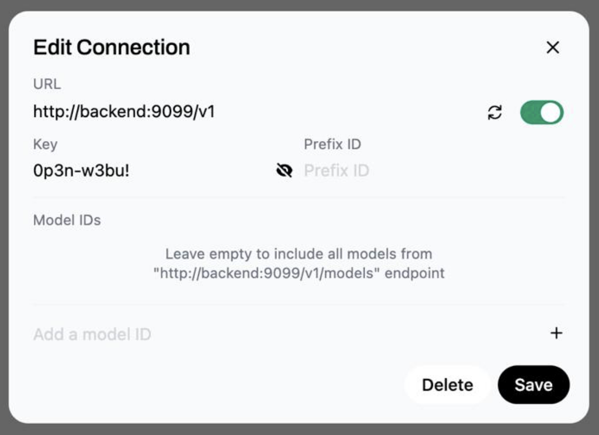

# Deployment Guide

## Base Containers

The base LAMB setup will start the following containers:

- Open WebUI API (port 8080)
- LAMB KB server (port 9090)
- LAMB Backend (port 9099)
- Frontend Svelte dev server (port 5173)

- Data persists via bind mounts under `/opt/lamb-project/lamb` (Open WebUI DB: `open-webui/backend/data/webui.db`, Chroma: `open-webui/backend/data/vector_db/chroma.sqlite3`, backend uses files under `/opt/lamb-project/lamb`).

## How to Deploy

For deployment, we use Docker Compose with a base configuration file (`docker-compose.yaml`) and a production override file (`docker-compose.prod.yaml`).

The base file (`docker-compose.yaml`) defines all common services for the application.
The production override file (`docker-compose.prod.yaml`) introduces the Caddy container, which acts as a reverse proxy and manages TLS certificates automatically.

This approach avoids duplication: only production-specific changes are placed in the override file.

To deploy in production:

```bash
docker compose -f docker-compose.yaml -f docker-compose.prod.yaml up -d
```

Wait **5-10 minutes** for all services to start and for Caddy to obtain TLS certificates.
You can check the status of the containers with:

```bash
docker compose ps
```
To view logs for troubleshooting, use:

```bash
docker compose logs openwebui-build -f
docker compose logs openwebui  -f
docker compose logs backend -f
```

### Environment Files and Configuration

Before deploying, ensure you have:
- Edited `backend/.env` to include a valid `OPENAI_API_KEY` (see `backend/.env.example` for a template).
- Edited `lamb-kb-server-stable/.env` as needed for your setup.
- Copied and customized `frontend/svelte-app/static/config.js` from `config.js.sample`.

This is an example of `config.js` for a production deployment:

```javascript
window.LAMB_CONFIG = {
 api: {
  baseUrl: 'https://lamb.yourdomain.com/creator',
  lambServer: 'https://lamb.yourdomain.com/lamb',
  openWebUiServer: 'https://lamb.yourdomain.com/openwebui',
  },
  assets: {
    path: '/static'
  },
  features: {
    enableOpenWebUi: true,
    enableDebugMode: true
  }
};
````

### Caddy Configuration

Caddy is configured using the `Caddyfile` in the project root. Before deploying, make sure to edit the `Caddyfile` and replace all instances of `yourdomain.com` with your actual domain name. This ensures that Caddy will correctly handle HTTPS certificates and routing for your deployment.

The provided `Caddyfile` assumes that the main Lamb service will be available at `lamb.yourdomain.com`, and the OpenWebUI service will be available at its own subdomain: `owi.lamb.yourdomain.com`. Adjust these domain names as needed to match your setup.


# Post installation Setup OpenWebUI

OpenWebUI is the open source software Lamb uses as main chat client. We have several integrations between Lamb and OpenWebUI that need to work well for Lamb to work as intended. On the Lamb web interface you have a "OpenWebUI" button on the top right corner. By pressing this button you will be redirected to the OpenWebUI web interface logged as your current user. If you are the Lamb admin you will be admin on OpenWebUI as well.

Go to Your user menu and get to the "Admin Panel", on the "Settings" tab, choose the "Connections" option on the side bar. Now you need to:
* Edit the OpenAi connection and change the endpoint to **lamb-backend** on your system, and use as API KEY the value of LAMB_BEARER_TOKEN on backend/.env (that you should change for a secure key that no one knows). If you are using the Docker option it should look like this.

