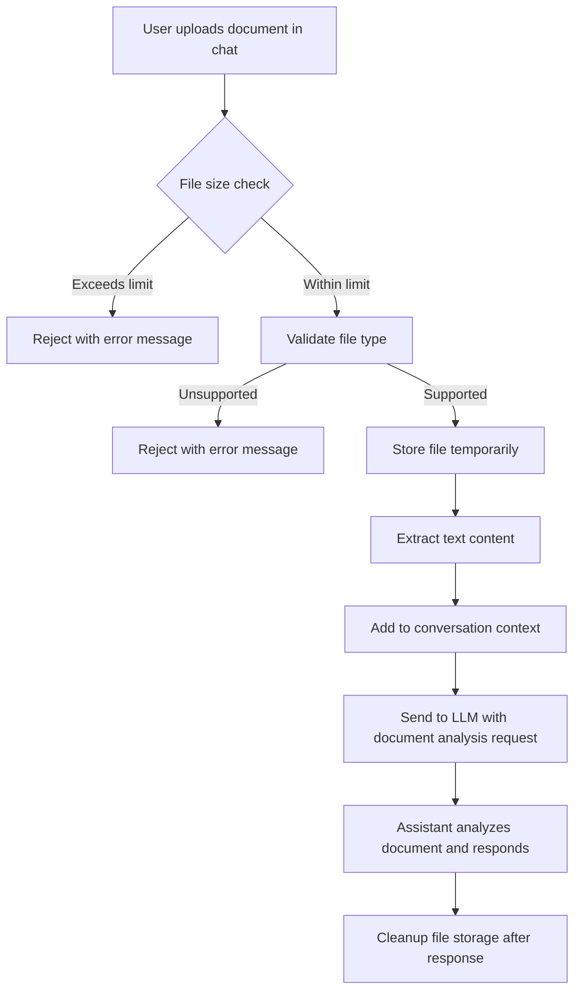

# File Processing and Attachment Support for LAMB Assistants

## Overview

LAMB already includes vision capabilities for image handling, but lacks support for processing attached files (such as PDFs, Word documents, etc.) that would be valuable for assistants that need to analyze documents during conversations. **Note:** This is separate from the built-in rubrics system, which uses RAG integration rather than file attachments.

This feature would enable educators to upload documents (student work, reference materials, etc.) for real-time analysis by AI assistants during chat interactions.

## Background

### Current State
- LAMB supports multimodal interactions through OpenAI's vision-capable models
- Vision capability in Open WebUI is currently hardcoded on model objects
- No support for document attachment processing beyond images
- File uploads are handled through multipart form data for images only

### Related Issues
- **Model Management**: Need better management of "model" objects in Open WebUI to allow editing capabilities like enable/disable vision or uploads
- **Vision Capability**: Current vision implementation requires hardcoded model configuration

## Problem Statement

Educators need to upload and analyze various document types (PDFs, Word docs, etc.) during conversations with AI assistants. For example, a teacher might want to upload a student's essay and ask the assistant to analyze it, provide feedback, or answer questions about the content. Without this capability, assistants are limited to text-only or image-only inputs, reducing their effectiveness for document analysis tasks.

**Note:** This is different from LAMB's rubrics system, where rubrics are pre-configured as RAG sources. This feature enables ad-hoc document analysis during chat conversations.

## Goals

1. **Enable Document Analysis**: Allow assistants to analyze uploaded documents during conversations (separate from rubrics RAG system)
2. **Cost Management**: Implement strict file size limits to prevent excessive API costs
3. **Storage Management**: Track file storage locations and implement cleanup mechanisms
4. **Multi-format Support**: Support common document formats used in education
5. **Integration**: Seamlessly integrate document analysis into the chat workflow

**Important Distinction:** This feature is separate from LAMB's built-in rubrics system. Rubrics are integrated via RAG plugins, while this feature enables analysis of arbitrary document attachments during conversations.

## Requirements

### File Size Management

File size limits must follow a hierarchical structure:

```
Assistant Limit ≤ Organization Limit ≤ System Limit
```

**Implementation Details:**
- Limits apply to both images and document files
- Configuration stored at organization level
- Assistant-level overrides for special cases
- System-level defaults for new organizations

### Supported File Types

**Definitely Supported:**
- `.txt` - Plain text files
- `.csv` - Comma-separated values
- `.md` - Markdown files
- `.json` - JSON data files
- `.pdf` - Portable Document Format

**Potentially Supported (TBD):**
- `.docx` - Microsoft Word documents
- `.xlsx` - Microsoft Excel spreadsheets
- `.pptx` - Microsoft PowerPoint presentations

### File Processing Flow



### Storage and Cleanup

**Storage Strategy:**
- Files stored temporarily during processing
- User-specific directories based on database ID
- Automatic cleanup after processing completion
- Optional batch garbage collection for failed processes

**Directory Structure:**
```
backend/static/uploads/
├── {user_id}/
│   ├── temp/          # Temporary processing files
│   └── processed/     # Successfully processed files (if needed)
└── cleanup_queue/     # Files pending deletion
```

### API Integration

**Enhanced Chat Completions API:**
This feature would extend the existing `/v1/chat/completions` endpoint to accept file attachments alongside text messages.

**Request Format:**
```json
{
  "model": "lamb_assistant.123",
  "messages": [
    {
      "role": "user",
      "content": [
        {
          "type": "text",
          "text": "Please analyze this student's essay and provide feedback."
        },
        {
          "type": "file",
          "file": {
            "name": "student_essay.pdf",
            "data": "base64-encoded-file-data",
            "mime_type": "application/pdf"
          }
        }
      ]
    }
  ]
}
```

**Alternative: Two-Step Process**
1. Upload file via dedicated endpoint
2. Reference file ID in chat completion

**File Upload Endpoint:**
```http
POST /v1/files/upload
Content-Type: multipart/form-data
Authorization: Bearer {token}

Form Data:
- file: The document file
- ttl_seconds: Optional time-to-live for temporary storage
```

**Response:**
```json
{
  "file_id": "file_1234567890_abcdef",
  "filename": "student_essay.pdf",
  "size_bytes": 245760,
  "mime_type": "application/pdf",
  "expires_at": 1704326400
}
```

### OpenAI Integration

File processing follows OpenAI's document handling approach:

**Reference:** https://platform.openai.com/docs/guides/pdf-files

**Key Implementation Points:**
- Files uploaded as multipart form data
- Server-side processing extracts text content
- Content injected into conversation context
- Temporary file cleanup after processing

## User Stories

### Primary Use Case: Document Analysis
```
As an educator using an assignment feedback assistant,
I want to upload student essays, projects, or assignments as PDFs,
So that the assistant can analyze the content and provide detailed feedback during our conversation.
```

### Secondary Use Case: Reference Materials
```
As an educator creating a subject matter assistant,
I want to upload reference documents, textbooks, or study guides,
So that the assistant can reference this material when answering student questions.
```

### File Management
```
As a system administrator,
I want to set file size limits at organization and system levels,
So that I can control costs and prevent abuse.
```

### Storage Cleanup
```
As a system administrator,
I want automatic cleanup of temporary files,
So that storage doesn't accumulate and cause disk space issues.
```

## Technical Implementation

### Backend Changes

**New Modules:**
- `file_processor.py` - Document parsing and text extraction
- `file_validator.py` - Size and type validation
- `storage_manager.py` - File storage and cleanup

**Database Schema Updates:**
```sql
-- File processing logs
CREATE TABLE file_processing_logs (
    id INTEGER PRIMARY KEY AUTOINCREMENT,
    user_id INTEGER NOT NULL,
    assistant_id INTEGER NOT NULL,
    original_filename TEXT NOT NULL,
    file_size_bytes INTEGER NOT NULL,
    file_type TEXT NOT NULL,
    processing_status TEXT NOT NULL,
    error_message TEXT,
    created_at INTEGER NOT NULL,
    processed_at INTEGER,
    FOREIGN KEY (user_id) REFERENCES Creator_users(id),
    FOREIGN KEY (assistant_id) REFERENCES assistants(id)
);

-- Organization file settings
ALTER TABLE organizations
ADD COLUMN file_size_limit_bytes INTEGER DEFAULT 10485760; -- 10MB default
```

### Frontend Changes

**New Components:**
- `FileUpload.svelte` - Drag-and-drop file upload interface
- `FileList.svelte` - Display uploaded files with processing status
- `FileSettings.svelte` - Admin interface for file size limits

**Integration Points:**
- Assistant creation/editing forms
- Chat interface for document uploads
- Admin settings panel

### Security Considerations

1. **File Type Validation**: Strict whitelist of allowed MIME types
2. **Size Limits**: Multiple validation layers (client + server)
3. **Storage Isolation**: Files stored in user-specific directories
4. **Cleanup Security**: Ensure only authorized users can access/delete files
5. **Rate Limiting**: Prevent abuse through upload frequency limits

## Acceptance Criteria

### Functional Requirements
- [ ] Users can upload PDF, TXT, CSV, MD, JSON files to assistants
- [ ] File size limits enforced at assistant ≤ org ≤ system levels
- [ ] Files processed and text content extracted for LLM context
- [ ] Temporary files automatically cleaned up after processing
- [ ] Error handling for unsupported files, size limits, processing failures

### Technical Requirements
- [ ] File processing integrated into completion pipeline
- [ ] Database schema updated for file tracking
- [ ] Storage management with garbage collection
- [ ] API endpoints documented and tested
- [ ] Security measures implemented and tested

### User Experience Requirements
- [ ] Clear file size limit display in upload interfaces
- [ ] Progress indicators for file processing
- [ ] Error messages for failed uploads/processing
- [ ] File type validation with helpful feedback

## Risk Assessment

### High Risk
- **Cost Management**: File processing could significantly increase API costs
- **Storage Management**: Improper cleanup could lead to disk space issues
- **Security**: File uploads are potential attack vectors

### Mitigation Strategies
- **Cost**: Strict size limits, processing quotas, cost monitoring
- **Storage**: Automated cleanup, monitoring, alerts
- **Security**: Input validation, sandboxed processing, access controls

## Success Metrics

1. **Usage**: Percentage of chat conversations that include document attachments
2. **Performance**: Average document processing time and analysis quality
3. **Cost**: API cost increase vs. educational value provided
4. **Reliability**: Document processing success rate and error rates
5. **User Satisfaction**: Educator feedback on document analysis capabilities

## Future Considerations

1. **Advanced Processing**: OCR for scanned documents, table/chart extraction, handwriting recognition
2. **Batch Processing**: Multiple file uploads and comparative analysis
3. **Integration**: Direct integration with LMS file systems and cloud storage
4. **Analytics**: Usage tracking, cost reporting, and document analysis quality metrics
5. **Collaborative Features**: Shared document analysis sessions, annotation capabilities
6. **Export Capabilities**: Generate reports based on document analysis

---

**Priority:** High
**Estimated Effort:** 3-4 weeks
**Dependencies:** Model management improvements, OpenAI API integration
**Stakeholders:** Educators, system administrators, developers
