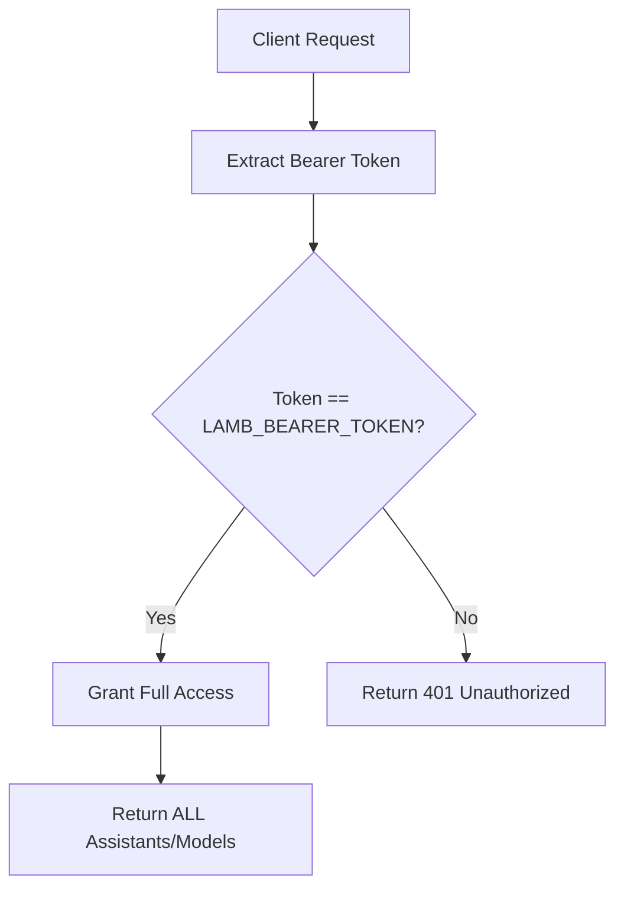
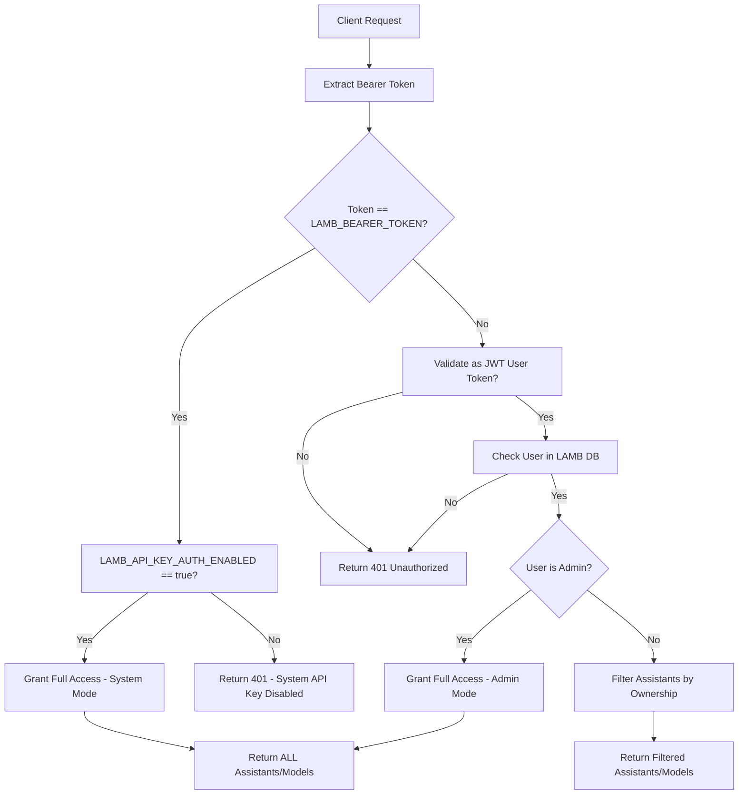

# New API Key Authentication Strategy for LAMB OpenAI-Compatible Endpoints

**Version:** 1.0
**Date:** November 26, 2025
**Status:** Requirements & Design Phase

---

## Executive Summary

This document outlines the requirements, design, and development plan for implementing a new API key authentication strategy for LAMB's OpenAI-compatible endpoints (`/v1/chat/completions`, `/v1/models`). The new strategy introduces dual authentication modes:

1. **System-wide API Key Mode**: Maintains current behavior with global access
2. **User-specific API Key Mode**: Limits access to user's owned and shared assistants only

This enhancement enables more granular access control while maintaining backward compatibility.

---

## 1. Current System Analysis

### 1.1 Existing Authentication Architecture

#### API Key Authentication (Current)
- **Environment Variable**: `LAMB_BEARER_TOKEN` (required)
- **Endpoints**: `/v1/chat/completions`, `/v1/models`
- **Behavior**: Single API key grants access to ALL assistants in the system
- **Validation**: Simple string comparison in `backend/main.py`

#### User Authentication (Current)
- **Mechanism**: JWT tokens via `/creator/login`
- **Storage**: Tokens validated against Open WebUI (OWI) database
- **Endpoints**: `/creator/*` routes (frontend API calls)
- **User Types**: `creator` (full access) vs `end_user` (redirect to OWI)

#### Assistant Access Control (Current)
- **Ownership**: Assistants belong to users and organizations
- **Sharing**: Users can share assistants with specific colleagues
- **Database**: `assistants` table with `owner` field, `assistant_shares` table
- **Access Logic**: Users can access assistants they own OR assistants shared with them

### 1.2 Current API Key Flow



---

## 2. Requirements

### 2.1 Functional Requirements

#### FR-AUTH-001: New Environment Variable
- **Description**: Introduce `LAMB_API_KEY_AUTH_ENABLED` environment variable
- **Behavior**:
  - If `true`: Enable dual-authentication strategy (system API key + user JWT tokens)
  - If `false`: Disable system API key, only allow JWT tokens (admins have full access to all assistants)
  - If not present: Default to `true`
- **Purpose**: Allow switching between authentication modes for debugging and backward compatibility

#### FR-AUTH-002: System-wide API Key Mode
- **Trigger**: When `LAMB_API_KEY_AUTH_ENABLED=true`
- **Behavior**: `LAMB_BEARER_TOKEN` grants access to ALL assistants (current behavior)
- **Endpoints**: `/v1/chat/completions`, `/v1/models`
- **Backward Compatibility**: Must maintain existing functionality when enabled

#### FR-AUTH-003: JWT-Only Mode
- **Trigger**: When `LAMB_API_KEY_AUTH_ENABLED=false`
- **Behavior**: System API key is disabled, only JWT tokens are accepted
- **Admin Access**: Admin JWT tokens grant full access to all assistants
- **User Access**: Regular user JWT tokens limit access to owned and shared assistants
- **Purpose**: Allow strict user-based access control when system API key is disabled

#### FR-AUTH-004: User-specific API Key Mode
- **Trigger**: When Bearer token matches valid user JWT token (regardless of `LAMB_API_KEY_AUTH_ENABLED`)
- **Behavior**:
  - Regular users: Limit access to owned and shared assistants only
  - Admin users: Grant full access to all assistants regardless of ownership
- **Validation**: JWT token validated against OWI, user checked in LAMB database
- **Endpoints**: `/v1/chat/completions`, `/v1/models`

#### FR-AUTH-005: Admin Full Access
- **Description**: Admin users always have full access to all assistants
- **Behavior**: Regardless of `LAMB_API_KEY_AUTH_ENABLED` setting, admin JWT tokens grant access to all assistants
- **Purpose**: Ensure administrators can always access and manage all system resources

#### FR-AUTH-006: Assistant Ownership Logic
- **Description**: Separate file containing assistant access control logic
- **Purpose**: Enable different implementations (open-source vs proprietary)
- **Driver Version**: Stub implementation for open-source distribution
- **Real Version**: Full implementation for proprietary use

#### FR-AUTH-005: Access Control Rules
- **Owned Assistants**: User can access assistants where `assistant.owner == user.email`
- **Shared Assistants**: User can access assistants shared via `assistant_shares` table
- **Organization Context**: Access respects organization boundaries
- **Filtering**: Both `/v1/models` and `/v1/chat/completions` must filter based on ownership

### 2.2 Non-Functional Requirements

#### NFR-PERF-001: Performance Impact
- **Database Queries**: New ownership checks should not significantly impact response times
- **Caching**: Consider caching user permissions for frequently accessed users
- **Indexing**: Ensure proper database indexes for ownership queries

#### NFR-SECURITY-001: Security Requirements
- **Token Validation**: JWT tokens must be properly validated against OWI
- **Access Isolation**: Users cannot access assistants they don't own or aren't shared with
- **Audit Trail**: Log authentication attempts and access denials
- **No Information Leakage**: Failed authentication should not reveal system information

#### NFR-COMPAT-001: Backward Compatibility
- **Existing API Keys**: Must continue working without changes
- **Existing Users**: No impact on current user workflows
- **Environment Variables**: New variable defaults to maintaining current behavior

#### NFR-MAINT-001: Maintainability
- **Separation of Concerns**: Authentication logic separated from business logic
- **Driver Pattern**: Easy to swap implementations
- **Documentation**: Clear separation between open-source and proprietary logic

---

## 3. Design

### 3.1 New Environment Variable

#### Environment Variable: `LAMB_API_KEY_AUTH_ENABLED`
```bash
# Enable dual authentication strategy (system API key + user JWT tokens)
LAMB_API_KEY_AUTH_ENABLED=true

# Disable system API key, use only JWT tokens (admins have full access)
LAMB_API_KEY_AUTH_ENABLED=false

# Not set - defaults to true
# LAMB_API_KEY_AUTH_ENABLED not set
```

#### Configuration Logic
```python
# In config.py or authentication module
LAMB_API_KEY_AUTH_ENABLED = os.getenv('LAMB_API_KEY_AUTH_ENABLED', 'true').lower() == 'true'
```

### 3.2 Authentication Flow Design

#### New Authentication Flow


### 3.3 Assistant Ownership Logic Module

#### Module Structure
```
backend/lamb/completions/
├── auth/
│   ├── __init__.py
│   ├── assistant_access.py      # Driver/stub version
│   └── assistant_access_real.py # Real implementation (not open-sourced)
```

#### Interface Definition
```python
# assistant_access.py - Driver Interface
class AssistantAccessManager:
    """
    Manages assistant access control logic.
    This is a driver version for open-source distribution.
    """

    def get_user_accessible_assistants(self, user_email: str, organization_id: int = None) -> List[int]:
        """
        Get list of assistant IDs accessible to a user.

        Args:
            user_email: User's email address
            organization_id: Optional organization filter

        Returns:
            List of assistant IDs the user can access
        """
        # Driver implementation - return all assistants or raise NotImplementedError
        raise NotImplementedError("Assistant access logic not implemented in driver version")

    def can_user_access_assistant(self, user_email: str, assistant_id: int) -> bool:
        """
        Check if user can access specific assistant.

        Args:
            user_email: User's email
            assistant_id: Assistant ID to check

        Returns:
            True if user can access assistant
        """
        raise NotImplementedError("Assistant access logic not implemented in driver version")
```

#### Real Implementation (Not Open-Sourced)
```python
# assistant_access_real.py - Real Implementation
class AssistantAccessManagerReal(AssistantAccessManager):
    """
    Real implementation of assistant access control.
    This contains the proprietary logic for determining assistant ownership.
    """

    def __init__(self, db_manager: LambDatabaseManager):
        self.db_manager = db_manager

    def get_user_accessible_assistants(self, user_email: str, organization_id: int = None) -> List[int]:
        # Query assistants table for owned assistants
        owned_assistants = self.db_manager.get_assistants_by_owner(user_email)

        # Query assistant_shares table for shared assistants
        shared_assistants = self.db_manager.get_shared_assistants_for_user(user_email)

        # Combine and deduplicate
        all_assistant_ids = set()
        all_assistant_ids.update([a['id'] for a in owned_assistants])
        all_assistant_ids.update([a['id'] for a in shared_assistants])

        # Filter by organization if specified
        if organization_id:
            # Additional filtering logic
            pass

        return list(all_assistant_ids)

    def can_user_access_assistant(self, user_email: str, assistant_id: int) -> bool:
        assistant = self.db_manager.get_assistant_by_id(assistant_id)
        if not assistant:
            return False

        # Check ownership
        if assistant['owner'] == user_email:
            return True

        # Check sharing
        return self.db_manager.is_assistant_shared_with_user(assistant_id, user_email)
```

### 3.4 Modified Endpoint Implementations

#### Updated `/v1/models` Endpoint
```python
@app.get("/v1/models")
async def get_models(request: Request):
    auth_result = await authenticate_api_request(request)

    if auth_result['mode'] == 'system':
        # System API key - return all assistants
        assistants = helper_get_all_assistants(filter_deleted=True)
    elif auth_result['mode'] == 'admin':
        # Admin user - return all assistants
        assistants = helper_get_all_assistants(filter_deleted=True)
    elif auth_result['mode'] == 'user':
        # Regular user - return only accessible assistants
        access_manager = get_assistant_access_manager()
        accessible_ids = access_manager.get_user_accessible_assistants(auth_result['user_email'])
        assistants = [a for a in helper_get_all_assistants(filter_deleted=True)
                     if a['id'] in accessible_ids]
    else:
        raise HTTPException(
            status_code=status.HTTP_401_UNAUTHORIZED,
            detail="Invalid authentication"
        )

    # Format and return response
    response_body = {
        "object": "list",
        "data": [
            {
                "id": "lamb_assistant."+str(assistant["id"]),
                "object": "model",
                "created": int(time.time()),
                "owned_by": "lamb_v4",
                "capabilities": _get_assistant_capabilities(assistant)
            }
            for assistant in assistants
        ]
    }
    return JSONResponse(content=response_body, headers=headers)
```

#### Updated `/v1/chat/completions` Endpoint
```python
@app.post("/v1/chat/completions")
async def generate_openai_chat_completion(request: Request):
    auth_result = await authenticate_api_request(request)

    if not auth_result['mode']:
        raise HTTPException(
            status_code=status.HTTP_401_UNAUTHORIZED,
            detail="Invalid authentication"
        )

    # ... existing request processing ...

    assistant_id = helper_get_assistant_id(form_data.model)

    if auth_result['mode'] == 'user':
        # Check if regular user can access this specific assistant
        access_manager = get_assistant_access_manager()
        if not access_manager.can_user_access_assistant(auth_result['user_email'], assistant_id):
            raise HTTPException(
                status_code=status.HTTP_403_FORBIDDEN,
                detail="Access denied: You do not have permission to use this assistant"
            )
    # Note: 'system' and 'admin' modes have full access, no additional checks needed

    # ... continue with existing logic ...
```

### 3.5 Authentication Function

#### New Authentication Function
```python
async def authenticate_api_request(request: Request) -> Dict[str, Any]:
    """
    Authenticate API request and determine access mode.

    Returns:
        {
            'mode': 'system' | 'user' | 'admin' | None,
            'user_email': str | None,
            'user_id': int | None,
            'is_admin': bool | None
        }
    """
    api_key = request.headers.get("Authorization")
    if not api_key or not api_key.startswith("Bearer "):
        return {'mode': None}

    token = api_key.split("Bearer ")[1].strip()

    # Check if system API key
    if token == API_KEY:
        if LAMB_API_KEY_AUTH_ENABLED:
            return {'mode': 'system'}
        else:
            # System API key disabled
            return {'mode': None}

    # Try to validate as user JWT token
    user_manager = OwiUserManager()
    owi_user = user_manager.get_user_auth(token)

    if owi_user:
        # Check if user exists in LAMB creator users
        db_manager = LambDatabaseManager()
        creator_user = db_manager.get_creator_user_by_email(owi_user['email'])

        if creator_user:
            # Check if user is admin
            is_admin = owi_user.get('role') == 'admin'

            if is_admin:
                return {
                    'mode': 'admin',
                    'user_email': owi_user['email'],
                    'user_id': creator_user['id'],
                    'is_admin': True
                }
            else:
                return {
                    'mode': 'user',
                    'user_email': owi_user['email'],
                    'user_id': creator_user['id'],
                    'is_admin': False
                }

    return {'mode': None}
```

---

## 4. Development Plan

### 4.1 Phase 1: Infrastructure Setup

#### Task 1.1: Environment Variable Implementation
- [ ] Add `LAMB_API_KEY_AUTH_ENABLED` to config.py
- [ ] Add warning logging for missing variable
- [ ] Update environment documentation

#### Task 1.2: Assistant Access Module Structure
- [ ] Create `backend/lamb/completions/auth/` directory
- [ ] Implement driver version (`assistant_access.py`)
- [ ] Create interface for real implementation
- [ ] Add import logic to handle different implementations

### 4.2 Phase 2: Authentication Logic

#### Task 2.1: Authentication Function
- [ ] Implement `authenticate_api_request()` function
- [ ] Add proper error handling and logging
- [ ] Unit tests for authentication logic

#### Task 2.2: Assistant Access Logic (Real Implementation)
- [ ] Implement ownership checking logic
- [ ] Implement sharing logic
- [ ] Add organization filtering
- [ ] Performance optimization (caching, indexing)

### 4.3 Phase 3: Endpoint Modifications

#### Task 3.1: Update `/v1/models` Endpoint
- [ ] Integrate new authentication logic
- [ ] Add assistant filtering based on user access
- [ ] Maintain backward compatibility

#### Task 3.2: Update `/v1/chat/completions` Endpoint
- [ ] Add assistant access validation
- [ ] Return appropriate error messages
- [ ] Ensure streaming responses work correctly

### 4.4 Phase 4: Testing & Validation

#### Task 4.1: Unit Tests
- [ ] Authentication function tests
- [ ] Assistant access logic tests
- [ ] Endpoint filtering tests

#### Task 4.2: Integration Tests
- [ ] End-to-end API testing with different auth modes
- [ ] Performance testing
- [ ] Backward compatibility testing

#### Task 4.3: Security Testing
- [ ] Access control validation
- [ ] Token validation edge cases
- [ ] Audit logging verification

### 4.5 Phase 5: Documentation & Deployment

#### Task 5.1: Documentation Updates
- [ ] Update API documentation
- [ ] Update environment variable documentation
- [ ] Add migration guide

#### Task 5.2: Deployment Preparation
- [ ] Create database migrations if needed
- [ ] Update Docker configurations
- [ ] Add feature flags for gradual rollout

---

## 5. Questions & Clarifications Needed

### 5.1 Technical Questions

1. **Database Performance**: Should we add database indexes for the new access queries? What are the expected query patterns?

-> NOT really

2. **Caching Strategy**: How should we cache user permissions? Redis, in-memory, or database-level caching?

-> NO (on high usage scenarios we will migrate the DB to postgresql and we can cache at Database Server Level )

3. **Error Messages**: What level of detail should error messages provide? Should they distinguish between "assistant not found" vs "access denied"?
--> Yes , high detail for errors. 
/models will return -> unauthorized , or list of valid models

4. **Audit Logging**: What events should be logged? Authentication attempts, access denials, permission checks?
Authentication errors, and access denials shoudl be logged. 


5. **System API Key Behavior**: ✅ When `LAMB_API_KEY_AUTH_ENABLED=false`, the system API key is completely disabled
Only disabled on the /models and /completions endpoints, other usages of the system api key shoudl remain

6. **LTI Permission Storage**: How to efficiently store and query LTI user permissions? Store in LAMB DB or query OWI groups?

**RECOMMENDED: Store in LAMB DB** - Create `user_assistant_permissions` table for fast lookups

### 5.1.1 LTI Permission Storage Analysis

**Current LTI Permission Model:**
- LTI users get access through OWI groups when assistants are published
- OWI manages chat access through group membership (`owi_group_manager.add_user_to_group_by_email()`)
- LTI users table tracks which users accessed which assistants, but doesn't store permissions

**The Problem:** For API authentication, we need to check assistant access before allowing `/v1/chat/completions` or filtering `/v1/models`. OWI group membership is stored in OWI's database, not LAMB's.

**Performance Impact:**

| Method | `/v1/models` (100 assistants) | `/v1/chat/completions` (1 assistant) | Reliability |
|--------|------------------------------|-----------------------------------|-------------|
| **Query OWI Groups** | 100+ OWI DB queries | 1-2 OWI DB queries | ❌ Fails if OWI down |
| **LAMB Permission Table** | 1 LAMB DB query | 1 LAMB DB query | ✅ Works independently |

**Recommended Solution: `user_assistant_permissions` table**

```sql
CREATE TABLE user_assistant_permissions (
    id INTEGER PRIMARY KEY AUTOINCREMENT,
    user_email TEXT NOT NULL,
    assistant_id INTEGER NOT NULL,
    permission_type TEXT NOT NULL, -- 'owner', 'shared', 'lti_group', 'organization'
    granted_by TEXT, -- who granted the permission
    granted_at INTEGER NOT NULL,
    expires_at INTEGER, -- optional expiration
    FOREIGN KEY (assistant_id) REFERENCES assistants(id) ON DELETE CASCADE,
    UNIQUE(user_email, assistant_id, permission_type)
);

-- Indexes for performance
CREATE INDEX idx_uap_user_assistant ON user_assistant_permissions(user_email, assistant_id);
CREATE INDEX idx_uap_assistant ON user_assistant_permissions(assistant_id);
CREATE INDEX idx_uap_user ON user_assistant_permissions(user_email);
```

**Efficient Query:**
```sql
-- Get all assistants accessible to a user in ONE query
SELECT DISTINCT a.id, a.name, a.owner, a.organization_id, p.permission_type
FROM assistants a
LEFT JOIN user_assistant_permissions p ON a.id = p.assistant_id
WHERE p.user_email = ? OR a.owner = ? OR a.organization_id = ?
ORDER BY a.id;
```

### 5.1.2 Methods That Modify Assistant Permissions

**All these methods must update the `user_assistant_permissions` table:**

1. **Assistant Ownership Changes:**
   - `assistant_router.update_assistant()` - when assistant ownership changes
   - Database triggers on `assistants.owner` field updates

2. **Assistant Sharing Operations:**
   - `database_manager.share_assistant()` - adds 'shared' permission
   - `database_manager.unshare_assistant()` - removes 'shared' permission
   - `assistant_sharing_router.update_assistant_shares()` - bulk share/unshare

3. **Assistant Publishing/Unpublishing:**
   - `database_manager.publish_assistant()` - creates OWI group, sync LTI permissions
   - `database_manager.unpublish_assistant()` - removes OWI group access
   - `assistant_router.publish_assistant()` - API endpoint for publishing

4. **LTI User Creation/Access:**
   - `database_manager.create_lti_user()` - when LTI user accesses assistant
   - OWI group membership changes (when users are added/removed from groups)
   - `owi_group_manager.add_user_to_group_by_email()` - grants 'lti_group' permission
   - `owi_group_manager.remove_user_from_group_by_email()` - removes 'lti_group' permission

5. **Organization Changes:**
   - User organization membership changes
   - Organization permission updates
   - Assistant organization transfers

6. **User Account Changes:**
   - User deletion/deactivation
   - Role changes (admin/non-admin)

**Sync Strategy Required:**
- **Real-time Updates:** All permission-changing operations must update the permission table
- **Background Sync:** Periodic sync of OWI group membership to catch external changes
- **Triggers:** Database triggers for automatic permission updates on related table changes
- **Audit Trail:** Track all permission grants/revocations with timestamps

**Implementation Impact:** Every method that currently modifies assistant access relationships must be updated to maintain the permission table as the single source of truth for API authentication.


### 5.2 Business Logic Questions

7. **Organization Boundaries**: Should user-specific access respect organization boundaries, or can users access assistants from other organizations if shared?

The current visibility of assitants is dependent on organization, so yes. Use the existing methods

8. **End Users**: Should end_user type accounts be able to use JWT tokens for API authentication, or only creator users?

All types of users, end users, creator user, and lti users ...

9. **Admin Access**: ✅ Admin users have full access to all assistants regardless of ownership (answered)

10. **Sharing Scope**: Should assistant sharing be organization-wide or user-specific only?

11. **API Key Inheritance**: When an assistant is shared, should the recipient be able to use their own JWT token to access it?

### 5.3 Implementation Questions

12. **Permission Table Sync**: How to ensure the permission table stays synchronized with OWI groups, sharing changes, and ownership updates?

13. **Driver Detection**: How should the system detect which implementation to use? Environment variable, file existence, or build-time flag?

14. **Fallback Behavior**: When the real implementation is not available, what should the driver do? Return all assistants, return none, or raise an error?

15. **Version Compatibility**: How do we ensure the driver version doesn't break when new features are added to the real version?

16. **Testing Strategy**: How do we test the driver version when it doesn't contain the real logic?

---

## 6. Risk Assessment

### 6.1 High Risk Items
- **Backward Compatibility**: Breaking existing API key functionality
- **Performance Impact**: New database queries in hot paths
- **Security**: Incorrect access control could leak data

### 6.2 Mitigation Strategies
- **Feature Flag**: `LAMB_API_KEY_AUTH_ENABLED` allows disabling new behavior
- **Comprehensive Testing**: Both unit and integration tests
- **Gradual Rollout**: Enable per environment/organization
- **Audit Logging**: Track all authentication and access decisions

---

## 7. Success Criteria

### 7.1 Functional Success
- [ ] System API key continues working for all assistants
- [ ] User JWT tokens limit access to owned/shared assistants only
- [ ] No breaking changes to existing functionality
- [ ] Proper error handling and user feedback

### 7.2 Performance Success
- [ ] Authentication overhead < 50ms
- [ ] No significant impact on API response times
- [ ] Database queries properly optimized

### 7.3 Security Success
- [ ] No unauthorized access to assistants
- [ ] Proper token validation
- [ ] Comprehensive audit logging
- [ ] No information leakage in error messages

---

## 8. Next Steps

1. **Answer Questions**: Address the questions in Section 5
2. **Implementation Planning**: Create detailed implementation tickets
3. **Timeline**: Establish development timeline and milestones
4. **Review**: Technical review of design with team
5. **Start Development**: Begin with Phase 1 infrastructure setup
