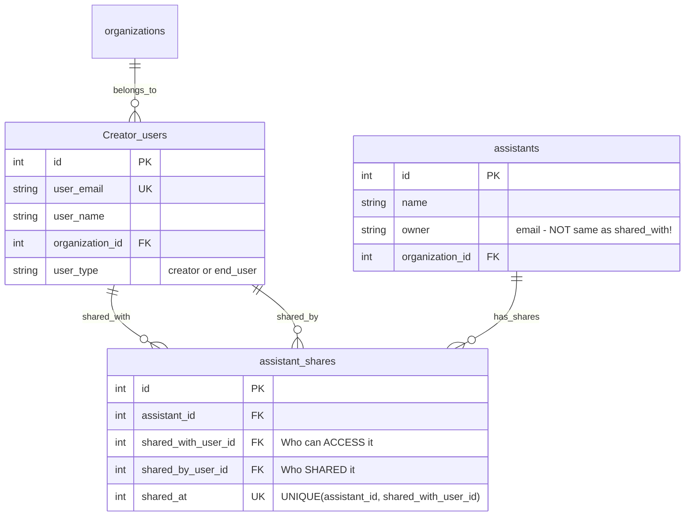

# Assistant Sharing Behavior - Clarification

## ✅ Current Behavior (CORRECT)

### Scenario: u2@dev.com shares assistant with admin@dev.com

This is **EXPECTED and CORRECT** behavior. Here's why:

## Admin Roles - Two Separate Contexts

### Context 1: Org-Admin Interface (`/org-admin?view=assistants`)

```
┌─────────────────────────────────────────┐
│ SPECIAL ADMIN PRIVILEGES                 │
├─────────────────────────────────────────┤
│ ✅ Can manage sharing for ANY assistant  │
│ ✅ Sees "Manage Sharing" button for all  │
│ ✅ Can add/remove users from any shares  │
│ ✅ Doesn't need to be shared WITH        │
└─────────────────────────────────────────┘
```

### Context 2: Regular Assistants Interface (`/assistants`)

```
┌─────────────────────────────────────────┐
│ ADMIN = REGULAR CREATOR USER            │
├─────────────────────────────────────────┤
│ ✅ Only sees "My Assistants" (owned)     │
│ ✅ Only sees "Shared with Me" if:        │
│    - Someone explicitly shared WITH them │
│    - assistant_shares row exists         │
│ ✅ CAN be shared with (normal user)      │
│ ✅ NO automatic access to all assistants │
└─────────────────────────────────────────┘
```

## Why u2 Can Share with Admin

**This is intentional!**

1. **Admins are users too** - They have a user account in LAMB
2. **Admins CAN be collaborators** - They might need to work with specific assistants
3. **Separation of concerns**:
   - **Admin powers** = Management interface only
   - **Personal access** = Must be explicitly granted like any user

## Example Flow

### Step 1: u2 Creates Assistant
```
u2@dev.com creates "Math Tutor"
Owner: u2@dev.com
```

### Step 2: u2 Shares with Admin
```
u2 opens sharing modal
Selects: admin@dev.com
Clicks "Save Changes"

Database:
assistant_shares table:
- assistant_id: 2
- shared_with_user_id: 1 (admin's ID)
- shared_by_user_id: 2 (u2's ID)
```

### Step 3: What Each User Sees

**Admin in `/assistants` (Regular UI)**:
```
My Assistants: [Admin's own assistants]
Shared with Me: ["Math Tutor" ← Shared by u2]  ✅ CORRECT
```

**Admin in `/org-admin?view=assistants` (Admin UI)**:
```
All Org Assistants:
- Admin's assistants (owned)
- u2's assistants (can manage sharing)  ✅ CORRECT
- Everyone's assistants (full control)
```

**u2 in `/assistants` (Regular UI)**:
```
My Assistants: ["Math Tutor"]
Shared with Me: [Other users' shared assistants]
```

## Database Schema



## Key SQL Queries

### Query 1: "Shared with Me" (Regular Assistants UI)

```sql
-- Returns ONLY assistants explicitly shared WITH the user
SELECT a.*, s.shared_by_user_id
FROM assistant_shares s
JOIN assistants a ON s.assistant_id = a.id
WHERE s.shared_with_user_id = ?  -- User's ID
```

**Result for admin@dev.com**:
- ✅ Shows "Math Tutor" (u2 shared WITH admin)
- ❌ Does NOT show u2's other assistants (not shared)
- ❌ Does NOT show all org assistants automatically

### Query 2: "Organization Assistants" (Org-Admin UI)

```sql
-- Returns ALL assistants in organization
SELECT * 
FROM assistants
WHERE organization_id = ?
```

**Result for admin@dev.com**:
- ✅ Shows ALL assistants in organization
- ✅ Admin can manage sharing for all
- ✅ But this is ONLY in org-admin interface

## Why This Design?

### 1. **Separation of Privileges**
- Management power ≠ Automatic access
- Admin UI for management
- Regular UI for daily work

### 2. **Explicit is Better**
- Admins must be explicitly shared with to collaborate
- Clear audit trail of who has access
- No implicit "admin sees everything"

### 3. **Flexibility**
- Admins can be team members
- Admins can receive shares like anyone
- Admins don't clutter "Shared with Me" with all org assistants

## Test Cases

### ✅ Test 1: Admin Receives Share
```
u2 shares "Math Tutor" with admin
Expected:
- admin sees "Math Tutor" in "Shared with Me" ✅
- Database has assistant_shares row ✅
```

### ✅ Test 2: Admin Doesn't Auto-See All
```
u2 creates "Science Tutor" (doesn't share with admin)
Expected:
- admin DOES NOT see "Science Tutor" in "Shared with Me" ✅
- admin CAN manage it in org-admin interface ✅
```

### ✅ Test 3: Admin Manages All (Admin UI)
```
Admin goes to /org-admin?view=assistants
Expected:
- Sees ALL org assistants ✅
- Can click "Manage Sharing" on any assistant ✅
- Can add/remove shares for any assistant ✅
```

## Conclusion

The current implementation is **CORRECT**:
- ✅ Admins CAN be shared with
- ✅ Admins only see explicitly shared assistants in "Shared with Me"
- ✅ Admins have management powers only in org-admin interface
- ✅ No automatic "admin sees all" in regular UI

**If u2@dev.com shared with admin@dev.com, this is working as designed!**

