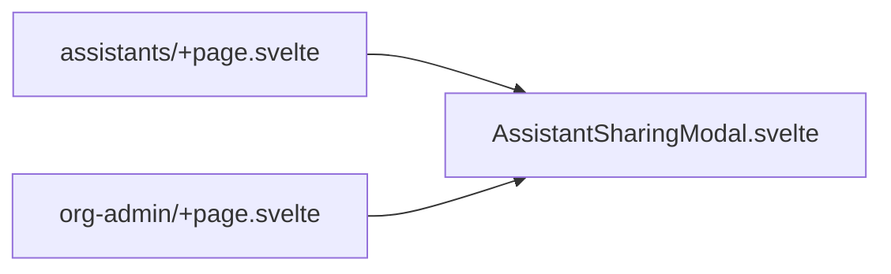

# AssistantForm refactor

**Last updated:** 2026-05-19

Documentation for refactoring the assistant form from a single monolithic component into a modular tree with testable business logic and separated presentation.

---

## Executive summary

| Metric | Before (peak) | After |
|--------|-----------------|-------|
| `AssistantForm.svelte` | **~1,747 LOC** (single file) | **~478 LOC** (orchestrator) |
| Pure logic modules | 0 (all inline) | 5 in [`logic/`](./logic/) |
| UI subcomponents (form only) | 0 (inline markup) | 10 in [`components/`](./components/) |
| Dedicated unit tests | minimal | 7 files + helpers |

The goal was to apply **SRP** (Single Responsibility Principle) and support **Open/Closed** behaviour: extend features (new RAG type, new field) without growing another god-component.

### Design principles

| Principle | How it shows up here |
|-----------|----------------------|
| **SRP** | Each module has one reason to change: state (`assistantFormState`), fetch (`assistantFormFetchers`), submit (`assistantFormSubmit`), import validation (`importAssistantValidator`), UI per section (`components/*`). |
| **Open/Closed** | New fetchers or validation rules go into `.js` modules with tests; the orchestrator composes them without rewriting ~1,700 lines. |
| **Presentation / logic split** | Root `.svelte` wires props and effects; `logic/` holds pure or near-pure functions testable with Vitest. |
| **Composition** | `AssistantForm` delegates to child components via props and callbacks; it does not own their internal DOM. |

---

## Current directory layout

```
assistants/
├── AssistantForm.svelte              ← Form orchestrator (refactored)
├── AssistantSharing.svelte           ← NOT part of form refactor (see below)
├── AssistantSharingModal.svelte      ← NOT part of form refactor (see below)
├── refactor.md                       ← This document
├── components/                       ← Form presentation only (10 Svelte files)
├── logic/                            ← Form business logic (5 JS modules)
├── *.test.js, *.spec.js              ← Co-located tests (root)
└── __tests__/helpers.js              ← Shared test utilities
```

External consumers:

- [`src/routes/assistants/+page.svelte`](../../../routes/assistants/+page.svelte) — `AssistantForm`, `AssistantSharingModal`
- [`src/routes/org-admin/+page.svelte`](../../../routes/org-admin/+page.svelte) — `AssistantSharingModal`

---

## Assistant sharing — out of scope

`AssistantSharing.svelte` and `AssistantSharingModal.svelte` live at the **assistants root** (same level as `AssistantForm.svelte`). They are **not** part of this refactor:

- `AssistantForm.svelte` does not import them.
- They were only grouped under `components/` during folder layout (`3e5ada8f`). The only incidental touch during the form work was `{#each}` keys on `AssistantSharing` (`6f1e5b21`).
- They still use inline `fetch` and hardcoded API paths instead of the form’s `logic/` + service pattern (`apiJson`, `assistantFormFetchers`, etc.).
- `AssistantSharingModal` and `AssistantSharing` are **parallel implementations** (dual-list modal vs table/LTI UI). The modal does **not** wrap `AssistantSharing`. `AssistantSharing.svelte` is currently **unused** by any route.

A **future refactor** is needed to align sharing with the form architecture: dedicated service module, logic extraction, thin UI, and tests.



---

## File index

### Orchestrator

| File | Role |
|------|------|
| [AssistantForm.svelte](./AssistantForm.svelte) | Entry point: props, lifecycle effects, state coordination, `isMounted` fetch wrappers, submit, JSON import. |

### Logic — [`logic/`](./logic/)

| File | Role |
|------|------|
| [assistantFormState.svelte.js](./logic/assistantFormState.svelte.js) | `createAssistantFormState()` factory; `reset` / `populate` / `revert` / `clearRagDependentState`. |
| [assistantFormUtils.svelte.js](./logic/assistantFormUtils.svelte.js) | Pure helpers: models, RAG placeholders, connector metadata, placeholder highlighting. |
| [assistantFormFetchers.js](./logic/assistantFormFetchers.js) | Fetch knowledge bases, rubrics, and user files. |
| [assistantFormSubmit.js](./logic/assistantFormSubmit.js) | `validateSubmission` and `buildAssistantPayload` before API calls. |
| [importAssistantValidator.js](./logic/importAssistantValidator.js) | Validate imported assistant JSON against `systemCapabilities`. |

### Presentation — [`components/`](./components/)

| File | Role |
|------|------|
| [AssistantFormHeader.svelte](./components/AssistantFormHeader.svelte) | Create/edit title and JSON file import. |
| [AssistantNameField.svelte](./components/AssistantNameField.svelte) | Name input and sanitization preview. |
| [AssistantDescriptionField.svelte](./components/AssistantDescriptionField.svelte) | Description with optional AI generation. |
| [AssistantPromptFields.svelte](./components/AssistantPromptFields.svelte) | System prompt, template, RAG placeholders, template modal. |
| [ConfigurationPanel.svelte](./components/ConfigurationPanel.svelte) | Side panel: connector, LLM, RAG, vision/image toggles. |
| [RagOptionsPanel.svelte](./components/RagOptionsPanel.svelte) | RAG-specific options (top-k, KB or file). |
| [KnowledgeBaseSelector.svelte](./components/KnowledgeBaseSelector.svelte) | Multi-select owned/shared knowledge bases. |
| [SingleFileSelector.svelte](./components/SingleFileSelector.svelte) | File list and upload for `single_file_rag`. |
| [RubricSelector.svelte](./components/RubricSelector.svelte) | Rubric and format for `rubric_rag`. |
| [FormActions.svelte](./components/FormActions.svelte) | Errors, success, cancel (edit), submit button. |

### Sharing (root level, not part of form refactor)

| File | Role |
|------|------|
| [AssistantSharing.svelte](./AssistantSharing.svelte) | Org/LTI sharing UI (standalone; unused by routes today). |
| [AssistantSharingModal.svelte](./AssistantSharingModal.svelte) | Dual-list sharing modal (used from routes). |

### Tests (root of `assistants/`)

| File | Covers |
|------|--------|
| [AssistantForm.svelte.test.js](./AssistantForm.svelte.test.js) | Component contract and integration (create/edit, fields, validation). |
| [assistantFormState.svelte.test.js](./assistantFormState.svelte.test.js) | State factory, reset, populate, revert, `clearRagDependentState`. |
| [assistantFormUtils.svelte.test.js](./assistantFormUtils.svelte.test.js) | `selectModel`, placeholders, model extraction. |
| [assistantFormFetchers.test.js](./assistantFormFetchers.test.js) | KB/rubric/file fetch, guards, errors. |
| [assistantFormSubmit.test.js](./assistantFormSubmit.test.js) | Validation and API payload building. |
| [importAssistantValidator.test.js](./importAssistantValidator.test.js) | Import JSON validation (Vitest). |
| [importAssistantValidator.spec.js](./importAssistantValidator.spec.js) | Same logic, alternate spec suite. |
| [__tests__/helpers.js](./__tests__/helpers.js) | Store mocks and shared test utilities. |

---

## Quick reference (what each piece does)

### [AssistantForm.svelte](./AssistantForm.svelte)

Svelte 5 orchestrator: creates `form` via `createAssistantFormState()`, syncs the `assistant` prop, loads config from the store, triggers fetches when RAG changes, handles create/update submit and JSON import. `doFetch*` wrappers guard async updates with `isMounted` after unmount (#352).

### Logic modules

- **assistantFormState** — ~30 reactive fields; populate/reset/revert helpers. Fetches are **not** triggered inside this module (Option C); the orchestrator and RAG `$effect` handle that.
- **assistantFormUtils** — Shared pure functions for model selection, placeholders, connector model lists, template highlight.
- **assistantFormFetchers** — `fetchKnowledgeBases`, `fetchRubricsList`, `fetchUserFiles`; mutates `form`, calls services; unit-testable without mounting the form.
- **assistantFormSubmit** — Pre-submit validation and payload construction (metadata JSON, RAG collections, capabilities).
- **importAssistantValidator** — Validates import JSON against available connectors/models/RAG processors; returns `validationLog` and `hasErrors` (log is mainly for tests/debug; UI uses `importError` / `successMessage`).

### Presentation components

- **AssistantFormHeader** — Header, i18n title, hidden input for `.json` import.
- **AssistantNameField** — Name input; “will be saved as” preview in create mode.
- **AssistantDescriptionField** — Description textarea; generate description via API.
- **AssistantPromptFields** — Prompts, placeholder buttons, highlighted preview, `TemplateSelectModal`.
- **ConfigurationPanel** — Advanced mode, processor/connector/LLM/RAG selects, vision/image toggles; hosts `RagOptionsPanel`.
- **RagOptionsPanel** — Top-k; `KnowledgeBaseSelector` or `SingleFileSelector` depending on RAG type.
- **KnowledgeBaseSelector** — Owned/shared KB checkboxes.
- **SingleFileSelector** — File list and upload; `onFilesChanged` to refresh after upload.
- **RubricSelector** — Accessible rubrics and markdown/json format.
- **FormActions** — Error/success messages, cancel in edit, submit to main form id.

### Tests

Root `*.test.js` files import from `./logic/...` after the folder reorganization. `AssistantForm.svelte.test.js` dynamically imports the orchestrator with mocked services and store.

---

## Refactor timeline (commits)

History for `frontend/svelte-app/src/lib/components/assistants/`. Grouped by phase; newest first within each group.

### Phase 3 — Folder layout (2026-05-18)

| Date | Commit | Description |
|------|--------|-------------|
| 2026-05-19 | *(this commit)* | Relocate sharing components to assistants root; update `refactor.md` (sharing out of scope, form-only Data flow diagram). |
| 2026-05-18 | `3e5ada8f` | Move form UI into `components/`, logic into `logic/`; tests stay at root; update route and test imports. |
| 2026-05-18 | `e4e1d07f` | Extract `validateSubmission` / `buildAssistantPayload` → `assistantFormSubmit.js` + tests. |
| 2026-05-18 | `50fb5855` | **Option C:** remove fetch callbacks from `assistantFormState`; triggers live in `AssistantForm`. |
| 2026-05-18 | `1b38d6cb` | Extract KB/rubric/file fetchers → `assistantFormFetchers.js` + tests. |
| 2026-05-18 | `f1724ff8` | Replace `onDestroy` with `$effect` cleanup (Svelte 5). |
| 2026-05-18 | `bb1ada55` | Remove duplicate sanitization preview from `FormActions`. |
| 2026-05-18 | `6f1e5b21` | Add keys to `{#each}` blocks (ConfigurationPanel, AssistantPromptFields, AssistantSharing). |
| 2026-05-18 | `b8d34630` | **P0:** `get(store)` → `$assistantConfigStore` in `$derived.by`. |

### Phase 2 — State extraction (2026-05-15)

| Date | Commit | Description |
|------|--------|-------------|
| 2026-05-15 | `4cb27239` | **Phase 1 plan:** extract state to `assistantFormState.svelte.js` (#96); `AssistantForm` ~892 → ~635 LOC. |

### Phase 1b — Tech debt and fixes (2026-05-14)

| Date | Commit | Description |
|------|--------|-------------|
| 2026-05-14 | `969cd70b` | Fix file list fetch (`apiJson`, creator path); DescriptionField and single-file RAG fixes. |
| 2026-05-14 | `691d4664` | Remove unused `createAsyncResource` factory and tests. |
| 2026-05-14 | `5278bbf1` | Fix `oninput` in DescriptionField; `fileInputRef` null check. |
| 2026-05-14 | `283effd7` | Misc utility, validator, and UX improvements. |
| 2026-05-14 | `c4e3dee2` | Behavioral tests for edit mode and validation. |
| 2026-05-14 | `8fa465d2` | Reset file input before click (re-select same file). |
| 2026-05-14 | `a7626084` | Rename `onchange` → `oninput` on fields. |
| 2026-05-14 | `d82938b8` | i18n for ConfigurationPanel and PromptFields. |
| 2026-05-14 | `a92f6f8e` | Remove dead derived values, unused props, empty blocks. |
| 2026-05-14 | `9d3295f8` | Co-locate `TemplateSelectModal` with AssistantPromptFields. |
| 2026-05-14 | `7cca822b` | DescriptionField: `apiFetch` + inline errors instead of `alert`. |
| 2026-05-14 | `445fa0ad` | `fetchUserFiles`: raw fetch → `apiFetch`. |
| 2026-05-14 | `ea07bad2` | Fix stale `availableModels`, remove `bind:this` anti-patterns. |
| 2026-05-14 | `ff4b949d` | Replace manual store subscribe with `$effect` auto-subscription. |

### Phase 1a — Component extraction from monolith (2026-05-12)

| Date | Commit | Description |
|------|--------|-------------|
| 2026-05-12 | `e71b1956` | svelte-check fixes in extracted components. |
| 2026-05-12 | `7562236d` | Remove dead imports, unused state, `console.log`. |
| 2026-05-12 | `a0cbc3f2` | DRY: `loadRagPlaceholders`, model selector helpers. |
| 2026-05-12 | `f9a28e49` | Adopt `ragProcessorHelpers` for all inline RAG checks. |
| 2026-05-12 | `c42615b5` | Fix double-escaped regex in RAG dropdown labels. |
| 2026-05-12 | `81a18e11` | Restore `getAuthToken` shared utility. |
| 2026-05-12 | `d96ed205` | Extract `importAssistantValidator` from `handleFileSelect`. |
| 2026-05-12 | `da36c1d0` | Dead code cleanup; callback props (Task 3.1). |
| 2026-05-12 | `8cd6672b` | Extract **FormActions**. |
| 2026-05-12 | `09f740f7` | Extract **ConfigurationPanel**. |
| 2026-05-12 | `03bad6b6` | Extract **RagOptionsPanel**. |
| 2026-05-12 | `80b8e20f` | Extract **SingleFileSelector**. |
| 2026-05-12 | `abb3fb0f` | Extract **KnowledgeBaseSelector**. |
| 2026-05-12 | `fa497d21` | Extract **RubricSelector**. |
| 2026-05-12 | `2b5d7e6f` | Extract **AssistantPromptFields**. |
| 2026-05-12 | `b7cf8eb8` | Extract **AssistantDescriptionField**. |
| 2026-05-12 | `c9c0ce47` | Extract **AssistantNameField**. |
| 2026-05-12 | `78fc80cb` | Extract **AssistantFormHeader**. |
| 2026-05-12 | `5fd62f09` | Async resource factory and shared form utilities (later removed in `691d4664`). |
| 2026-05-12 | `ad209fb2` | Baseline contract tests before refactor. |
| 2026-05-12 | `59c86667` | Shared test helpers and mocks. |

### `AssistantForm.svelte` size over time

```
~1,407 LOC   initial import (0a732503)
      ↓      feature growth (RAG, rubrics, sharing, import, …)
~1,747 LOC   peak monolith (~87667982)
      ↓      May 12: extract 10 form child components + import validator + utils
      ↓      May 15: state → assistantFormState.svelte.js
  ~635 LOC   after state extraction (4cb27239)
      ↓      May 18: fetchers, submit, Svelte 5 fixes, folder layout
  ~478 LOC   current orchestrator (3e5ada8f)
```

Logic was **redistributed**, not deleted: ~490 LOC in `logic/`, ~1,400 LOC across form `components/`, ~900 LOC in tests. Sharing components at the assistants root are unchanged by this refactor. The win is maintainability and isolated unit tests, not fewer total lines for the feature.

---

## Data flow

```mermaid
graph TD
    subgraph orchestrator ["AssistantForm.svelte (orchestrator ~478 LOC)"]
        AF["AssistantForm.svelte"]
    end

    subgraph logicFolder ["logic/ (business logic)"]
        State["assistantFormState.svelte.js<br/>state factory + reset/populate/revert"]
        Fetchers["assistantFormFetchers.js<br/>fetchKBs / fetchFiles / fetchRubrics"]
        Submit["assistantFormSubmit.js<br/>validate / buildPayload"]
        Utils["assistantFormUtils.svelte.js<br/>selectModel / placeholders / highlight"]
        Validator["importAssistantValidator.js<br/>import JSON validation"]
    end

    subgraph componentsFolder ["components/ (presentational)"]
        Header["AssistantFormHeader"]
        Name["AssistantNameField"]
        Desc["AssistantDescriptionField"]
        Prompts["AssistantPromptFields"]
        Config["ConfigurationPanel"]
        Rubric["RubricSelector"]
        Actions["FormActions"]
    end

    subgraph configChildren ["ConfigurationPanel children"]
        RAGPanel["RagOptionsPanel"]
        KBSel["KnowledgeBaseSelector"]
        FileSel["SingleFileSelector"]
    end

    subgraph services ["Shared services / stores"]
        ConfigStore["assistantConfigStore"]
        KBService["knowledgeBaseService"]
        RubricService["rubricService"]
        AssistantService["assistantService"]
        ApiClient["apiClient"]
        RAGHelpers["ragProcessorHelpers"]
        AssistantData["assistantData"]
    end

    subgraph routes ["Routes (form consumer)"]
        PageAssistants["assistants/+page.svelte"]
    end

    PageAssistants --> AF

    AF --> State
    AF --> Fetchers
    AF --> Submit
    AF --> Utils
    AF --> Validator
    AF --> ConfigStore
    AF --> AssistantService

    AF --> Header
    AF --> Name
    AF --> Desc
    AF --> Prompts
    AF --> Config
    AF --> Rubric
    AF --> Actions

    Config --> RAGPanel
    RAGPanel --> KBSel
    RAGPanel --> FileSel

    State --> Utils
    State --> RAGHelpers
    State --> AssistantData
    State --> ConfigStore

    Fetchers --> KBService
    Fetchers --> RubricService
    Fetchers --> ApiClient
    Fetchers --> RAGHelpers
    Fetchers --> AssistantData

    Submit --> RAGHelpers

    Validator --> RAGHelpers

    Config --> Utils
    Config --> ConfigStore
    Config --> RAGHelpers

    Prompts --> Utils

    Desc --> ApiClient
```



---

## How to extend safely

| Need | Where to change |
|------|-----------------|
| New form field | `createAssistantFormState` + UI component + `buildAssistantPayload` + state/submit tests |
| New RAG type with async data | `assistantFormFetchers.js` + RAG `$effect` in `AssistantForm` + selector in `components/` |
| New save validation rule | `assistantFormSubmit.js` + `assistantFormSubmit.test.js` |
| New import JSON rule | `importAssistantValidator.js` + validator tests |
| Visual-only change | Specific file under `components/` |
| Assistant sharing feature | Root-level `AssistantSharing*.svelte` + future service module; **not** form `logic/` until a dedicated sharing refactor |

---

## Testing

After any change under `assistants/`, run unit checks first, then optional type/lint, then E2E if the creator flow is affected.

### Unit tests (Vitest)

From the Svelte app root:

```bash
cd frontend/svelte-app

# Full unit test suite
npm run test:unit -- --run

# This feature only
npm run test:unit -- --run src/lib/components/assistants/

# Single module
npx vitest run src/lib/components/assistants/assistantFormFetchers.test.js
npx vitest run src/lib/components/assistants/assistantFormSubmit.test.js
npx vitest run src/lib/components/assistants/assistantFormState.svelte.test.js
npx vitest run src/lib/components/assistants/AssistantForm.svelte.test.js
```

**Expected:** all assistant unit tests pass (133+ tests in the full suite; one unrelated failure may exist in `src/routes/page.svelte.test.js` depending on branch).

Also recommended:

```bash
npm run check    # svelte-check
npm run lint     # prettier + eslint
```

### End-to-end tests (Playwright)

Creator flows (including assistant create/edit) are covered by Playwright E2E tests. Configure env first: copy `testing/playwright/.env.sample` to `testing/playwright/.env`.

```bash
cd testing/playwright

# Install deps once
npm install
npx playwright install   # browsers, if needed

# All E2E tests
npm test
# or
npx playwright test

# Single file (e.g. creator flow)
npx playwright test tests/creator_flow.spec.js

# Single test by name
npx playwright test -g "test name"

# Headed / UI mode
npm run test:headed
npm run test:ui

# HTML report
npm run report
```

E2E tests assume a running stack (backend, frontend, etc.) as described in the project `CLAUDE.md` and Playwright README.

---

*Branch: `frontend-refactor`.*
